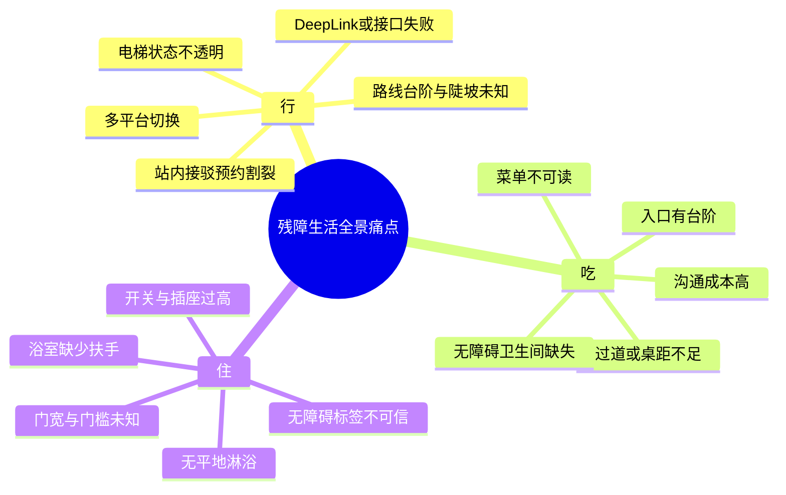
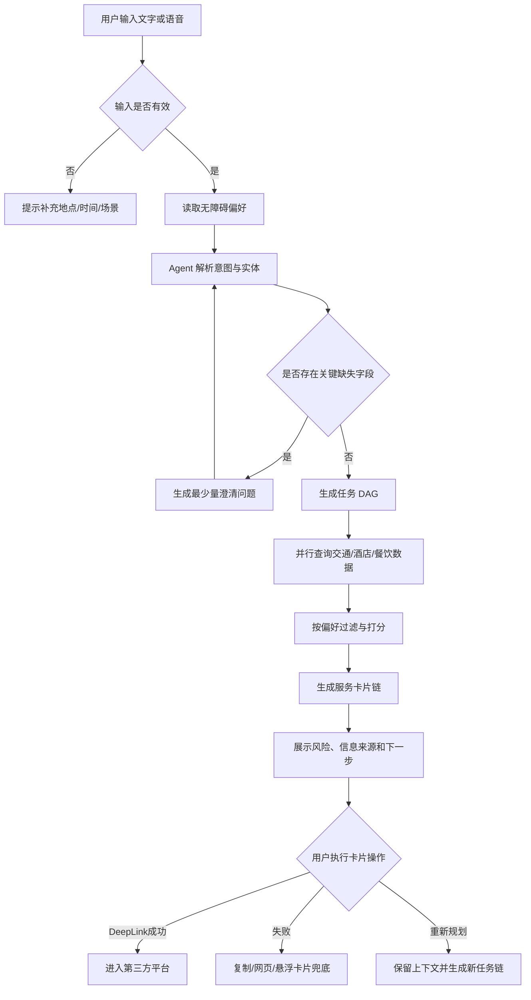
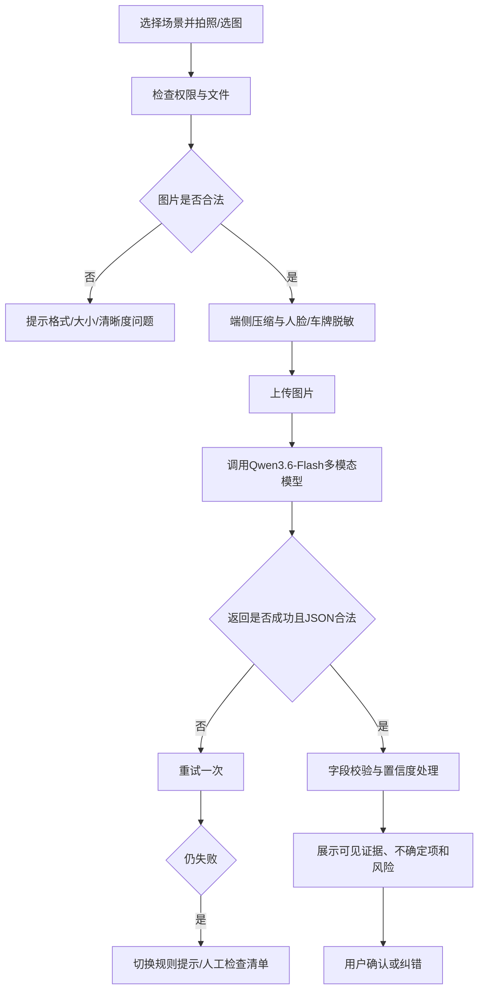
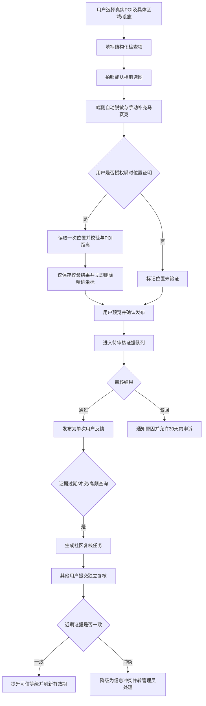
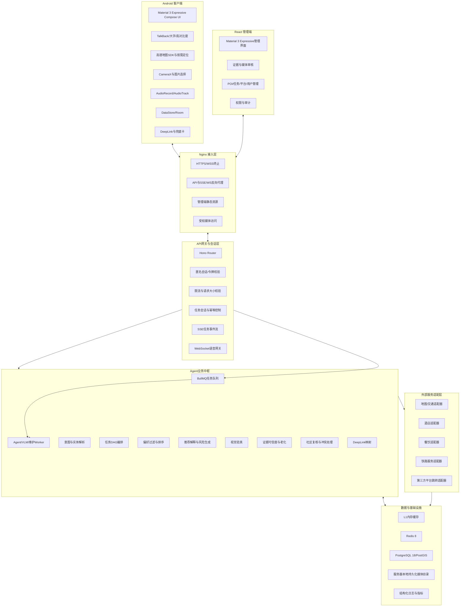
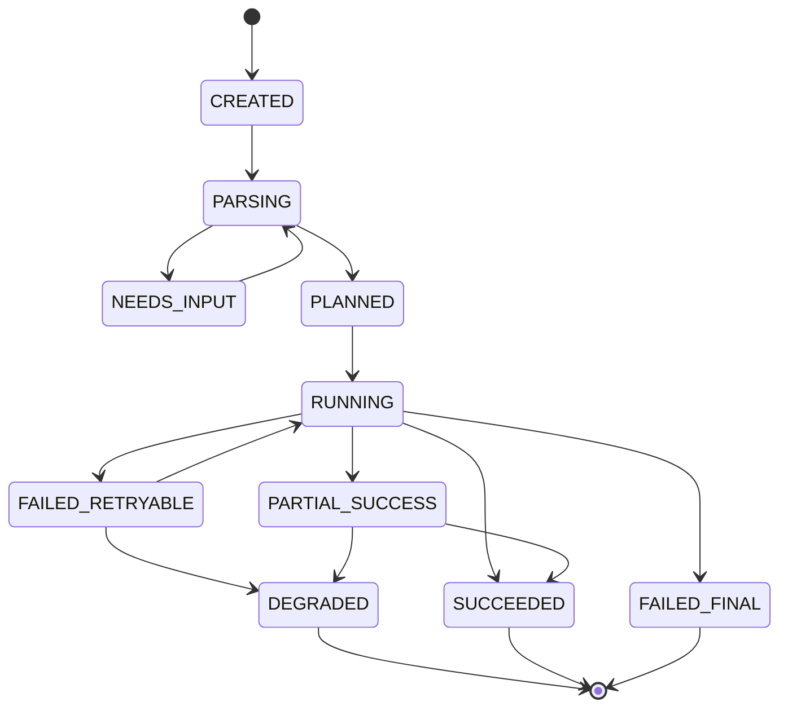
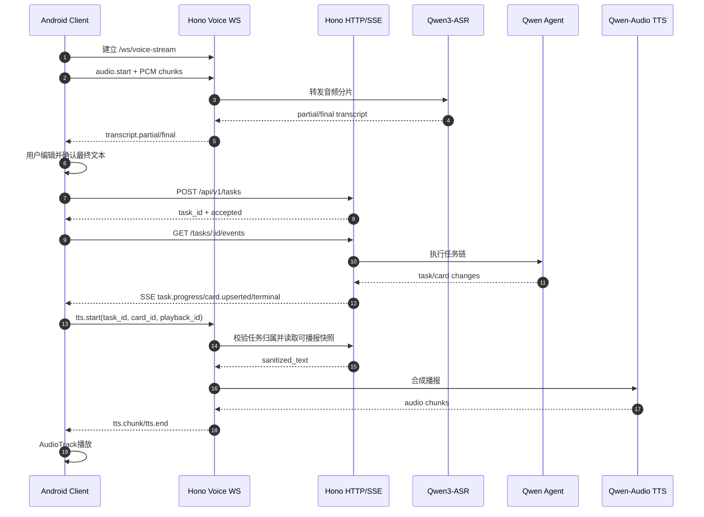
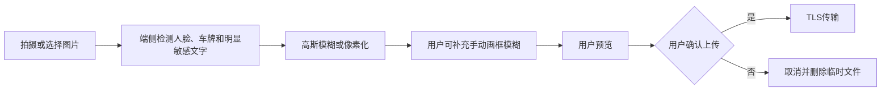

# 跨平台“无障碍生活服务”自动化 Agent 中枢 - 需求规格说明书（PRD）

> **项目方向**：以真实、可追溯的无障碍信息降低轮椅及行动不便用户的出行决策成本
> **项目定位**：面向真实用户的一站式“吃·住·行”无障碍自动化 Agent 生活中枢
> **产品载体**：Android 原生 App + Node.js/Hono Agent 服务端 + React 管理端
> **核心能力**：复合需求理解、无障碍偏好匹配、视觉验真、语音交互、跨平台任务编排、失败兜底  
> **文档用途**：指导真实用户 MVP 的产品设计、研发实现、联调测试、部署、验收与演示

---

## 0. 文档信息

| 项目 | 内容 |
| :--- | :--- |
| 文档名称 | 跨平台“无障碍生活服务”自动化 Agent 中枢需求规格说明书 |
| 文档版本 | V2.0 |
| 当前阶段 | 面向真实用户的 MVP 设计与重写阶段 |
| 首发范围 | 江西省南昌市，允许全国任意城市作为出发地 |
| 目标平台 | Android 10 及以上，`minSdk 29`、`targetSdk 36`、`compileSdk 36` |
| 服务端技术 | Node.js 24 LTS、Hono、BullMQ、Redis 8、PostgreSQL 18/PostGIS、Nginx |
| 管理端技术 | React + TypeScript，采用 Material 3 Expressive 设计语言 |
| AI 能力 | Qwen3.7-Plus、Qwen3.6-Flash、Qwen3-ASR、Qwen-Audio TTS，均通过阿里云百炼调用 |
| 主要用户 | 首版聚焦轮椅用户及行动不便用户，并为视障、听障和高龄用户保留能力扩展模型 |
| 核心场景 | 出行规划、住宿与餐饮筛选、无障碍证据采集与复核、视觉验真、第三方平台跳转 |
| 验收对象 | 产品负责人、研发团队、测试人员、无障碍体验用户和管理端运营人员 |

### 0.1 术语说明

| 术语 | 说明 |
| :--- | :--- |
| 无障碍 POI | 带有无障碍设施信息的酒店、餐厅、车站、卫生间等地点 |
| 验真 | 通过现场图片、商家图片或用户上传图片，识别场所是否满足特定无障碍条件 |
| 任务链 | Agent 将一个复合需求拆解为多个可执行子任务后形成的有序任务集合 |
| 服务卡片 | App 中展示某个子任务结果、状态、风险和操作入口的 UI 组件 |
| DeepLink | 用于唤起第三方 App 指定页面的链接或 URL Scheme |
| 安装实例标识 | App 首次安装时生成并私密保存的 GUID，用于创建匿名用户和自动恢复会话，不是硬件设备号 |
| 无障碍证据 | 与具体地点、区域或设施绑定的结构化观测、照片、商户声明或人工审核记录 |
| 社区复核任务 | 证据过期、冲突或低可信时，由其他到访用户重新核实具体无障碍特征的任务 |
| 数据未知 | 尚无足够证据确认某项无障碍特征，未知不得视为满足 |
| 降级 | 外部服务或 AI 能力失败时，切换到规则、带来源与时间戳的真实缓存、手动输入或明确未知状态；不得生成静态成功数据 |
| P0/P1/P2 | P0 为真实用户 MVP 必须完成，P1 为首版后续增强，P2 为规模化扩展 |

### 0.2 V2.0 已确认产品决策

1. 产品不再以简单比赛 Demo 为目标，正式流程不得使用 Mock 数据冒充真实结果。
2. 首版聚焦轮椅及行动不便用户；扩展时以“能力需求”而非残障标签建模。
3. 无障碍数据采用“高德真实 POI 基础信息 + 用户/商户证据 + AI 可见事实 + 管理员审核”的分层证据模型。
4. 首发精细数据覆盖南昌，全国其他地点可查询基础信息，但缺少证据时必须标记“尚未核验”。
5. 核心功能免注册，使用安装实例 GUID 创建匿名账户；手机号可选，仅用于未来的跨设备恢复。
6. 用户可提交现场检查表和脱敏照片；证据支持社区复核、冲突处理、可信度衰减和撤回。
7. Android App 与 React 管理端均采用 Material 3 Expressive，并以无障碍可用性优先。
8. 管理端一次覆盖 POI、证据审核、用户、任务链路、DeepLink、媒体、权限、审计和系统配置。
9. 只有用户确认发布的社区脱敏证据进入服务器本地持久卷；AI 临时验真图使用非持久目录并用完即删。二者通过存储适配器和物理目录隔离，不把 Base64 或二进制写入 PostgreSQL。
10. 单机以 Docker Compose 部署 Node.js 24、PostgreSQL 18、Redis 8、Nginx、后端和管理端。
11. 文字任务通过 SSE 增量推送，实时语音通过 WebSocket 传输；局部失败不得中断整个任务链。
12. Agent、视觉验真和周期清理任务统一使用 BullMQ + Redis 8；PostgreSQL 仍是任务状态与 SSE 事件的唯一事实来源。
12. App 不直接完成支付、购票、预订或叫车，只提供真实信息、风险解释和经验证的第三方交接入口。

---

## 1. 项目背景、目标与成功标准

### 1.1 项目背景

残障人士在“吃、住、行”过程中通常需要在地图、铁路、网约车、酒店、餐饮等多个平台之间反复切换。传统平台主要提供通用信息，缺少对轮椅通行条件、无障碍卫生间、浴室扶手、门槛高度、语音菜单等细粒度信息的统一表达，也缺少跨场景任务衔接和失败后的可恢复机制。

本项目以 Android App 为统一入口，由 Agent 理解用户的自然语言或语音需求，结合用户无障碍偏好，自动生成一组有先后关系的服务卡片，并在第三方平台不可直达时提供复制、悬浮提示、网页打开或人工确认等兜底方式。

### 1.2 核心问题

系统重点解决以下四类问题：

1. **场景割裂**：用户需要跨多个 App 重复填写地点、时间、同行信息和无障碍需求。
2. **信息不可信**：平台中的“无障碍”标签粒度不足，无法说明门宽、门槛、扶手、淋浴条件等关键细节。
3. **交互门槛高**：视障、听障、行动不便用户难以完成复杂表单、扫码菜单、文字阅读或多层页面操作。
4. **链路容易中断**：DeepLink 失败、接口超时、AI 识别失败或网络中断后，用户通常需要从头开始。

### 1.3 产品目标

#### 1.3.1 真实用户 MVP 目标

1. 用户可通过文字或语音提交一个包含“吃、住、行”中至少两个场景的复合需求。
2. Agent 能将需求拆解为结构化任务链，并展示任务依赖、推荐理由、风险提示和下一步操作。
3. 用户可上传酒店、餐厅或道路图片，系统输出可解释的无障碍验真结果，并展示置信度与不确定项。
4. 至少完成高德地图、12306、滴滴、携程和美团五类平台适配；仅启用经官方资料或真机验证的 DeepLink，其他平台使用 Web、App 首页或复制兜底。
5. App 的关键流程可使用 TalkBack、键盘焦点、大字体和高对比度完成。
6. 任一外部能力失败时，系统不得崩溃、空白或无限加载，必须给出原因、保留已完成结果并提供可操作的替代方案。
7. 正式流程只展示真实查询、真实证据、明确缓存或“未知”状态，禁止在异常时静默返回固定演示结果。
8. 用户能够对南昌真实 POI 提交、查看、复核和撤回无障碍证据，管理员能够完成审核闭环。

#### 1.3.2 后续扩展目标

1. 接入更多真实第三方开放接口，实现实时库存、车次、路线和无障碍服务状态查询。
2. 建立众包验真、商户认证和历史可信度机制。
3. 建立持续监控、风控、审计、数据治理和多区域容灾体系。
4. 在真实用户测试中验证任务完成率、无障碍可用性与信息准确率。
5. 扩展至视障用户：完善 TalkBack、语音交互、菜单 OCR、图片描述和导航播报。
6. 扩展至听障用户：提供实时转写、视觉/震动提醒和可编辑大字沟通卡。
7. 扩展至高龄或临时行动不便用户：提供简化模式、陪同人协作和常用行程模板。
8. 扩展医院、政务大厅、学校、景区等场景及南昌以外城市，无需改变核心证据模型。

### 1.4 非目标与边界

以下能力不作为 MVP 的强制交付内容：

- 不直接替用户完成支付、购票、酒店下单、网约车下单或身份认证。
- 不承诺第三方平台存在稳定、公开且长期有效的无障碍专用接口。
- 不将 AI 图片判断作为建筑规范鉴定、医疗判断或人身安全保证。
- 不在缺乏真实路况数据时宣称路线绝对无台阶、无陡坡或无施工。
- 不保存用户身份证、银行卡、车票账户密码等高敏感信息。
- 不在后台持续录音、持续拍摄或未经授权上传图像。

### 1.5 成功指标

#### 1.5.1 MVP 验收指标

| 指标 | 目标值 | 测量方式 |
| :--- | :--- | :--- |
| 复合意图拆解成功率 | 预置 20 条测试语句中不低于 90% | 对比预期任务类型、地点、日期和偏好字段 |
| 任务卡片完整率 | 每次任务链必须包含标题、状态、推荐理由、风险、操作入口 | 自动化检查 + 人工验收 |
| VLM Schema 合法率 | 分层人工标注集中的结果不低于 99% 通过 Schema | 自动评测报告 |
| VLM 关键障碍安全性 | 按 16.4.3 统计，关键障碍召回率不低于 95%，危险“满足约束”误判率不高于 2% | 双人标注集 + 分字段混淆矩阵；模糊/遮挡图应返回未知 |
| 异常可恢复率 | 预置异常用例 100% 有明确提示和替代操作 | 故障注入测试 |
| 核心流程崩溃率 | 0 | 端到端测试 |
| TalkBack 可操作率 | P0 页面关键控件 100% 可聚焦且有语义标签 | 人工无障碍测试 |
| MVP 任务完成时间 | 从提交需求到展示首批任务卡片不超过 8 秒 | 客户端埋点 |
| 数据真实性 | 正式模式 0 条 Mock 或伪造无障碍属性冒充真实结果 | 故障注入 + 数据来源审计 |
| 社区证据闭环率 | 提交、审核、复核、冲突和撤回流程均可追溯，20 组固定投票样例 100% 命中预期状态 | 自动化检查 + 人工验收 |

#### 1.5.2 远期生产指标

| 指标 | 目标 |
| :--- | :--- |
| 核心 API P95 | 不高于 1.5 秒（不含第三方慢请求） |
| 任务链生成成功率 | 不低于 99% |
| 缓存命中率 | 不低于 85% |
| 服务可用性 | 不低于 99.9% |
| 验真结果人工复核一致率 | 不低于 90% |

---

## 2. 用户、角色与典型场景

### 2.1 目标用户

MVP 优先服务轮椅用户及行动不便用户。用户档案和无障碍特征按“能力需求”建模，不把残障类别硬编码为业务分支，以便后续扩展视障、听障、高龄及临时行动不便用户。

#### 2.1.1 轮椅用户

核心关注点包括无台阶入口、坡度、门宽、通道宽度、无障碍卫生间、平地淋浴、扶手、低位设施和上下车接驳。

#### 2.1.2 视障或低视力用户

核心关注点包括语音输入、语音播报、TalkBack 顺序、图片内容描述、菜单朗读、大字模式、高对比度和操作反馈。

#### 2.1.3 听障用户

核心关注点包括实时文字转写、视觉提示、字幕、震动反馈、可展示给服务人员的结构化需求卡。

#### 2.1.4 高龄或临时行动不便用户

核心关注点包括简化操作、较少步骤、清晰提示、大按钮、避免复杂授权和可随时求助。

### 2.2 用户角色

| 角色 | 权限与职责 |
| :--- | :--- |
| 匿名普通用户 | 通过安装实例自动进入，创建偏好、发起任务、上传图片、查看推荐、跳转第三方平台、反馈和复核结果 |
| 已绑定用户（后续） | 在匿名能力基础上，可选绑定手机号，用于卸载重装或跨设备恢复；手机号不是 MVP 必填项 |
| 超级管理员 | 管理管理员账号、角色、系统参数、平台配置和全部审计记录 |
| 审核员 | 审核 POI、图片证据、用户反馈和冲突记录 |
| 运营人员 | 维护 POI、证据有效期、DeepLink 模板和数据源状态 |
| 只读审计员 | 只读查看任务链、审核历史、安全事件和系统健康状态 |

### 2.3 典型用户故事

1. 作为轮椅用户，我希望一次说出出差需求，系统自动拆分高铁、接驳、酒店和餐厅任务，避免跨平台重复输入。
2. 作为视障用户，我希望通过语音完成查询，并让系统朗读每个推荐的关键无障碍条件和风险。
3. 作为听障用户，我希望语音内容同步显示为文字，并能生成一张需求卡给司机、酒店或餐厅工作人员查看。
4. 作为用户，我希望看到“已验证”“用户反馈”“平台自报”“AI 推测”等信息来源，而不是只看到一个笼统的无障碍标签。
5. 作为用户，我希望第三方 App 跳转失败后仍能保留目的地、车次和要求，并通过复制或网页继续操作。

---

## 3. 场景与痛点拆解



### 3.1 行：无障碍交通

- 传统路线规划通常不包含坡度、台阶、无障碍电梯实时状态等信息。
- 铁路重点旅客服务、网约车、步行导航和酒店入住信息分散。
- 用户到达现场后发现道路不可通行时，缺少快速重新规划和人工求助入口。

### 3.2 吃：无障碍餐饮

- 餐厅入口台阶、桌椅间距和卫生间条件通常没有结构化数据。
- 纸质或扫码菜单可能不适合视障用户。
- 听障用户可能难以口头表达过敏、忌口、座位或通行需求。

### 3.3 住：无障碍住宿

- “无障碍客房”标签可能未覆盖门宽、门槛、淋浴、扶手和洗手台空间等细节。
- 商家图片拍摄角度有限，AI 只能识别可见内容，不能推断未展示设施。
- 真实房型、库存和无障碍设施状态可能随时间变化，需要明确数据更新时间。

---

## 4. MVP 范围与优先级

### 4.1 P0：必须完成

| 编号 | 功能 | 最小交付物 |
| :--- | :--- | :--- |
| P0-01 | 无障碍偏好档案 | 完成首次设置、编辑、保存、用于推荐过滤 |
| P0-02 | 文字复合需求输入 | 能输入一段自然语言并提交 |
| P0-03 | 语音输入与文字回显 | 录音、识别、可编辑识别结果、重新提交 |
| P0-04 | Agent 意图解析与任务拆解 | 输出结构化任务链，支持吃、住、行至少三类任务 |
| P0-05 | 服务卡片链 | 展示状态、推荐、来源、风险、操作和失败信息 |
| P0-06 | 酒店/餐厅/道路图片验真 | 上传图片并得到结构化判断、置信度和不确定项 |
| P0-07 | 第三方平台交接适配 | 覆盖高德、12306、滴滴、携程和美团；每个平台至少具备一个按 7.8.3 验证的 DeepLink、官方 Web、App 首页或复制交接路径 |
| P0-08 | 复制与网页兜底 | 跳转失败后可复制关键信息或打开备选网页 |
| P0-09 | 无障碍 UI | TalkBack 标签、焦点顺序、大字、高对比度、足够触控区域 |
| P0-10 | 异常处理 | 网络、AI、图片、语音、第三方跳转、权限等异常均有处理 |
| P0-11 | 内嵌地图与按需定位 | App 内展示真实 POI、标为“未验证无障碍”的普通路线、已知证据点和未知风险，支持手动地点输入 |
| P0-12 | 匿名安装账户 | 使用私密 GUID 创建匿名用户、签发可撤销令牌并自动恢复会话 |
| P0-13 | 用户现场反馈 | 关联真实 POI 提交通用/分类检查表、脱敏照片、未知项和撤回请求 |
| P0-14 | 社区复核 | 支持待复核任务、位置瞬时证明、证据时间线、共识计算和冲突升级 |
| P0-15 | 隐私与数据中心 | 查看授权、撤回同意、删除/导出个人数据、清除缓存和匿名账户 |
| P0-16 | 完整 React 管理端 | 覆盖 POI、证据、用户、任务、平台、媒体、角色、审计和系统状态管理 |
| P0-17 | 任务实时进度 | 创建后立即返回任务 ID，通过 SSE 增量推送任务和卡片状态 |
| P0-18 | 日志与关键埋点 | 可按 request/task/subtask ID 查看阶段耗时、错误码和降级路径，禁止记录原始敏感数据 |

### 4.2 P1：MVP 后续增强

- 菜单图片识别、菜品结构化与语音朗读。
- 历史任务列表和一键重新执行。
- 卡片排序、收藏和分享。
- 听障沟通卡：将特殊需求以大字卡片展示给服务人员。
- 手机号可选绑定、跨设备同步和账户找回（P1，不阻塞 MVP）。
- 社区贡献徽章、可信贡献者成长体系，不涉及现金或积分兑换。
- 更多车站实时状态、商户认证及经授权的第三方库存信息。

### 4.3 P2：规模化扩展

- 经授权的真实库存与交易接口、商户认证和更完整的信誉评分。
- 路线段空间模型、实时障碍上报与社区协同；达到独立验收阈值后再提供轮椅友好候选路线。
- 多城市、多语言和多终端适配。
- 视障、听障、高龄用户专用能力以及医院、政务、学校等场景模板。
- 多区域部署、内容风控、审计报表和多活容灾。

### 4.4 真实数据接入策略

第三方平台是否提供公开、稳定且经授权的接口存在不确定性，因此每个外部服务必须实现统一适配器接口，并明确区分以下状态：

1. **REAL**：使用已获得授权和凭证的真实 API，并保留来源、时间和原始平台标识。
2. **EVIDENCE_ENRICHED**：高德提供真实基础 POI，EazyPath 使用用户、商户、AI 可见事实和人工审核证据补充无障碍属性。
3. **DEEPLINK_ONLY**：没有授权查询接口时，仅生成经验证的跳转、Web 入口和待填写信息。
4. **UNKNOWN**：数据源不可用或没有无障碍证据时，明确返回未知，不构造固定结果。

高德 POI 搜索不提供门宽、门槛、坡道、扶手、平地淋浴等完整无障碍字段。禁止把普通 POI 自动补写为“平地入口、电梯覆盖、通道宽敞”等已确认属性。禁止在未实际接入的情况下宣称已经完成真实下单、真实购票或实时无障碍车辆调度。

---

## 5. 核心业务流程

### 5.1 复合需求主流程



### 5.2 图片验真流程



### 5.3 语音交互流程

1. 用户点击并明确授权麦克风后开始录音。
2. 客户端显示录音状态、时长、停止按钮和实时音量提示。
3. Qwen3-ASR 返回中间结果时仅用于回显；最终结果返回后进入可编辑文本框。
4. 用户确认后才提交给 Agent，避免误识别直接触发任务。
5. Agent 输出文本后，客户端按句切分并使用 Qwen-Audio TTS 流式播报。
6. 用户可随时暂停、继续或关闭播报。
7. 麦克风权限拒绝、识别超时或环境噪声过大时，自动切换文字输入。

### 5.4 第三方跳转流程

1. 服务端生成经过白名单校验的 DeepLink 和备用 Web URL。
2. Android 使用 `resolveActivity` 检查是否存在可处理目标链接的应用。
3. 可处理时发起跳转，并在返回 App 后提示用户确认是否完成。
4. 不可处理或抛出异常时，复制结构化信息并展示备用操作。
5. 兜底卡必须包含目标平台、目的地/车次、日期、无障碍需求和手动操作步骤。

### 5.5 用户现场反馈与社区复核流程



社区复核不依赖原提交者或商户持续在线。同一安装实例不能在同一轮复核中重复计票；新用户、未验证位置和缺少照片的反馈权重较低。系统不得在后台持续定位，也不得向管理员展示用户原始精确坐标。

---

## 6. 系统总体架构

### 6.1 分层架构



### 6.2 核心设计原则

- **适配器隔离**：Agent 不直接依赖第三方响应格式。
- **结构化优先**：LLM 输出必须经过 JSON Schema 校验，不将自由文本直接驱动高风险操作。
- **用户确认**：涉及跳转、上传、定位、复制敏感内容时必须有明确确认。
- **可恢复**：任务、卡片和外部请求均有状态，失败不清空已完成结果。
- **信息来源透明**：推荐结果必须展示数据来源和更新时间。
- **AI 不确定性可见**：低置信度、图片不可见区域和推测内容必须显式提示。
- **真实或未知**：正式流程只返回真实数据、明确缓存或未知，不静默构造 Mock 结果。
- **能力需求建模**：用户与场所均按可扩展能力/特征建模，不把某类残障标签写死在业务分支中。
- **隐私用完即删**：瞬时位置、临时图片和原始语音只为当前操作使用，到达约定终点后立即删除。
- **存储适配器隔离**：首版使用服务器本地媒体目录，未来迁移对象存储不改变业务接口。
- **队列不作事实源**：API 先在 PostgreSQL 持久化任务和初始事件，再投递 BullMQ；Worker 处理后将状态和事件写回 PostgreSQL，SSE 断线恢复不得依赖 Redis 中的瞬时数据。
- **队列可靠性**：API 生产者连接 Redis 必须快速失败；Worker 连接按 BullMQ 要求禁用命令重试上限，任务使用确定性 Job ID 防重复，业务错误按可重试性决定退避重试或终止。

### 6.3 任务状态模型



| 状态 | 含义 | 客户端表现 |
| :--- | :--- | :--- |
| CREATED | 已创建任务 | 显示“正在准备” |
| PARSING | 正在解析需求 | 展示流式进度 |
| NEEDS_INPUT | 缺少必要信息 | 展示一个明确的补充问题 |
| PLANNED | 已生成任务计划 | 展示任务清单骨架 |
| RUNNING | 正在执行子任务 | 每张卡片独立加载 |
| PARTIAL_SUCCESS | 部分子任务成功 | 保留成功卡片并标记失败项 |
| SUCCEEDED | 全部完成 | 允许执行卡片操作 |
| FAILED_RETRYABLE | 可重试失败 | 提供重试按钮并显示次数 |
| DEGRADED | 已使用缓存、规则或手动方案 | 显示“缓存/规则/手动模式”及原因，不生成伪结果 |
| FAILED_FINAL | 无法继续 | 给出原因、手动方案和返回入口 |

---

## 7. 功能需求详细说明

## 7.1 用户无障碍偏好档案

### 7.1.1 功能说明

用户首次进入时可选择跳过，也可创建无障碍偏好。偏好只用于筛选与排序，不用于推断用户医疗状况。

### 7.1.2 字段定义

```typescript
export interface UserProfile {
  userId: string;
  profileVersion: number;
  accessibilityMode: Array<
    | 'wheelchair_manual'
    | 'wheelchair_electric'
    | 'visually_impaired'
    | 'low_vision'
    | 'hearing_impaired'
    | 'elderly'
    | 'temporary_mobility_limitation'
  >;
  mobility: {
    requireStepFreeEntrance: boolean;
    maxObstacleHeightCm?: number;
    minAisleWidthCm?: number;
    minDoorWidthCm?: number;
    avoidSteepSlope: boolean;
    requireElevator: boolean;
  };
  dining: {
    requireAccessibleRestroom: boolean;
    needVoiceMenu: boolean;
    needLargeTextMenu: boolean;
    dietaryNotes?: string;
  };
  lodging: {
    requireRollInShower: boolean;
    requireGrabBars: boolean;
    requireBasinLegClearance: boolean;
    requireLowSwitches: boolean;
  };
  interaction: {
    preferVoiceInput: boolean;
    preferVoiceOutput: boolean;
    largeText: boolean;
    highContrast: boolean;
    hapticFeedback: boolean;
  };
  updatedAt: string;
}
```

### 7.1.3 交互要求

- 每项偏好说明其对推荐结果的影响。
- 必选项不超过 3 个，其余均可跳过。
- 数值字段提供合理默认值和范围校验。
- 支持“严格匹配”和“优先满足”两种模式。
- 默认使用“优先满足”；用户可以把任一具体条件设为硬性要求。
- 未知不等于满足。严格条件的数据为未知时，不进入默认推荐结果。
- 严格匹配无结果时，不直接展示不满足结果，先询问是否放宽条件。

### 7.1.4 验收标准

- 保存后重新进入页面，字段值保持一致。
- 修改偏好后，新任务使用最新版本，历史任务保留当时的偏好快照。
- TalkBack 能读出字段名称、当前值和控件类型。
- 未创建档案时仍可使用系统，推荐卡片标记“未应用个性化偏好”。

### 7.1.5 匿名安装账户

- App 首次启动生成随机安装实例 GUID，保存于 App 私有存储，不读取 IMEI、序列号、MAC 地址等硬件标识。
- App 同时在 Android Keystore 生成不可导出的安装实例签名密钥对；GUID 只作公开标识，私钥和可轮换刷新令牌才用于证明当前安装实例。
- 首次注册提交 GUID、公钥和一次性随机数；服务端保存 GUID 的不可逆摘要、公钥、令牌摘要和会话状态，返回短期访问令牌与单次轮换刷新令牌。
- 已存在安装实例的恢复、敏感操作和令牌异常重放需通过服务端挑战随机数签名；GUID 单独泄露不能恢复账户或调用隐私接口。
- 访问/刷新令牌使用 Keystore 密钥加密后保存在 App 私有存储；刷新令牌每次使用后轮换，检测到旧令牌重放时撤销该安装实例全部会话。
- `data-extraction-rules` 与 Android 11 及以下备份规则必须排除 GUID、私钥关联元数据、访问令牌和刷新令牌，避免自动备份或换机恢复破坏“安装级、可重置”边界。
- 未绑定手机号的用户卸载重装或更换设备后无法恢复原匿名账户，产品需在用户积累数据后提示可选绑定。
- 手机号始终是可选字段，MVP 不要求注册或登录即可使用核心功能。

实现依据：[Android 唯一标识符最佳实践](https://developer.android.com/identity/user-data-ids)、[Android Keystore](https://developer.android.com/privacy-and-security/keystore)、[Android Auto Backup 规则](https://developer.android.com/identity/data/autobackup)。

---

## 7.2 文字与语音需求输入

### 7.2.1 功能说明

首页提供文字输入框、语音按钮、常用示例和最近任务入口。用户可输入单一或复合需求。

### 7.2.2 输入校验

- 空输入不可提交。
- 最大长度 1000 个字符。
- 语音单次最长 60 秒，达到上限自动停止并提示。
- 输入包含日期但缺少年份时，按当前时间推断，并在卡片中展示具体日期供用户确认。
- 输入含“帮我订”“直接下单”等表达时，系统只能生成跳转或操作建议，不得宣称已经完成交易。

### 7.2.3 语音实现要求

- 音频格式：16kHz、16bit、mono PCM，或按云服务要求转换。
- 采用 WebSocket 流式上传；网络不稳定时允许切换为录制完成后一次上传。
- 中间识别结果与最终识别结果使用不同样式。
- 最终文本必须可编辑。
- 录音开始、暂停、结束均有视觉和震动反馈。

### 7.2.4 验收标准

- 麦克风权限允许后可正常开始和停止录音。
- 权限拒绝时不循环弹窗，展示“去设置”和“改用文字输入”。
- 识别失败后保留录音失败状态，不提交空任务。
- 用户修改识别文本后，Agent 使用修改后的内容。

---

## 7.3 Agent 意图解析与任务拆解

### 7.3.1 支持意图

| 一级意图 | 二级意图 |
| :--- | :--- |
| 行 | 高铁信息、站内重点旅客服务、网约车、普通路线与无障碍风险叠加、接驳规划 |
| 住 | 酒店搜索、无障碍条件筛选、客房图片验真、跳转预订 |
| 吃 | 餐厅搜索、无障碍条件筛选；菜单拍照识别、语音菜单和沟通卡为 P1 |
| 通用 | 修改条件、重新规划、查看风险、解释推荐、反馈验真结果 |

### 7.3.2 结构化输出

```json
{
  "request_id": "req_xxx",
  "language": "zh-CN",
  "entities": {
    "origin": "赣州",
    "destination": "南昌",
    "start_date": "2026-08-14",
    "end_date": "2026-08-16",
    "area": "红谷滩",
    "cuisine": "赣菜"
  },
  "constraints": {
    "step_free": true,
    "accessible_restroom": true,
    "min_door_width_cm": 85
  },
  "missing_required_fields": [],
  "tasks": [
    {"task_id": "t1", "type": "rail", "depends_on": []},
    {"task_id": "t2", "type": "hotel", "depends_on": ["t1"]},
    {"task_id": "t3", "type": "dining", "depends_on": ["t2"]},
    {"task_id": "t4", "type": "ride_hailing", "depends_on": ["t1", "t2"]}
  ]
}
```

### 7.3.3 解析规则

- 所有日期转换为 ISO 8601 绝对日期。
- 地点区分出发地、目的地、住宿区域和餐饮区域。
- 用户明确提出的条件优先级高于偏好档案。
- 条件冲突时不得自行选择，需生成澄清问题。
- 缺少非关键字段时使用默认值，但必须在结果中提示。
- LLM 输出必须通过 JSON Schema 校验；失败后最多修复一次，仍失败则切换规则解析。

### 7.3.4 验收标准

- 预置复合语句能正确生成 2—5 个任务。
- 每个任务具有唯一 ID、类型、依赖关系、执行状态和输入参数。
- 输入修改后可创建新版本，不覆盖原任务日志。
- LLM 返回非法 JSON 时不会导致服务端 500 或客户端崩溃。

### 7.3.5 阿里云百炼模型配置基线

| 环境变量 | MVP 默认模型 | 用途 | 约束 |
| :--- | :--- | :--- | :--- |
| `AGENT_MODEL` | `qwen3.7-plus` | 意图解析、任务规划、结构化输出和工具调用 | 不接收原始图片或音频 |
| `VISION_MODEL` | `qwen3.6-flash` | 图片可见事实提取与结构化验真 | AI 结论不得自动成为已认证事实 |
| `ASR_MODEL` | `qwen3-asr-flash-realtime` | 实时语音转写 | 最终文本必须允许用户编辑确认 |
| `TTS_MODEL` | `qwen-audio-3.0-tts-plus` | 结果与风险提示播报 | 必须支持暂停、继续、语速和关闭 |

- 四类模型通过统一百炼 Provider 调用，但配置、超时、限流、日志和降级必须相互独立。
- 模型名允许通过部署环境变量替换；`DASHSCOPE_API_KEY` 等凭证只能保存在部署 `.env`，`.env.example` 仅放占位符。
- 若官方下线或替换模型，应先查官方文档、完成回归评测后再更新默认值，不允许静默切换到能力不同的模型。

官方目录：[文本生成模型](https://help.aliyun.com/zh/model-studio/text-generation-model)、[语音识别模型](https://help.aliyun.com/en/model-studio/asr-model/)、[语音合成模型](https://help.aliyun.com/zh/model-studio/tts-model)。

---

## 7.4 任务链与服务卡片

### 7.4.1 卡片公共字段

```typescript
export interface ServiceCard {
  cardId: string;
  taskId: string;
  category: 'rail' | 'ride' | 'route' | 'hotel' | 'dining' | 'verification';
  title: string;
  status: 'loading' | 'ready' | 'warning' | 'failed' | 'degraded';
  summary: string;
  matchedAccessibilityFeatures: string[];
  unmetAccessibilityFeatures: string[];
  evidence: EvidenceItem[];
  sourceType:
    | 'official_api'
    | 'merchant'
    | 'community_unverified'
    | 'community_consensus'
    | 'admin_verified'
    | 'ai_inferred'
    | 'unknown';
  sourceUpdatedAt?: string;
  riskLevel: 'low' | 'medium' | 'high' | 'unknown';
  riskMessage?: string;
  primaryAction?: CardAction;
  secondaryActions: CardAction[];
}
```

### 7.4.2 展示要求

每张卡片至少展示：

- 当前状态。
- 结果名称与简要说明。
- 满足的无障碍条件。
- 未满足或未知的条件。
- 信息来源、更新时间、证据数量、可信等级和是否已过期。
- 推荐理由。
- 风险等级和风险说明。
- 主操作与至少一个替代操作。

### 7.4.3 排序规则

推荐分数由以下部分组成：

- 无障碍硬条件匹配：50%。
- 距离与时间：20%。
- 信息可信度：20%。
- 用户偏好和历史反馈：10%。

存在任一严格硬条件不满足时，该结果不得进入默认推荐前三名。若全部结果都不满足，展示“暂无完全匹配”，并按缺口最少排序。

### 7.4.4 验收标准

- 一个子任务失败不影响其他卡片展示。
- 卡片加载超过 3 秒时展示进度说明，而不是仅显示转圈。
- 未核验数据必须显示“无障碍情况未知”，不得使用推荐色或确定性表达。
- 信息来源为 AI 推断时，必须显示“请现场确认”。

---

## 7.5 无障碍 POI 搜索与匹配

### 7.5.1 输入

- 用户当前位置或指定区域。
- POI 类型：酒店、餐厅、车站、卫生间。
- 无障碍偏好与本次任务约束。
- 距离、价格、时间或菜系等普通筛选条件。

### 7.5.2 输出

- POI 基础信息。
- 经纬度与距离。
- 无障碍特征列表。
- 数据来源和更新时间。
- 匹配与未匹配条件。
- 可信度分数。
- 图片验真入口。

### 7.5.3 内容审核与证据可信度

`moderation_status` 只表示内容能否公开展示，取值为 `pending`、`approved`、`rejected`、`withdrawn`；`evidence_grade` 才表示事实可信等级。管理员通过图片合规审核只会把 `moderation_status` 改为 `approved`，不会自动把用户或 AI 证据升级为 A 级。

| 等级 | 来源 | 展示文案 |
| :--- | :--- | :--- |
| A | 可核验的官方无障碍信息，或符合下述材料与双人审批规则的现场测量 | 已认证，仍请关注更新时间 |
| B | 多名独立用户近期一致复核 | 用户近期一致验证 |
| C | 单次用户反馈、位置未验证反馈或商家自报 | 待进一步确认 |
| D | AI 根据图片中可见内容推断 | AI 图片判断，请现场确认 |
| U | 无证据、证据过期或证据冲突 | 无障碍情况未知/存在冲突 |

- A 级只接受两类材料：① 可公开核验且明确描述同一地点/区域/设施/特征的政府、铁路运营方、场所官方页面或盖章文件；② 包含测量方法、数值/单位、拍摄时间、脱敏现场照片和一次性位置证明的结构化现场测量记录。
- 官方材料由具有 `fact_certifier` 权限的管理员核验 URL/文件真实性、对象匹配和有效期后认证；用户、商户或管理员现场测量必须由提交者之外的两名不同管理员分别复核，其中至少一人具有 `fact_certifier` 权限。
- A 级认证必须记录材料类型、核验地址或文件指纹、认证理由、适用对象、审批人和有效期，并保留原来源。普通内容审核员没有 A 级认证权限；任一必填材料缺失时最高保持 C 级或进入复核。
- B 级只能由 7.5.7 的社区共识计算生成，匿名社区共识不得自动升级为 A 级。
- 验收集至少包含 10 组 A 级申请：官方页面有效/失效、对象不匹配、材料缺失、单人审批、双人审批和撤销；只有满足全部条件的样例可进入 A 级。

### 7.5.4 无结果处理

- 展示未满足的具体条件。
- 提供放宽距离、价格或非关键偏好的选项。
- 严格条件只能由用户主动放宽。
- 仍无结果时提供人工电话确认清单或可复制询问模板。

### 7.5.5 通用地点与设施层级

无障碍数据不按酒店、餐厅等类别建立互不兼容的固定字段表，而采用通用层级和可配置检查模板：

1. **地点（Place）**：酒店、餐厅、车站、公共卫生间、商场、景区等真实 POI。
2. **区域（Place Unit）**：正门、侧门、大堂、楼层、站台、客房、就餐区等。
3. **设施（Facility）**：坡道、电梯、卫生间、淋浴区、停车位等。
4. **特征定义（Feature Definition）**：门宽、门槛、台阶数量、是否有扶手等可复用定义。
5. **观测记录（Observation）**：某次用户、商户、AI 或管理员对具体区域/设施的结构化证据。

例如同一酒店可以表达“正门有台阶、侧门有固定坡道”，同一房型也可区分普通客房和无障碍客房。医院、学校或政务场所等后续类别通过新增检查模板扩展，不修改核心表结构。

### 7.5.6 证据老化与社区复核

- 电梯状态、道路施工和临时坡道等动态证据按小时或天设置有效期。
- 用户现场反馈默认 90 天后进入待复核状态。
- 商户自报默认 180 天后进入待复核状态。
- 固定建筑结构证据最长 1 年后进入待复核状态，不因“固定”而永久有效。
- 多名独立用户近期一致复核可提高可信等级并刷新有效期；冲突时立即降级并转管理员审核。
- AI 结论只代表照片拍摄时的可见事实，不得随时间自动升级为认证信息。
- 同一安装实例在同一轮复核中只计一次；MVP 只采用 7.5.7 明示的账户历史门槛、瞬时位置证明和照片完整度权重，不使用不可解释的连续“信誉分”。

### 7.5.7 MVP 社区共识计算规则

- 每个复核任务只核实一个 `target + feature_key`，用户回答 `present`、`absent` 或 `unknown`；`unknown` 记录覆盖情况但不进入正反方向权重。
- 结构化清单无图片的基础权重为 `0.5`；附用户确认后的脱敏现场图片为 `0.8`；图片完整且一次性位置证明落在类别配置的现场距离阈值内时为 `1.0`。
- 默认现场距离阈值为 POI 中心或已知入口点 200 米；车站、景区等大范围地点必须由类别模板调整，系统只保存是否通过、粗粒度距离区间和时间。
- 注册不足 7 天且没有历史已通过贡献的安装账户，其单票最终权重上限为 `0.5`；达到 7 天且至少有 1 条未被撤销/驳回的历史贡献后，才视为“已有历史的安装账户”。
- 形成 `community_consensus` 必须同时满足：至少 3 个不同安装账户、至少 1 个已有历史的安装账户、至少 1 票包含脱敏现场图片并通过一次性位置证明、`present + absent` 有效权重总和不少于 `2.0`、占优方向权重占有效方向权重不少于 `75%`。
- 未达到人数或总权重时保持 `pending_review`；达到总权重但无方向达到 `75%` 时标记 `conflicting` 并进入管理员队列，不输出确定结论。
- 同一安装账户同一轮只保留一次有效复核；修改答案时替换本轮旧票而非累加。商户自报和 AI 推断不计入社区票数，可作为并列证据展示。
- 管理员只能按 7.5.3 的 A 级材料和双人审批规则将状态改为 `admin_verified`；不满足时可标记 `rejected` 或重新发起复核。所有操作必须填写理由并写入审计日志，不得静默篡改原始复核记录。
- 上述阈值必须配置化、版本化并写入共识快照，MVP 默认值变更需回放评测集和记录审计事件。
- 服务端按安装账户、接口和经 HMAC 处理的短期网络风险键限流；原始 IP 只可进入受限安全日志并按日志期限删除。检测到批量新 GUID、重复媒体哈希或异常投票模式时暂停计权并进入管理员队列。
- 产品需明确披露：匿名安装账户无法彻底消除重装或多设备刷票风险。未达到上述反滥用门槛的内容只能保持 C/U 级，不得为了覆盖率强行生成 B 级共识。

---

## 7.6 Qwen3.6-Flash 多模态图片验真

### 7.6.1 支持场景

| 场景 | 必须识别字段 |
| :--- | :--- |
| 餐厅入口 | 台阶数量、是否有坡道、入口是否可见、是否建议现场确认 |
| 餐厅内部 | 过道是否可能通行、桌椅拥挤程度、可见障碍物 |
| 餐厅卫生间 | 扶手、门槛、可见空间、是否完整展示 |
| 酒店客房 | 房门、通道、低位设施、可见空间 |
| 酒店浴室 | 扶手、平地淋浴、门槛、淋浴凳、洗手台下留空 |
| 道路 | 台阶、施工、路障、积水、陡坡迹象、电梯关闭提示 |
| 菜单（P1） | 菜名、价格、主要成分、过敏风险提示（仅识别，不作医疗保证，不计入 P0 验收） |

### 7.6.2 图片预处理

- 支持 JPEG、PNG、WebP。
- 单张原图不超过 10MB。
- 长边压缩到不超过 1920px，JPEG 质量建议 80%—85%。
- 端侧自动识别人脸、车牌和明显敏感文字并进行模糊化；用户必须预览，可拖框补充马赛克或修正误识别区域后再上传。
- 室内验真建议上传整体图和细节图两张。
- 图片过暗、过曝、模糊或遮挡严重时，先提示重拍，不直接输出肯定结论。
- 临时验真图只在内存或非持久临时卷处理，分析完成后立即删除，异常残留最迟 10 分钟清理；临时卷不得与社区证据持久卷共用根目录，也不得纳入常规备份。
- 用户主动发布为社区证据时，只保存经确认的脱敏版本；原始版本不得持久化到服务端。

### 7.6.3 结构化返回

```json
{
  "scene": "hotel_bathroom",
  "visible": {
    "grab_bars": true,
    "roll_in_shower": false,
    "threshold_present": true,
    "basin_leg_clearance": null
  },
  "confidence": 0.86,
  "evidence": [
    "右侧墙面可见横向扶手",
    "淋浴区入口可见凸起门槛"
  ],
  "unknown_items": [
    "洗手台下方未完整拍摄"
  ],
  "risk_level": "high",
  "recommendation": "不建议仅凭该图片确认可供轮椅独立使用，请联系酒店核实门槛高度和洗手台空间。"
}
```

### 7.6.4 置信度规则

- `confidence >= 0.85`：可展示“较高置信度”，仍需保留 AI 判断提示。
- `0.60 <= confidence < 0.85`：展示“存在不确定性”，建议补拍。
- `confidence < 0.60`：不得输出“可通行/不可通行”的确定结论，只展示可见事实和重拍建议。
- 对图片未覆盖区域必须返回 `unknown`，禁止模型自行补全。

### 7.6.5 调用与重试

- 客户端上传超时：15 秒。
- VLM 请求超时：20 秒。
- 网络或 5xx 最多自动重试 1 次，间隔 1 秒并增加随机抖动。
- 4xx、图片违规、格式错误不自动重试。
- 结构化解析失败时执行一次 JSON 修复；仍失败则返回人工检查清单。

### 7.6.6 验收标准

- 返回内容包含可见事实、未知项、置信度、风险和建议。
- 模型低置信度时不输出确定结论。
- 图片上传过程中退出页面，可取消请求且不继续后台上传。
- 服务失败时保留图片本地状态，并允许重新提交或删除。

---

## 7.7 Qwen3-ASR 与 Qwen-Audio TTS 流式语音

### 7.7.1 时序



### 7.7.2 WebSocket 消息类型

| 方向 | 类型 | 说明 |
| :--- | :--- | :--- |
| Client → Server | `audio.start` | 会话、采样率、编码格式 |
| Client → Server | `audio.chunk` | 二进制音频分片 |
| Client → Server | `audio.stop` | 停止录音 |
| Client → Server | `tts.start` | 携带 `task_id`、`card_id`、`playback_id` 和语速，请求播报已授权快照 |
| Client → Server | `tts.cancel` | 停止指定 `playback_id` 的后续合成与发送 |
| Server → Client | `transcript.partial` | 中间识别结果 |
| Server → Client | `transcript.final` | 最终识别结果 |
| Server → Client | `tts.chunk` | 音频分片 |
| Server → Client | `tts.end` | 指定播放会话正常结束 |
| Server → Client | `error` | 错误码、可重试性和替代方案 |

语音 WebSocket 只承载 ASR/TTS 会话。用户确认最终文本后，客户端通过 HTTP 创建 Agent 任务，并统一通过 SSE 接收 `task.progress`、`card.upserted` 和终态事件。TTS 只能读取当前匿名账户有权访问的任务/卡片快照；暂停/继续由客户端 AudioTrack 控制，取消时发送 `tts.cancel`。WS 重连不重放 Agent 事件，也不改变任务状态。

### 7.7.3 性能目标

MVP 采用以下可验收目标：

- 语音中间文字首包不超过 1.5 秒。
- 用户确认文本后，Agent 首个可见进度不超过 1 秒。
- TTS 首包目标不超过 1 秒；350ms 作为优化目标，不作为 MVP 阻断验收项。
- 播报可被用户立即暂停或关闭。

---

## 7.8 跨平台 DeepLink 与兜底

### 7.8.1 适配器定义

```typescript
export interface PlatformLinkAdapter {
  platform: string;
  canBuild(action: string): boolean;
  buildDeepLink(input: Record<string, unknown>): string | null;
  buildWebUrl(input: Record<string, unknown>): string | null;
  buildClipboardText(input: Record<string, unknown>): string;
  validate(input: Record<string, unknown>): ValidationResult;
}
```

### 7.8.2 链接配置

所有 Scheme、App ID、页面路径和参数必须通过服务端配置中心或本地配置文件维护，不得散落硬编码。每次发布前逐条在目标设备验证。文档中的链接模板视为候选配置，不视为长期有效承诺。

| 平台类型 | MVP 行为 | 失败兜底 |
| :--- | :--- | :--- |
| 地图导航 | 传入目的地经纬度并唤起地图 | 打开 Web 地图、复制地址 |
| 网约车 | 唤起打车页面或平台首页 | 复制上下车地点与无障碍需求 |
| 铁路服务 | 唤起 12306 或相关服务页面 | 复制车次、日期、联系人和重点旅客需求 |
| 酒店 | 唤起酒店详情页或搜索页 | 打开网页、复制酒店与房型要求 |
| 餐饮 | 唤起门店详情页 | 打开网页、复制店名和无障碍要求 |

### 7.8.3 官方能力核验结论（2026-08-08）

| 平台 | 官方公开能力 | MVP 启用策略 | 默认兜底 |
| :--- | :--- | :--- | :--- |
| 高德地图 | 官方 Android URI 支持地图主图、POI、导航和驾车/公交/步行/骑行等常规路径规划；官方 Web URI 可在浏览器打开并尝试调起 App | **直接启用**官方 `Intent + URI`，以经纬度、POI ID 和名称跳转；发布前真机验证 | 官方 Web URI、复制地址/坐标 |
| 滴滴出行 | 当前公开 OpenAPI 列出行程和“呼端链接”等接口，但官方接入说明要求先确认接口授权；旧版 SDK 同样要求申请 `appid/secret` | **条件启用**：仅在获得正式合作授权后，由服务端调用获授权接口取得链接；禁止把抓包 Scheme 或旧 SDK 模板硬编码进 App | 真机验证后的 App 首页、复制上下车地点和无障碍沟通文本 |
| 中国铁路 12306 | 官方网站提供车票查询、重点旅客预约等服务，并明确铁路未授权其他网站或 App 开展类似服务；未找到面向普通第三方的公开稳定 DeepLink 参数规范 | **不启用业务 DeepLink**；不得代填、代提交实名购票或重点旅客预约 | 12306 官方网站、真机验证后的 App 首页、复制出发/到达/日期和重点旅客需求 |
| 携程旅行 | 官方提供稳定移动 Web 首页和酒店搜索页；公开开放文档主要面向合作伙伴/供应商，未找到面向普通第三方的公开稳定消费端 DeepLink 规范 | **默认使用官方移动 Web**；只有取得合作文档并真机验证后才开放酒店深页跳转 | `m.ctrip.com` 官方移动页、复制酒店名/日期/房型与无障碍要求 |
| 美团 | 官方生态开放平台支持 API、H5 和混合接入，但流程包含合作申请、商务评估和方案确认；未找到无需合作即可稳定使用的消费端 DeepLink 规范 | **默认使用官方移动 Web**；合作获批后再按正式文档启用 H5/深页能力 | `i.meituan.com` 官方移动页、复制门店名和无障碍要求 |

官方依据：

- [高德地图 Android 路径规划 URI](https://lbs.amap.com/api/amap-mobile/guide/android/route)
- [高德地图 Web URI 路径规划](https://lbs.amap.com/api/uri-api/guide/travel/route)
- [高德地图 Web 服务 POI 搜索](https://lbs.amap.com/api/webservice/guide/api/search/)
- [高德地图 Web 服务路径规划 2.0](https://lbs.amap.com/api/webservice/guide/api/newroute)
- [滴滴 OpenAPI 接入前必读](https://didi.apifox.cn/doc-353529)
- [滴滴 OpenAPI 能力目录](https://didi.apifox.cn/)
- [中国铁路 12306 官方网站](https://www.12306.cn/)
- [携程官方移动酒店页](https://m.ctrip.com/webapp/hotel/j)
- [美团生态开放平台](https://openapi.meituan.com/)
- [美团官方移动端](https://i.meituan.com/client/meituan)

“未找到公开稳定规范”只表示本次官方公开资料核验的结论，不等于平台技术上绝对不存在内部或合作方能力。平台配置需包含 `documentation_url`、`authorization_status`、`last_verified_at`、`verified_app_version` 和 `enabled`；缺少授权或超过验证周期时自动降为 Web/首页/复制。

### 7.8.4 高德无障碍能力边界

- 高德 POI 搜索可作为地点名称、类别、地址、坐标、入口经纬度等基础数据来源，但官方公开字段未提供坡道、门宽、无障碍卫生间等筛选项。
- 高德路径规划公开参数包含普通驾车、公交、步行、骑行等模式及部分常规策略，但没有公开的“轮椅/无障碍路线”模式。
- 高德路径规划 2.0 的步行结果可返回直梯、扶梯、阶梯、斜坡等道路类型。这些字段可用于标记“已知存在阶梯/电梯”等风险信号，但不是无障碍认证，也不能证明未标出阶梯的路段一定可供轮椅通行。
- 因此高德负责地图底图、定位、POI 和常规路径候选；EazyPath 在 MVP 中叠加高德道路类型风险信号，以及路线附近已有的入口、电梯、台阶、施工等社区/商户/管理员证据点，并明确展示未覆盖路段和现场风险。
- MVP 所有高德步行结果统一标为“普通步行路线（未验证无障碍）”，不得改名为“轮椅路线”或“无障碍路线”。路线段空间模型、证据覆盖率和候选路线评级属于 P2，未完成独立规格与验收前不得通过配置提前开放。

#### 7.8.4.1 地图路线替代方案核验

- 百度地图开放平台公开的轻量路线规划同样只列出驾车、骑行、步行和公交路线，未提供公开的轮椅/无障碍算路策略。[百度 DirectionLite 官方说明](https://lbsyun.baidu.com/docs/webapi?title=directionlite%2Fguide%2Fwebservice-lwrouteplanapi)
- 截至 2026-08-08，本次官方公开资料核验未找到可直接替换高德、并能对中国大陆提供稳定轮椅路线保证的地图 API。该结论表示“未找到公开可用能力”，不等于厂商内部或未来版本绝对不存在。
- MVP 不更换地图底座：继续使用已有高德 Key 和官方能力，自建可追溯无障碍证据层。后续若其他厂商发布正式轮椅路线 API，须经过江西真机/实地样本对比、授权与成本评估后，通过地图 Provider 接口接入。

### 7.8.5 安全要求

- 仅允许白名单协议和白名单域名。
- 所有参数进行 URL 编码。
- 禁止将模型原始输出直接拼接为 Scheme。
- 禁止在链接中放置身份证、手机号、精确家庭住址等高敏感数据。
- 跳转前展示目标平台和将要传递的主要信息。

### 7.8.6 失败检测与兜底顺序

1. 检查目标 App 是否安装。
2. 尝试 DeepLink。
3. 捕获 `ActivityNotFoundException` 或解析异常。
4. 若存在 Web URL，则提示打开网页。
5. 自动生成剪贴板文本，但仅在用户点击“复制”后写入剪贴板。
6. 返回本 App 后保留原卡片，并提供“已完成/未完成/遇到问题”的手动确认入口。

### 7.8.7 验收标准

- 目标 App 未安装时不崩溃。
- 链接配置错误时展示错误卡片和备用操作。
- 用户点击复制后显示复制成功反馈，并可在 60 秒后提示清除敏感剪贴板内容。
- 返回本 App 后任务状态和卡片内容仍然保留。
- 未获得合作授权的平台不得启用受限 API 或非公开 Scheme。
- 只有收到第三方平台可验证的回执，才可显示“已叫车/已预约/已预订”；单纯跳转成功只能显示“已打开平台”。

---

## 7.9 结果解释、风险提示与用户确认

### 7.9.1 风险等级

| 等级 | 条件示例 | 展示要求 |
| :--- | :--- | :--- |
| 低 | 多来源一致且近期验证 | 正常展示，仍标注来源 |
| 中 | 单一来源、更新时间较旧、部分条件未知 | 黄色提示并建议电话确认 |
| 高 | 发现台阶、门槛、无扶手或信息冲突 | 红色提示，默认不作为首选 |
| 未知 | 无图片、无结构化信息或模型低置信度 | 不作可通行承诺 |

### 7.9.2 禁止表达

系统不得使用以下无条件承诺式表达：

- “绝对可以通行”。
- “已经成功预订/购票”，除非真实接口明确返回成功凭证。
- “该路线完全安全”。
- “该酒店一定符合所有无障碍标准”。

推荐表达应包含事实依据、未知项和建议确认方式。

---

## 7.10 历史任务与恢复

### 7.10.1 P0 最小实现

- 任务执行期间将 `session_id`、任务状态和已生成卡片保存在本地。
- App 切后台或短时断网后重新进入，可恢复最近一次未结束任务。
- 服务端使用任务 ID 保证重复请求幂等。

### 7.10.2 幂等规则

- 创建任务接口接收 `Idempotency-Key`。
- 相同用户、相同 Key 在 10 分钟内重复提交，返回同一任务。
- 图片验真和外部查询均记录子请求 ID，防止客户端重连后重复计费或重复执行。

---

## 7.11 社区证据提交与复核

### 7.11.1 功能说明

用户可针对真实 POI、区域或设施提交结构化无障碍观测和脱敏照片。新提交默认进入待审核队列，通过后以“单次用户反馈”展示，不自动成为认证信息。

### 7.11.2 瞬时位置证明

- 仅在用户点击提交且主动授权时读取一次位置。
- 服务端只保存“距离校验通过/未通过”、粗粒度距离区间和校验时间，不保存原始经纬度。
- 距离计算完成后，客户端与服务端立即从内存、临时对象和日志上下文中删除精确位置。
- 室内漂移、权限拒绝或远程反馈不阻断提交，但证据标记为“位置未验证”并降低权重。
- 照片 EXIF 定位信息在上传前移除。

### 7.11.3 证据发布与撤回

- 用户发布前必须确认脱敏预览、公开范围、保存周期和撤回方式。
- `evidence expired` 与 `media retention expired` 是两个状态：观测到期后立即退出当前推荐与匹配，只能在证据时间线/复核页以“已过期”标签保留，不能继续证明当前可用性。
- 已过期观测的脱敏社区图片保留 90 天复核宽限期；宽限期内仅用于理解历史证据和发起新复核，不因复核成功自动延长旧图片期限。宽限期结束删除图片与 HMAC 指纹。
- 审核驳回的图片保留 30 天供申诉，之后删除文件，仅保留必要审计元数据。
- 图片删除后只保留 `feature_key`、结构化值、观测/过期时间、审核/共识结果和 `media_deleted_at` 等最小元数据，最长再保留 1 年用于共识审计；用户删除账户或证据时按 13.6 执行更早删除，法定例外需单独告知。
- 用户可查看、纠正和撤回自己的提交；撤回后立即停止公开展示，主存储文件与指纹最迟 10 分钟删除。若部署启用加密备份，已删除媒体在备份中的最长残留不得超过 30 天、不可在线访问，恢复时必须先重放删除清单。

## 7.12 隐私与数据管理中心

- 展示相机、麦克风、定位、社区发布等权限与同意状态。
- 允许撤回非必要同意、跳转系统权限设置、清除本地缓存。
- 允许删除偏好档案、历史任务、图片证据、现场反馈和匿名账户。
- 允许导出用户自己的结构化数据及数据来源/保存期限说明。
- 删除匿名账户时立即撤销服务端会话；受审计、申诉或安全保留期约束的数据先停止公开，期满后物理删除或不可逆匿名化。

---

## 8. 页面与交互清单

| 页面 | P级 | 主要内容 | 关键操作 |
| :--- | :--- | :--- | :--- |
| 启动与隐私说明 | P0 | 数据用途、非安全保证、权限说明 | 同意、查看详情、退出 |
| 首页 | P0 | 输入框、语音按钮、示例、最近任务 | 输入、录音、提交 |
| 偏好档案 | P0 | 无障碍需求、交互偏好 | 保存、跳过、恢复默认 |
| 地图与附近地点 | P0 | 高德地图、真实 POI、证据状态、未验证无障碍的普通路线和已知证据点 | 定位、手动选点、筛选、查看详情 |
| POI 详情 | P0 | 地点、区域、设施、证据时间线、可信度和过期状态 | 规划、反馈、复核、跳转 |
| 任务进度页 | P0 | Agent 阶段、任务链骨架 | 取消、重试、补充信息 |
| 结果卡片页 | P0 | 吃住行卡片、来源、风险 | 展开、跳转、复制、重新规划 |
| 图片验真页 | P0 | 拍照/选图、脱敏预览、场景选择 | 上传、重拍、删除 |
| 验真结果页 | P0 | 证据、未知项、置信度、建议 | 补拍、纠错、返回卡片 |
| 现场反馈页 | P0 | 通用/分类检查表、瞬时位置证明、脱敏图片 | 保存草稿、预览、提交 |
| 社区复核页 | P0 | 待复核特征、历史证据和冲突提示 | 确认、纠错、补图 |
| 隐私与数据中心 | P0 | 权限、同意、数据期限、导出和删除 | 撤回、导出、删除账户 |
| 无障碍设置 | P0 | 大字、高对比度、语音、震动 | 开关与预览 |
| 历史任务 | P1 | 历史任务与状态 | 查看、重新执行、删除 |
| 听障沟通卡 | P1 | 大字需求卡 | 编辑、全屏展示、复制 |

### 8.1 React 管理端页面

| 页面 | 主要内容 | 关键操作 |
| :--- | :--- | :--- |
| 管理员登录 | 环境变量初始化账号密码、安全 Cookie 与失败锁定；TOTP 为 P1 | 登录、修改密码、退出全部会话 |
| 数据概览 | 待审核、过期证据、冲突、任务错误、数据源状态 | 筛选、跳转待办 |
| POI 地图与列表 | 南昌地点、区域、设施、证据覆盖率 | 新增、编辑、合并、停用 |
| 证据审核 | 检查表、脱敏图片、位置证明结果、历史记录 | 通过、驳回、要求补充 |
| 社区复核与冲突 | 复核轮次、加权共识、冲突证据 | 结案、降级、重新发起复核 |
| AI 验真记录 | 模型、Prompt、结构化输出、置信度和错误 | 人工复核、标记问题 |
| 用户与安装实例 | 匿名用户、可选绑定、贡献历史和风控状态 | 限制、解除、删除请求处理 |
| Agent 任务 | 主任务、子任务、SSE 事件、错误和降级路径 | 查看、取消、重试 |
| 平台与 DeepLink | 高德、12306、滴滴、携程、美团配置与验证状态 | 编辑、启停、测试、回滚 |
| 本地媒体 | 文件元数据、关联证据、孤立文件、清理记录 | 受权预览、删除、重试清理 |
| 管理员与角色 | 超级管理员、审核员、运营、只读审计员 | 创建、授权、停用、会话撤销 |
| 审计日志 | 敏感操作前后值、操作者、时间和对象 | 检索、导出 |
| 系统设置 | 模型 ID、数据源健康、阈值和保留策略，不展示密钥原文 | 修改、验证、查看历史 |

#### 8.1.1 Material 3 Expressive 实现约束

- 视觉语言、色彩角色、排版层级、圆角、状态层、动效和组件密度遵循 [Material 3](https://m3.material.io/) / Material 3 Expressive；管理密集型表格和审核工作台仍以信息清晰、键盘效率和可访问性优先。
- 不把官方 [`@material/web`](https://material-web.dev/) 作为唯一 React 基础组件依赖，因为其项目当前处于维护状态；也不假设 MUI 默认主题就是 Material 3。实现采用稳定 React 组件/无样式 primitives，叠加自有 M3 Expressive design tokens、Material Symbols 和同目录 CSS Modules。
- design tokens 至少覆盖颜色角色、排版、间距、圆角、海拔/阴影、状态层、焦点环和动效时长；业务组件不得把颜色和间距散落硬编码。
- 支持响应式桌面/平板布局、键盘全流程、可见焦点、200% 缩放、深色/高对比度和 `prefers-reduced-motion`。Expressive 动效不得延迟审核操作或频繁抢占注意力。

### 8.2 无障碍交互规范

- 关键按钮触控区域不小于 48dp × 48dp。
- 文本支持系统字体缩放至 200%，不截断关键内容。
- 不仅依赖颜色表达状态，必须同时使用图标和文字。
- 焦点顺序与视觉顺序一致。
- 卡片标题、状态、风险和按钮均有独立语义。
- 动态更新区域通过可控的无障碍播报提示，避免频繁打断。
- 录音、加载、成功和失败均提供视觉反馈；用户启用时提供震动反馈。
- 动画支持“减少动态效果”设置。

---

## 9. API 设计

### 9.1 通用响应结构

```json
{
  "request_id": "req_xxx",
  "code": "OK",
  "message": "success",
  "data": {},
  "error": null,
  "timestamp": "2026-08-06T12:00:00Z"
}
```

### 9.2 接口清单

| 方法 | 路径 | 功能 | P级 |
| :--- | :--- | :--- | :--- |
| POST | `/api/v1/installations/challenges` | 获取安装实例注册/恢复/敏感操作的一次性挑战 | P0 |
| POST | `/api/v1/installations/register` | 提交 GUID、公钥与挑战签名，创建或恢复同一安装实例 | P0 |
| POST | `/api/v1/sessions/refresh` | 轮换匿名用户刷新令牌 | P0 |
| POST | `/api/v1/sessions/revoke` | 撤销当前或全部会话 | P0 |
| GET | `/api/v1/profile` | 获取偏好档案 | P0 |
| PUT | `/api/v1/profile` | 保存偏好档案 | P0 |
| POST | `/api/v1/tasks` | 创建 Agent 任务 | P0 |
| GET | `/api/v1/tasks/:taskId` | 获取任务状态与卡片 | P0 |
| POST | `/api/v1/tasks/:taskId/input` | 补充澄清信息 | P0 |
| POST | `/api/v1/tasks/:taskId/retry` | 重试失败子任务 | P0 |
| POST | `/api/v1/tasks/:taskId/cancel` | 取消任务 | P0 |
| GET | `/api/v1/tasks/:taskId/events` | SSE 推送任务进度 | P0 |
| WS | `/ws/voice-stream` | 流式语音识别与播报 | P0 |
| POST | `/api/v1/verifications/images` | 创建图片验真任务 | P0 |
| GET | `/api/v1/verifications/:id` | 获取验真结果 | P0 |
| POST | `/api/v1/links/resolve` | 生成 DeepLink 与兜底信息 | P0 |
| GET | `/api/v1/places/search` | 搜索真实 POI 与证据覆盖状态 | P0 |
| GET | `/api/v1/places/:placeId` | 获取地点、区域、设施和证据时间线 | P0 |
| POST | `/api/v1/observations` | 提交现场结构化观测与脱敏媒体引用 | P0 |
| POST | `/api/v1/observations/:id/withdraw` | 撤回用户自己的社区证据 | P0 |
| GET | `/api/v1/review-tasks` | 获取与当前地点/任务相关的社区复核任务 | P0 |
| POST | `/api/v1/review-tasks/:id/submissions` | 提交独立复核 | P0 |
| POST | `/api/v1/location-proofs/verify` | 瞬时距离校验，只返回证明结果 | P0 |
| POST | `/api/v1/media/uploads` | 初始化已确认的社区脱敏图片可恢复上传 | P0 |
| GET | `/api/v1/media/uploads/:uploadId` | 查询已接收分片和过期时间 | P0 |
| PUT | `/api/v1/media/uploads/:uploadId/parts/:partNo` | 上传或幂等覆盖单个分片 | P0 |
| POST | `/api/v1/media/uploads/:uploadId/complete` | 校验整文件并生成待关联媒体 | P0 |
| DELETE | `/api/v1/media/uploads/:uploadId` | 取消上传并删除暂存分片 | P0 |
| DELETE | `/api/v1/media/:id` | 删除用户有权撤回的媒体 | P0 |
| GET | `/api/v1/privacy/export` | 导出当前用户结构化数据 | P0 |
| DELETE | `/api/v1/privacy/account` | 删除匿名账户并撤销会话 | P0 |
| POST | `/api/v1/admin/auth/login` | 管理员登录 | P0 |
| POST | `/api/v1/admin/auth/logout` | 管理员登出及会话撤销 | P0 |
| CRUD | `/api/v1/admin/places/*` | 管理地点、区域、设施和特征模板 | P0 |
| CRUD | `/api/v1/admin/reviews/*` | 审核证据、冲突和申诉 | P0 |
| CRUD | `/api/v1/admin/platform-links/*` | 管理第三方平台配置、白名单和验证状态 | P0 |
| GET | `/api/v1/admin/tasks/*` | 查看 Agent 任务、子任务和事件 | P0 |
| CRUD | `/api/v1/admin/admin-users/*` | 管理管理员、角色和会话 | P0 |
| GET | `/api/v1/admin/audit-events` | 查询审计日志 | P0 |

### 9.3 创建任务请求示例

```json
{
  "input_type": "text",
  "content": "我下周五从赣州去南昌出差两天，住红谷滩附近方便轮椅的酒店，晚上找一家无障碍方便的赣菜馆，顺便规划高铁和打车。",
  "profile_version": 3,
  "client_timezone": "Asia/Shanghai"
}
```

### 9.4 错误响应示例

```json
{
  "request_id": "req_xxx",
  "code": "AI_OUTPUT_INVALID",
  "message": "暂时无法解析完整需求，已切换到基础解析模式。",
  "data": {
    "degraded": true,
    "available_actions": ["edit_input", "retry"]
  },
  "error": {
    "retryable": true,
    "retry_after_ms": 1000
  },
  "timestamp": "2026-08-06T12:00:00Z"
}
```

### 9.5 API 通用要求

- 所有请求生成 `request_id` 并贯穿日志。
- 创建类请求支持幂等键。
- 安装实例挑战为一次性随机值，默认 5 分钟过期并在成功或失败验证后失效；注册接口对“新建/已存在/公钥不匹配”返回统一外部错误，防止账户枚举，并记录重放审计。
- 单个请求体默认不超过 1MB；图片走独立上传接口。
- API 返回稳定错误码，不将第三方原始错误直接暴露给客户端。
- 所有时间使用 ISO 8601，服务端存 UTC，客户端按用户时区展示。
- 超时、重试、缓存和降级策略按接口类型配置。
- 正式 API 不接受 `MOCK` 数据模式参数；没有数据时返回明确未知或不可用错误。
- SSE 事件包含任务内严格递增事件 ID，客户端使用 `Last-Event-ID` 断点续传；Redis 只负责通知，PostgreSQL 任务/事件表是唯一事实来源。
- 社区媒体分片上传只允许在用户完成脱敏预览并确认发布后初始化。默认整文件不超过 10MB、分片 1MB（末片除外）、最多 10 片、会话 TTL 24 小时；每片和整文件均校验 SHA-256、MIME、魔数、尺寸与声明长度。
- 初始化和完成接口支持 `Idempotency-Key`；客户端通过查询接口获取已接收分片后只补缺失部分。完成后的媒体若 24 小时内未关联观测则自动删除；取消、账户删除和过期清理必须同时删除分片与元数据。
- 社区上传暂存区可位于受保护的证据持久卷以支持容器重启恢复，但与最终公开证据目录分区隔离、不可读取，完成关联后原子移动。AI 临时验真图不使用该协议，不进入持久卷，也不允许后台续传。
- 管理端使用独立安全 Cookie 会话和 RBAC，不能复用普通用户匿名令牌。

### 9.6 SSE 事件契约

```json
{
  "event_id": 42,
  "task_id": "task_xxx",
  "type": "card.upserted",
  "schema_version": 1,
  "occurred_at": "2026-08-08T12:00:00Z",
  "data": {}
}
```

- P0 事件类型：`task.accepted`、`task.progress`、`task.requires_input`、`subtask.updated`、`card.upserted`、`task.completed`、`task.failed`、`task.cancelled`、`heartbeat`。
- `task.completed`、`task.failed`、`task.cancelled` 是互斥终态；任务进入终态后不得再发布业务变更事件。
- 服务端默认每 15 秒发送心跳；客户端断线后按服务端 `retry` 建议重连，默认 3 秒，并携带最后成功处理的 `Last-Event-ID`。
- 断点续传窗口为 24 小时。游标不存在或已过期时返回 `TASK_EVENT_CURSOR_EXPIRED`，客户端调用 `GET /tasks/:taskId` 获取任务和卡片快照后从当前游标继续，不重新执行任务。
- 每次 SSE 连接必须校验访问令牌和任务归属；管理员事件查看使用独立 RBAC 接口。客户端按 `event_id + schema_version` 去重，未知事件类型必须忽略并记录兼容性日志。
- PostgreSQL 保存活跃窗口内的完整事件；窗口结束后可压缩为最小任务状态与卡片快照。事件载荷不得包含原始语音、图片、精确位置或第三方凭证。

---

## 10. 数据模型与存储

### 10.1 核心实体

- `installation_account`：由 App 生成 GUID 的匿名安装账户，不使用硬件设备号。
- `user_identity`：P1 预留的可选手机号绑定及跨设备恢复关系；P0 不提供绑定接口，未绑定时卸载后不可恢复。
- `user_profile`：用户偏好、硬约束和版本快照。
- `agent_session`：会话与上下文。
- `agent_task`：主任务。
- `agent_subtask`：吃住行子任务和依赖。
- `task_event`：SSE 增量事件和断线续传游标。
- `service_card`：展示结果快照。
- `place`：地点主实体及高德等外部来源映射。
- `place_unit`：客房、卫生间、入口、站台、楼层等地点内部单元。
- `facility`：坡道、电梯、无障碍卫生间、扶手等设施。
- `feature_definition`：通用特征字典，定义值类型、单位、适用对象和语义。
- `observation`：针对地点、单元或设施的事实观测及证据状态。
- `evidence_media`：已脱敏社区证据图片与本地文件存储元数据。
- `verification_record`：AI 图片验真的结构化结果；临时原图不持久保存。
- `community_review_task`：过期、冲突或高频地点的社区复核任务。
- `community_review_vote`：用户复核结果、权重和可选现场证明。
- `platform_link_config`：平台能力、DeepLink 模板、白名单与验证状态。
- `user_feedback`：纠错、现场反馈、撤回与申诉记录。
- `admin_user`、`admin_role`、`admin_permission`：管理端账户与 RBAC。
- `audit_event`：关键操作审计事件。

### 10.2 通用地点与无障碍观测模型

> 以下为需求级核心结构示意。最终迁移脚本需补齐外键策略、枚举/检查约束、分区和索引，并通过 PostgreSQL 18 + PostGIS 验证。

```sql
CREATE TABLE places (
    id UUID PRIMARY KEY,
    external_source VARCHAR(32),
    external_id VARCHAR(128),
    name VARCHAR(128) NOT NULL,
    category_code VARCHAR(64) NOT NULL,
    location GEOMETRY(Point, 4326) NOT NULL,
    address TEXT,
    source_updated_at TIMESTAMPTZ,
    created_at TIMESTAMPTZ DEFAULT CURRENT_TIMESTAMP,
    updated_at TIMESTAMPTZ DEFAULT CURRENT_TIMESTAMP
);

CREATE TABLE place_units (
    id UUID PRIMARY KEY,
    place_id UUID NOT NULL REFERENCES places(id),
    parent_unit_id UUID REFERENCES place_units(id),
    unit_type VARCHAR(64) NOT NULL,
    name VARCHAR(128),
    created_at TIMESTAMPTZ DEFAULT CURRENT_TIMESTAMP
);

CREATE TABLE facilities (
    id UUID PRIMARY KEY,
    place_id UUID NOT NULL REFERENCES places(id),
    place_unit_id UUID REFERENCES place_units(id),
    facility_type VARCHAR(64) NOT NULL,
    name VARCHAR(128),
    created_at TIMESTAMPTZ DEFAULT CURRENT_TIMESTAMP
);

CREATE TABLE feature_definitions (
    id UUID PRIMARY KEY,
    feature_key VARCHAR(128) UNIQUE NOT NULL,
    display_name VARCHAR(128) NOT NULL,
    value_type VARCHAR(16) NOT NULL,
    unit VARCHAR(32),
    target_types JSONB NOT NULL,
    schema_version INT NOT NULL DEFAULT 1
);

CREATE TABLE observations (
    id UUID PRIMARY KEY,
    place_id UUID NOT NULL REFERENCES places(id),
    place_unit_id UUID REFERENCES place_units(id),
    facility_id UUID REFERENCES facilities(id),
    feature_definition_id UUID NOT NULL REFERENCES feature_definitions(id),
    value_json JSONB NOT NULL,
    evidence_source VARCHAR(32) NOT NULL,
    moderation_status VARCHAR(16) NOT NULL,
    evidence_grade CHAR(1) NOT NULL,
    freshness_status VARCHAR(16) NOT NULL,
    confidence NUMERIC(4,3),
    observed_at TIMESTAMPTZ,
    expires_at TIMESTAMPTZ,
    created_at TIMESTAMPTZ DEFAULT CURRENT_TIMESTAMP
);

CREATE INDEX idx_places_geo ON places USING GIST (location);
CREATE INDEX idx_observations_place_feature
ON observations (place_id, feature_definition_id, moderation_status, freshness_status, expires_at);
```

### 10.3 验真记录

```sql
CREATE TABLE verification_records (
    id UUID PRIMARY KEY,
    place_id UUID REFERENCES places(id),
    place_unit_id UUID REFERENCES place_units(id),
    scene VARCHAR(64) NOT NULL,
    result_json JSONB NOT NULL,
    confidence NUMERIC(4,3),
    risk_level VARCHAR(16),
    model_name VARCHAR(64),
    prompt_version VARCHAR(32),
    image_fingerprint_hmac VARCHAR(128),
    fingerprint_key_version VARCHAR(32),
    fingerprint_expires_at TIMESTAMPTZ,
    original_media_stored BOOLEAN DEFAULT FALSE,
    temporary_media_deleted_at TIMESTAMPTZ,
    created_at TIMESTAMPTZ DEFAULT CURRENT_TIMESTAMP
);
```

`original_media_stored` 对 AI 临时验真必须为 `FALSE`。社区证据图片不进入该字段，而由 `evidence_media` 记录脱敏后文件、撤回状态、保留期限和访问权限。

- 图片指纹只用于短期幂等、重复媒体风控和清理对账，使用服务端密钥计算 HMAC-SHA-256；禁止保存可被离线枚举的裸 SHA-256，禁止在客户端响应或普通日志中返回指纹。
- AI 临时验真指纹默认保留 30 天后删除；社区证据指纹随有效证据保存，证据撤回/驳回后的申诉期结束即删除，安全调查依法冻结时需单独记录理由与期限。
- 指纹密钥至少每 90 天轮换，数据库记录密钥版本而非密钥；账户删除时删除可归属该账户的指纹，除非存在已告知的短期安全调查保留。

### 10.4 缓存设计

| 缓存 | Key 示例 | TTL | 说明 |
| :--- | :--- | :--- | :--- |
| L1 内存 | `poi:geo6:type:filtersHash` | 60 秒 | 热点查询 |
| Redis POI | `poi:{id}` | 30 分钟 | POI 详情 |
| Redis 查询 | `search:{geoHash}:{type}:{filtersHash}` | 5 分钟 | 搜索结果 |
| Agent 会话 | `session:{sessionId}` | 2 小时 | 短期上下文 |
| 任务状态 | `task:{taskId}` | 24 小时 | 瞬时状态；数据库保留最终事实 |
| SSE 事件游标 | `task-events:{taskId}` | 24 小时 | 加速断线续传，持久事件仍在数据库 |
| DeepLink 配置 | `linkconfig:{platform}` | 10 分钟 | 平台链接模板 |
| 限流 | `ratelimit:{scope}:{key}` | 按策略 | 匿名安装账户、上传和管理端限流 |

BullMQ 的队列、延迟任务和 Job Scheduler 使用独立 `eazypath` 前缀。Redis 8 必须启用 AOF，并将 `maxmemory-policy` 配置为 `noeviction`；禁止因缓存淘汰策略丢失等待中任务。队列 Job 不是业务审计记录，任务状态、卡片和 SSE 事件仍以 PostgreSQL 为准。

### 10.5 数据一致性

- 数据库为最终事实来源，缓存仅用于加速。
- POI 更新后删除对应详情缓存，并通过版本号使搜索缓存失效。
- 删除缓存失败时写入短 TTL 和失效版本，避免长期读取旧数据。
- 卡片保存结果快照，保证历史任务可复现当时推荐依据。
- 社区观测采用追加事实和状态流转，不直接覆盖原证据；共识结果可重算。
- 同一匿名安装账户在同一轮复核任务只计一次，单票权重和共识阈值严格按 7.5.7 计算；新鲜度只决定证据是否过期或是否发起复核，不额外修改单票权重。
- 本地媒体文件与数据库元数据通过清理任务对账；不得只删数据库记录而遗留文件。
- API 写库成功但 BullMQ 投递失败时，任务保留 `queued`/可重试状态并返回明确的依赖不可用错误；维护扫描可按确定性 Job ID 补投，不得重复创建业务任务。
- Worker 采用至少一次投递语义，处理器必须幂等；同一 Job 重试不得重复生成服务卡片、重复计票或重复发布终态事件。

---

## 11. 异常处理与降级设计

### 11.1 错误码规范

| 错误码 | 场景 | 是否可重试 | 用户提示 | 系统处理 |
| :--- | :--- | :--- | :--- | :--- |
| `NETWORK_OFFLINE` | 客户端断网 | 是 | 当前网络不可用，可查看已缓存结果 | 读取本地缓存 |
| `REQUEST_TIMEOUT` | 请求超时 | 是 | 请求超时，可重试 | 指数退避，最多 1—2 次 |
| `RATE_LIMITED` | 被限流 | 是 | 请求较多，请稍后重试 | 返回重试时间 |
| `INVALID_INPUT` | 输入为空或非法 | 否 | 请补充有效需求 | 不创建任务 |
| `MISSING_REQUIRED_FIELD` | 缺少地点或日期 | 否 | 需要补充一个关键信息 | 进入 NEEDS_INPUT |
| `AI_UNAVAILABLE` | LLM 服务不可用 | 是 | 智能解析暂不可用，已切换基础模式 | 规则解析或请用户手动补全 |
| `AI_OUTPUT_INVALID` | JSON 非法 | 是 | 解析结果异常，正在使用基础模式 | 修复一次后降级 |
| `VLM_LOW_CONFIDENCE` | 图片置信度低 | 否 | 图片不足以判断，请补拍 | 返回未知项 |
| `IMAGE_TOO_LARGE` | 图片过大 | 否 | 图片过大，请压缩或重选 | 客户端压缩/拒绝上传 |
| `IMAGE_BLURRY` | 图片模糊 | 否 | 图片不清晰，请重拍 | 不调用或不采纳结论 |
| `MIC_PERMISSION_DENIED` | 麦克风权限拒绝 | 否 | 可改用文字输入 | 不重复强制申请 |
| `CAMERA_PERMISSION_DENIED` | 相机权限拒绝 | 否 | 可从相册选择图片 | 提供替代入口 |
| `DEEPLINK_UNSUPPORTED` | App 未安装或 Scheme 不支持 | 否 | 无法直接打开，已提供备用方式 | Web/复制兜底 |
| `THIRD_PARTY_UNAVAILABLE` | 外部平台不可用 | 是 | 平台暂不可用，可查看带时间戳的缓存或手动继续 | 读真实缓存/Web/复制兜底 |
| `EVIDENCE_EXPIRED` | 无障碍证据已过期 | 否 | 信息较旧，请现场确认或参与复核 | 降级证据状态并创建候选复核任务 |
| `MEDIA_REDACTION_REQUIRED` | 图片仍含敏感内容 | 否 | 请完成模糊处理后再上传 | 阻止上传并返回预览修改入口 |
| `NO_MATCH_FOUND` | 无满足条件结果 | 否 | 暂无完全匹配，可选择放宽条件 | 展示缺口与替代方案 |
| `SESSION_EXPIRED` | 会话过期 | 否 | 会话已过期，可恢复本地结果或新建任务 | 新建会话 |
| `INTERNAL_ERROR` | 未知服务错误 | 视情况 | 服务暂时异常，请重试 | 记录错误并隐藏堆栈 |

### 11.2 异常处理原则

1. **局部失败不影响整体**：交通查询失败时，酒店和餐饮结果仍继续展示。
2. **已完成结果不丢失**：重试仅针对失败子任务。
3. **提示必须可行动**：每个错误至少提供“重试、修改、手动继续、返回”中的一个。
4. **不无限重试**：自动重试次数有上限，防止重复计费和长时间等待。
5. **不暴露技术细节**：客户端不展示堆栈、API Key 或第三方原始错误。
6. **降级可见且真实**：使用缓存或规则时必须显示来源、时间和限制；严禁以 Mock 冒充实时结果。
7. **取消有效**：用户取消后终止可终止的下游请求并停止语音播放。

### 11.3 典型异常流程

#### 11.3.1 Agent 超时

- 8 秒内未返回完整任务计划时，先展示已解析出的任务骨架。
- 后续结果按卡片增量更新。
- 达到服务端总超时后，切换规则模板生成基础任务链。
- 提示“智能解析较慢，已先生成基础计划”。

#### 11.3.2 VLM 失败

- 网络/5xx 自动重试一次。
- 仍失败则展示人工检查清单：入口台阶、坡道、门宽、扶手、门槛、通道、卫生间。
- 仅在 App 沙箱中保留尚未确认上传的临时副本，用户离开或取消后删除；相册原图不受影响。

#### 11.3.3 第三方平台失败

- 保留卡片和关键信息。
- 提供 Web、复制和手动步骤。
- 不生成替代库存、车次或无障碍属性；无法确认的字段明确显示“未知”。

#### 11.3.4 App 被系统回收

- 本地保存最近任务 ID、卡片快照和未完成状态。
- 重启后提示“发现未完成任务”，由用户选择恢复或放弃。
- 不自动重新发起录音、上传或第三方跳转。

---

## 12. 性能、稳定性与可观测性

### 12.1 MVP 性能指标

| 指标 | MVP 验收目标 | 说明 |
| :--- | :--- | :--- |
| App 冷启动 | 不超过 3 秒 | 中档 Android 设备 |
| 创建任务接口 | P95 不超过 2 秒 | 返回任务 ID 与初始状态 |
| 首个进度事件 | 不超过 1 秒 | 可先显示“正在解析” |
| 首批卡片可见 | 不超过 8 秒 | 可增量展示 |
| VLM 单次结果 | P95 不超过 12 秒 | 受云服务和网络影响 |
| DeepLink 响应 | 点击后 1 秒内有跳转或兜底反馈 | 不允许无反馈 |
| 崩溃 | 核心验收流程 0 次 | 20 次连续运行 |

### 12.2 上线初期服务目标

| 性能维度 | 目标 |
| :--- | :--- |
| 核心 API P90 | 不高于 1.0 秒 |
| 核心 API P95 | 不高于 1.5 秒 |
| 核心 API P99 | 不高于 2.5 秒 |
| 缓存命中率 | 不低于 85% |
| 服务可用性 | 不低于 99.9% |
| 并发能力 | 通过压测和服务器规格确定，不预设未经验证的 QPS 承诺 |

### 12.3 超时与熔断

| 服务 | 连接超时 | 总超时 | 自动重试 | 熔断 |
| :--- | :--- | :--- | :--- | :--- |
| LLM | 3 秒 | 15 秒 | 1 次 | 连续失败阈值 5 次 |
| VLM | 3 秒 | 20 秒 | 1 次 | 连续失败阈值 3 次 |
| ASR | 3 秒 | 会话级 70 秒 | 断线重连 1 次 | 按会话隔离 |
| TTS | 3 秒 | 15 秒 | 1 次 | 连续失败阈值 5 次 |
| 第三方 POI | 2 秒 | 8 秒 | 1 次 | 平台级熔断 |
| Redis | 200ms | 500ms | 0 | 失败直读数据库 |
| BullMQ 投递 | 200ms | 500ms | 由业务补投 | 不将未入队伪装为执行中 |

### 12.4 日志字段

- `request_id`
- `session_id`
- `task_id`
- `subtask_id`
- `user_id_hash`
- `service_name`
- `data_mode`
- `stage`
- `latency_ms`
- `status`
- `error_code`
- `retry_count`
- `degraded`
- `model_name`
- `prompt_version`

日志禁止记录原始语音、完整图片 Base64、API Key、身份证、手机号和精确家庭地址。

### 12.5 关键埋点

- 首页展示、开始录音、录音成功/失败。
- 任务提交、任务生成、澄清、取消、重试。
- 卡片展示、展开、跳转、复制、网页兜底。
- 图片选择、脱敏完成、上传、验真成功/低置信度/失败。
- 社区信息提交、撤回、复核领取、复核完成、共识变化和证据过期。
- 匿名账户创建、数据导出、账户删除和授权撤回；手机号绑定埋点在 P1 启用。
- TalkBack 模式、字体缩放和高对比度模式使用情况（仅匿名统计）。

---

## 13. 隐私、安全与合规

### 13.1 数据分类

| 数据 | 分类 | 默认处理 |
| :--- | :--- | :--- |
| 无障碍偏好 | 敏感个人偏好 | 最小化保存、加密存储、可删除 |
| 精确位置 | 高敏感 | 仅任务期间使用，默认不记录历史轨迹 |
| AI 验真临时图片 | 高敏感 | 端侧脱敏，处理后立即删除，残留最长 10 分钟 |
| 社区证据图片 | 敏感 | 仅保存用户确认后的脱敏版本，受控访问且可撤回 |
| 原始语音 | 高敏感 | 仅流式处理，服务端不落盘 |
| 识别文本 | 敏感 | 仅任务需要时短期保存 |
| 一次性位置证明 | 高敏感 | 只保存是否现场、粗粒度距离和时间；精确坐标立即删除 |
| POI 公开信息 | 一般数据 | 可缓存并记录来源 |
| 日志 | 运营数据 | 脱敏后保存 |

### 13.2 权限原则

- 相机、麦克风和定位分别申请，不捆绑授权；MVP 不依赖悬浮窗权限。
- 在用户触发对应功能时再申请权限。
- 权限拒绝后提供不依赖该权限的替代方案。
- 不在后台持续获取定位、录音或拍照。

### 13.3 端侧脱敏



### 13.4 传输与存储

- HTTPS 和 WSS 强制使用 TLS 1.2 以上，优先 TLS 1.3。
- 服务端密钥只通过环境变量或密钥管理服务注入。
- 敏感字段采用 AES-256-GCM 等认证加密方式。
- 数据库账号按最小权限分配。
- 上传接口校验 MIME、魔数、大小和扩展名。
- 社区证据文件保存在部署服务器受保护目录和持久化 Docker Volume 中，不通过静态目录裸露；由鉴权接口读取。
- AI 临时验真目录与社区证据目录物理隔离：建议临时目录使用 `/run/eazypath/verification` 的 `tmpfs` 或非持久卷，社区证据使用 `/var/lib/eazypath/evidence` 持久卷；实际路径通过独立环境变量配置。
- 临时目录只允许验真 worker 读写，不提供下载 API；持久证据目录只保存脱敏版本，由媒体服务鉴权读取。清理与对账任务分别运行，禁止把临时文件移动到持久目录来规避重新上传确认。
- 服务启动时先扫描并删除 `MEDIA_TEMP_DIR` 残留，再接受验真请求；运行期间至少每分钟清理一次修改时间超过 10 分钟的临时文件。清理连续失败或目录占用超过安全阈值时停止接收新图片并告警，不得继续堆积。
- 社区上传暂存区按 `upload_id` 执行 24 小时 TTL 清理；容器重启后从数据库恢复未完成会话并对账，过期分片、孤立最终文件和缺失文件都必须形成可审计清理记录。
- 文件存储必须通过适配器抽象，后续可迁移到对象存储而不改变业务实体和 API。
- DeepLink 只允许白名单协议和域名，防止任意跳转。

### 13.5 数据生命周期

- 原始语音：服务端零落盘，流式处理完成立即释放。
- AI 验真临时图片：处理完成立即删除；异常中断后的残留最迟 10 分钟清理。
- 社区证据图片：只保存脱敏版本；有效期内用于当前证据，过期后按 7.11.3 保留 90 天复核宽限期再删除，不使用含糊的“生命周期策略触发”作为清理条件。
- 被驳回的社区图片：保留 30 天申诉期后删除文件，仅保留最小审计元数据。
- 敏感任务上下文（原始识别文本、模型临时上下文和精确位置输入）：默认 24 小时后删除或匿名化；用户主动删除时立即进入清理队列。
- 历史任务只保留用户选择保留所需的最小任务元数据、偏好版本和卡片快照，不包含已清理的原始语音、临时图片、精确位置或模型上下文；用户可随时删除。
- 一次性位置证明：计算后立即删除精确坐标，只保存 `verified`、粗粒度距离区间和时间。
- 用户偏好：持续保存，用户可在隐私与数据中心随时清空或导出。
- 访问与审计日志：默认保存 30 天；安全审计事件按部署策略保存，但不得含原始敏感内容。

### 13.5.1 阿里云百炼第三方处理边界

- Agent 文本、脱敏后的验真图片、ASR 音频流和待播报文本会按功能分别发送至阿里云百炼；首次向任一百炼能力发送对应数据前，必须展示第三方处理者、数据类型、用途和当前隐私说明链接，并取得该能力的独立同意，不能只在上传图片或录音时提示。
- 同意项至少拆为“智能文本规划（Agent）”“图片辅助判断（VLM）”“语音转文字（ASR）”“结果语音播报（TTS）”，记录政策版本、时间和撤回状态。拒绝/撤回后分别降级为规则与手动搜索、人工检查清单、文字输入和关闭播报，不得阻止无关核心功能。
- EazyPath 只向模型发送完成任务所需的最小内容：视觉模型只接收用户确认后的脱敏图，ASR 只接收当前语音流，TTS 不接收安装 GUID，文本 Agent 不接收手机号、原始精确家庭地址或不必要的证据原图。
- 官方说明称调用数据不会用于模型训练、传输数据会加密，但会根据法律法规存储模型与应用调用数据。因此“用完即删”只承诺 EazyPath 客户端临时副本和自有服务器临时文件，不得表述为百炼侧所有副本立即删除。
- 部署时优先选择满足项目数据地域要求的中国内地接入地域，并在隐私中心记录当前地域、隐私说明版本和核验日期；不得使用控制台 Playground、平台托管数据集或知识库存放用户临时图片/语音。
- 每次上线前复核百炼服务协议、隐私说明、地域和删除能力。若供应商保留期限或用户删除能力无法确认，应在界面明确说明，不得用模糊“零留存”文案替代。

官方依据：[百炼合规资质与隐私说明](https://help.aliyun.com/zh/model-studio/privacy-notice)、[百炼地域与数据存储范围](https://help.aliyun.com/zh/model-studio/regions/)。

### 13.6 隐私与数据中心

- 展示相机、麦克风、定位、语音处理和社区证据的授权状态及用途。
- 支持撤回授权、清除本地缓存、删除偏好、任务、反馈、证据和匿名账户。
- 支持导出与当前匿名安装账户或已绑定账户关联的数据。
- 账户删除后撤销令牌并触发异步清理；依法或为安全审计必须保留的数据需最小化并向用户说明。
- 匿名账户删除开始后先进入 `deleting` 状态，普通用户接口立即拒绝继续写入；清理范围必须覆盖上传暂存分片、社区媒体文件与 HMAC 指纹、反馈/申诉正文和注册挑战。仍在公开的社区观测立即撤回并降为 `U`，历史审计主体不可逆去标识化。同步文件清理失败时由每分钟维护任务持续重试，不依赖用户保持登录；只有全部可归属媒体和上传会话清理完成后才物理删除账户行。
- 社区证据撤回后停止公开展示；若已参与历史共识，只保留不可回溯到原图的最小审计记录。

### 13.7 AI 安全边界

- 图片识别结果只描述可见证据，不替代人工或专业验收。
- Agent 不执行未经用户确认的外部跳转和数据提交。
- 第三方网页、商家文本和用户评论均视为不可信输入，不允许覆盖系统规则。
- 工具调用参数使用结构化白名单，防止提示注入驱动任意工具调用。

### 13.8 首个管理员引导

- 首个管理员用户名由 `ADMIN_BOOTSTRAP_USERNAME` 提供；密码优先从 `ADMIN_BOOTSTRAP_PASSWORD_FILE` 指向的 Docker Secret/一次性只读文件读取，只有 `development` 简单测试才允许直接使用 `ADMIN_BOOTSTRAP_PASSWORD` 环境变量。测试用户名可配置为 `sakura`，密码不得写入本文档、源码或 `.env.example`。
- 数据库迁移完成后执行幂等引导：系统中不存在 `super_admin` 时才读取引导秘密并创建账号；已有 `super_admin` 时不得再读取引导秘密，也不得因服务重启自动覆盖密码或角色。
- 密码进入数据库前必须使用 Argon2id 哈希；引导秘密不得出现在日志、异常、进程诊断页面或管理端响应中。创建成功后输出不含秘密的“请移除引导 Secret 并重新部署”状态。
- `production`/`staging` 引导成功后，在运行容器仍能读取密码环境变量或秘密文件时 readiness 必须保持未就绪；部署者移除 Secret/变量并重建容器后才允许对外就绪。`development` 只警告，但不得公网暴露。
- `.env.example` 对上述变量只使用说明性占位符并配中文注释；部署 `.env` 中的一次性密码在引导后必须删除或轮换，不能长期留作备用密码。
- 后续改密通过受保护的管理端流程或独立的一次性运维命令完成，并记录审计事件。

### 13.9 管理端认证与会话安全

- `production` 与 `staging` 的管理员密码至少 12 位并拒绝常见弱密码；`development` 可为本地简单测试放宽到至少 6 位，但启动时必须高亮警告且不得将管理端暴露到公网。
- 同一用户名或短期网络风险键 15 分钟内连续失败 5 次后锁定 15 分钟；响应不得暴露用户名是否存在，解锁与失败事件进入安全审计。
- 管理端会话使用随机不透明 Session ID，数据库/Redis 只保存摘要；登录和权限变化时轮换，会话空闲 30 分钟、最长 8 小时，改密、停用管理员或“退出全部会话”立即撤销。
- Cookie 必须设置 `Secure`、`HttpOnly`、`SameSite=Strict` 和限定管理 API 的 `Path`；所有变更请求使用 CSRF Token，并仅允许配置的管理端 Origin。
- Argon2id 参数采用实现时最新 OWASP 最低建议并在目标服务器基准测试，禁止退化为明文、可逆加密或快速哈希。
- P0 不要求 TOTP；若 P1 启用，必须同时提供绑定确认、一次性恢复码、丢失处理、强制撤销和审计，不得只增加一个未闭环开关。

---

## 14. 研发任务拆解与完成方式

### 14.1 Android 客户端任务

| 编号 | 具体任务 | 完成方式 | 输出物 | 验收 |
| :--- | :--- | :--- | :--- | :--- |
| A-01 | 建立 Compose 工程和导航 | `minSdk 29`、`compileSdk/targetSdk 36`、JVM 17，配置页面路由 | 可构建 APK | 所有 P0 页面可进入 |
| A-02 | 首页文字输入 | TextField、示例填充、输入校验 | 首页模块 | 空输入不可提交 |
| A-03 | 语音采集 | AudioRecord、权限处理、WS 分片 | 语音组件 | 可录音、停止、回显 |
| A-04 | 任务进度流 | SSE 客户端、`Last-Event-ID`、状态映射 | 进度页面 | 可增量展示并断线续传 |
| A-05 | 服务卡片 | 统一卡片组件、状态和操作区域 | 卡片组件库 | 成功/失败/降级均可展示 |
| A-06 | 图片采集 | CameraX/Photo Picker、压缩、预览；社区脱敏证据分片续传 | 图片验真与证据上传 | 社区证据可恢复上传；AI 临时验真取消后不后台续传 |
| A-07 | 端侧脱敏 | 人脸、车牌、敏感文字检测和手动画框 | 脱敏模块 | 上传前可预览和补充模糊 |
| A-08 | DeepLink | resolveActivity、Intent、异常捕获 | 跳转模块 | 未安装时触发兜底 |
| A-09 | 兜底操作 | Web URL、复制、悬浮卡片可选 | 兜底卡 | 每次失败有替代操作 |
| A-10 | 本地恢复 | DataStore/Room 保存任务快照 | 恢复模块 | 重启后可恢复最近任务 |
| A-11 | 无障碍适配 | semantics、焦点、字体、高对比度 | 无障碍验收记录 | P0 控件可由 TalkBack 操作 |
| A-12 | 匿名账户 | 安装 GUID、令牌签发/刷新和数据丢失提示 | 账户模块 | 不提供手机号也可完整使用 MVP |
| A-13 | 内嵌地图 | 高德地图、按需定位、证据图层 | 地图页 | 可浏览南昌 POI 与证据状态 |
| A-14 | 社区闭环 | 结构化提交、证据图片、撤回、复核任务 | 反馈与复核页面 | 无定位权限也可提交且权重可解释 |
| A-15 | 隐私中心 | 权限状态、缓存清理、导出与删除 | 隐私与数据中心 | 用户可执行全部 P0 隐私操作 |
| A-16 | 语音播报控制 | TTS 播放、暂停、继续、语速和关闭 | 播报组件 | 离开页面自动停止播放 |

### 14.2 服务端任务

| 编号 | 具体任务 | 完成方式 | 输出物 | 验收 |
| :--- | :--- | :--- | :--- | :--- |
| B-01 | Hono API 骨架 | 路由、中间件、统一响应、错误处理 | API 服务 | 健康检查可用 |
| B-02 | 会话和任务模型 | session/task/subtask 状态机 | 任务服务 | 状态流转符合定义 |
| B-03 | Agent 解析 | Prompt、JSON Schema、修复与规则降级 | 解析服务 | 非法 JSON 可降级 |
| B-04 | Task Planner | 生成 DAG、并行执行、依赖控制 | 编排器 | 子任务可独立成功失败 |
| B-05 | 推荐匹配 | 硬条件过滤、评分、解释 | Matcher | 显示满足/不满足条件 |
| B-06 | 外部适配器 | REAL/EVIDENCE_ENRICHED/DEEPLINK_ONLY/UNKNOWN 统一接口 | Adapter 层 | 不可用时不伪造业务数据 |
| B-07 | VLM 服务 | 上传校验、Prompt、结构化解析 | 验真 API | 返回证据、未知项、风险 |
| B-08 | Voice Gateway | WS 会话、ASR/TTS 转发 | 语音网关 | 断线可恢复一次 |
| B-09 | DeepLink Mapper | 模板配置、白名单、URL 编码 | 链接服务 | 不接受任意 Scheme |
| B-10 | 缓存与幂等 | Redis、缓存键、Idempotency-Key | 基础设施模块 | 重复提交不重复执行 |
| B-11 | 监控与日志 | 结构化日志、耗时、错误码 | 可观测性 | 可按 request_id 定位链路 |
| B-12 | 匿名账户 | GUID 注册、令牌撤销和会话恢复 | 身份服务 | 不读取硬件设备号；数据模型预留 P1 绑定关系 |
| B-13 | 通用无障碍数据 | 地点层级、特征字典、观测和证据状态 | 数据服务 | 新类别无需新增固定业务列 |
| B-14 | 社区复核引擎 | 过期/冲突派单、加权共识、防重复 | 复核服务 | 单安装账户每轮只计一次 |
| B-15 | 媒体生命周期 | 本地存储适配器、鉴权读取、清理对账 | 媒体服务 | 临时图残留不超过 10 分钟 |
| B-16 | 隐私操作 | 导出、撤回、删除、令牌撤销 | 隐私服务 | 删除任务可审计并完成清理 |
| B-17 | SSE 事件服务 | 持久事件、心跳、游标续传 | 事件流服务 | 重连不丢失关键任务状态 |
| B-18 | BullMQ 队列与 Worker | Agent、VLM、清理队列，确定性 Job ID、退避和 Job Scheduler | 异步任务基础设施 | Redis 重连不丢业务事实，重复投递不产生重复结果 |

### 14.3 React 管理端任务

| 编号 | 具体任务 | 完成方式 | 输出物 | 验收 |
| :--- | :--- | :--- | :--- | :--- |
| M-01 | 管理员认证与 RBAC | 环境变量引导账号、Argon2id、会话 Cookie、角色权限 | 登录与权限框架 | 初始账号不硬编码，越权请求被拒绝 |
| M-02 | 数据看板 | 真实指标、待审核、过期与冲突统计 | Dashboard | 指标可追溯且不使用伪造统计 |
| M-03 | POI 管理 | 地图/列表、详情、编辑、合并和来源映射 | 地点管理 | 可处理重复地点和通用特征 |
| M-04 | 证据与 AI 审核 | 社区证据、AI 验真、申诉和状态流转 | 审核工作台 | 审核操作全部记录审计日志 |
| M-05 | 用户与任务运维 | 匿名安装、绑定用户、任务和事件查看 | 运维页面 | 默认隐藏敏感字段 |
| M-06 | 平台与媒体运维 | DeepLink 配置、能力开关、本地媒体和清理状态 | 系统运维页面 | 配置校验和文件对账可用 |
| M-07 | 管理员与审计 | 管理员、角色、权限、审计查询 | 安全管理页面 | 最小权限和关键操作二次确认 |
| M-08 | Material 3 Expressive UI | React 组件体系 + 自定义 M3 Expressive tokens、响应式 CSS Modules | 完整管理端 UI | 键盘、焦点、对比度与响应式通过验收 |

### 14.4 AI Prompt 与评测任务

| 编号 | 具体任务 | 完成方式 | 输出物 | 验收 |
| :--- | :--- | :--- | :--- | :--- |
| AI-01 | 意图解析 Prompt | 明确字段、禁止补全、日期规则 | Prompt V1 | 20 条测试集通过率 ≥90% |
| AI-02 | VLM 场景 Prompt | 按场景拆分字段和未知项 | Prompt V1 | 16.4.3 分层标注集 Schema 合法率 ≥99% |
| AI-03 | 输出 Schema | 使用 JSON Schema 校验 | Schema 文件 | 错误字段可识别 |
| AI-04 | 解释生成 | 只引用结构化证据 | Explain Prompt | 不出现无依据承诺 |
| AI-05 | 测试集 | 按 16.4.3 分层覆盖正常、模糊、冲突、缺失、注入图片，并含 20 组社区投票样例 | 评测数据集 | 双人独立标注、分歧已仲裁且每字段样本下限满足 |
| AI-06 | 回归脚本 | 统计 Schema 合法率、关键障碍召回率、危险假阳性、未知回退率和耗时 | 测试报告 | 关键障碍召回 ≥95%，危险假阳性 ≤2% |

### 14.5 部署与配置任务

| 编号 | 具体任务 | 完成方式 | 输出物 | 验收 |
| :--- | :--- | :--- | :--- | :--- |
| D-01 | 单机容器部署 | Docker Compose 编排 Node 24、BullMQ Worker、PostgreSQL 18/PostGIS、Redis 8、Nginx | 部署配置 | 数据库、Redis AOF 与社区媒体使用持久化卷；AI 临时图使用 tmpfs |
| D-02 | Nginx 入口 | HTTPS、API、SSE、WebSocket、管理端静态资源和上传限制 | 反向代理配置 | SSE 不被缓冲，语音 WS 可升级 |
| D-03 | 数据初始化 | 迁移后通过一次性 Secret（开发测试可用环境变量）创建首个管理员并哈希密码 | 引导脚本 | 幂等、不输出明文，引导后运行容器不再携带秘密 |
| D-04 | 环境变量同步 | 同步 `.env` 与 `.env.example` 的变量名和中文注释 | 配置模板 | 示例文件只含占位符；现有真实值不被覆盖 |
| D-05 | 模型配置 | 分离 Agent、视觉、ASR、TTS 模型和统一百炼凭证 | AI 配置 | 四类模型可独立替换和降级 |

#### 14.5.1 环境变量契约

| 变量 | 必填 | 敏感 | 默认/示例 | 用途与启动校验 |
| :--- | :--- | :--- | :--- | :--- |
| `APP_ENV` | 是 | 否 | `development`/`staging`/`production` | 决定安全策略，值不合法时拒绝启动 |
| `APP_PUBLIC_URL` | 是 | 否 | `https://api.example.com` | API/SSE/WS 对外基址，必须为允许协议 |
| `ADMIN_PUBLIC_URL` | 是 | 否 | `https://admin.example.com` | 管理端 Origin 与回调基址 |
| `CORS_ALLOWED_ORIGINS` | 是 | 否 | 精确 Origin 列表 | 禁止生产环境使用 `*` |
| `DATABASE_URL` | 是 | 是 | 占位符 | PostgreSQL 18 连接，启动检查连通性与迁移版本 |
| `REDIS_URL` | 是 | 是 | 占位符 | Redis 8/BullMQ 连接，必须使用 `noeviction`；失败时健康检查不可用且不得绕过限流/会话安全 |
| `AUTH_TOKEN_SECRET` | 是 | 是 | 至少 32 字节随机值 | 匿名访问令牌签名/派生，不得与管理端共用 |
| `ADMIN_SESSION_SECRET` | 是 | 是 | 至少 32 字节随机值 | 管理端会话与 CSRF 派生 |
| `DATA_ENCRYPTION_KEY_CURRENT_VERSION` | 是 | 否 | `v2` | 新写数据使用的加密密钥版本 |
| `DATA_ENCRYPTION_KEYRING` | 是 | 是 | `v2:<base64>,v1:<base64>` | 至少包含当前版本；旧版本仅用于迁移期读取 |
| `MEDIA_FINGERPRINT_KEY_CURRENT_VERSION` | 是 | 否 | `v2` | 新指纹使用的 HMAC 密钥版本 |
| `MEDIA_FINGERPRINT_KEYRING` | 是 | 是 | `v2:<base64>,v1:<base64>` | 图片指纹独立 keyring，不得复用会话/数据加密密钥 |
| `ADMIN_BOOTSTRAP_USERNAME` | 首次部署 | 否 | `<管理员用户名>` | 首个管理员用户名，测试环境可设为 `sakura` |
| `ADMIN_BOOTSTRAP_PASSWORD_FILE` | 首次部署优先 | 是 | `/run/secrets/admin_bootstrap_password` | 一次性 Docker Secret 文件，引导后移除 |
| `ADMIN_BOOTSTRAP_PASSWORD` | 仅开发测试 | 是 | `<临时密码>` | 不允许用于 production/staging |
| `DASHSCOPE_API_KEY` | 是 | 是 | 占位符 | 阿里云百炼统一凭证 |
| `AGENT_MODEL` | 否 | 否 | `qwen3.7-plus` | Agent 文本模型 |
| `VISION_MODEL` | 否 | 否 | `qwen3.6-flash` | 多模态图片模型 |
| `ASR_MODEL` | 否 | 否 | `qwen3-asr-flash-realtime` | 实时 ASR 模型 |
| `TTS_MODEL` | 否 | 否 | `qwen-audio-3.0-tts-plus` | TTS 模型 |
| `AMAP_WEB_SERVICE_KEY` | 是 | 是 | 占位符 | 服务端高德 Web API |
| `AMAP_ANDROID_KEY` | Android 构建 | 受限配置 | 占位符 | Android 地图 SDK Key，需绑定包名与签名 |
| `MEDIA_TEMP_DIR` | 否 | 否 | `/run/eazypath/verification` | AI 临时图非持久目录，不能位于持久卷 |
| `MEDIA_UPLOAD_STAGING_DIR` | 否 | 否 | `/var/lib/eazypath/staging` | 已确认社区证据分片暂存区 |
| `MEDIA_EVIDENCE_DIR` | 否 | 否 | `/var/lib/eazypath/evidence` | 社区脱敏证据持久目录 |
| `MEDIA_MAX_IMAGE_BYTES` | 否 | 否 | `10485760` | 图片大小上限，必须为正整数 |
| `MEDIA_QUOTA_BYTES` | 是 | 否 | 按服务器磁盘配置 | 媒体配额与告警阈值 |
| `SSE_RESUME_WINDOW_SECONDS` | 否 | 否 | `86400` | SSE 断点续传窗口 |
| `VOICE_WS_MAX_SESSION_SECONDS` | 否 | 否 | `70` | 单次语音 WS 会话上限 |
| `LOG_LEVEL` | 否 | 否 | `info` | 生产禁止 `trace` 输出敏感上下文 |

- `.env` 与 `.env.example` 的变量名、顺序和中文注释必须同步；每条注释使用英文标点且不含真实密钥。示例文件只保留安全占位符。
- 生产环境缺少必填变量、密钥长度不足、目录重叠/不可写、Origin 非法或使用开发弱密码时必须拒绝启动，不能静默生成默认密钥。
- 密钥轮换需有版本字段与操作说明：令牌/管理会话密钥轮换可使旧会话失效；数据加密 keyring 采用新写旧读，后台完成重加密且确认无旧版本行后才能销毁旧钥。
- 指纹轮换时，新上传使用当前版本；仍有社区脱敏文件的记录从受保护文件重算当前 HMAC 并更新版本。已删除原图的 AI 临时记录无法重算，旧指纹钥至少保留到该版本全部 30 天短期指纹到期。重复检测对迁移中的有效版本逐一计算，确认数据库无旧版本指纹后才销毁旧钥。

### 14.6 测试与演示任务

| 编号 | 具体任务 | 输出物 |
| :--- | :--- | :--- |
| T-01 | 编写 P0 功能测试用例 | 测试用例表 |
| T-02 | 准备 20 条复合需求语句 | Agent 测试集 |
| T-03 | 准备 15—20 张验真图片 | VLM 测试集 |
| T-04 | 执行权限、断网、超时、低置信度和 DeepLink 失败测试 | 异常测试报告 |
| T-05 | TalkBack 与 200% 字体测试 | 无障碍测试报告 |
| T-06 | 20 次完整主流程回归 | 稳定性记录 |
| T-07 | 准备录屏和离线备用视频 | 答辩备份素材 |
| T-08 | 社区提交、过期、冲突、复核和撤回测试 | 数据闭环测试报告 |
| T-09 | 管理端 RBAC、审核、审计和媒体清理测试 | 管理端测试报告 |

---

## 15. 验收标准

### 15.1 总体验收门槛

以下条件全部满足，才视为真实用户 MVP 可交付：

1. P0 功能完成率 100%。
2. 核心主流程可在目标 Android 设备连续运行 20 次，无崩溃和卡死。
3. 所有预置异常均有用户可理解的提示和替代操作。
4. 至少一个江西省内、以南昌为目的地的完整“吃住行”复合场景可从输入走到卡片和第三方跳转/兜底。
5. 至少一个图片验真场景能展示证据、未知项、置信度和风险。
6. TalkBack 可完成首页输入、任务提交、结果浏览和主要按钮操作。
7. 正式模式中不存在伪造库存、车次、POI 或无障碍属性；缓存、未知和 AI 推断均有清晰标识。
8. 不出现“已下单”“已购票”等与实际能力不符的表述。
9. 匿名安装账户、社区证据提交、社区复核、证据撤回和隐私删除形成可验证闭环。
10. React 管理端 P0 页面完整可用，管理员初始化、RBAC、审核、审计和媒体清理通过验收。

### 15.2 Given-When-Then 验收用例

#### AC-01 复合需求生成任务链

- **Given** 用户已设置轮椅偏好。
- **When** 用户输入“下周五从赣州去南昌两天，找红谷滩附近方便轮椅的酒店和赣菜，并规划高铁和打车”。
- **Then** 系统生成高铁、酒店、餐饮和接驳任务；日期转换为具体日期；卡片展示偏好匹配和来源。

#### AC-02 缺少关键信息

- **Given** 用户输入“帮我找一家方便轮椅的酒店”。
- **When** 系统无法确定城市或区域。
- **Then** 仅询问地点，不一次提出多个无关问题；用户补充后继续原任务。

#### AC-03 部分子任务失败

- **Given** 酒店接口正常、餐饮接口超时。
- **When** Agent 执行任务链。
- **Then** 酒店卡正常展示；餐饮卡显示超时、重试和手动搜索选项；整个页面不失败。

#### AC-04 图片高置信度验真

- **Given** 上传清晰的酒店浴室图片，可见扶手和门槛。
- **When** VLM 返回置信度 0.85 以上。
- **Then** 页面展示可见证据、门槛风险、未知项和“AI 判断，请现场确认”。

#### AC-05 图片低置信度

- **Given** 上传模糊或遮挡严重的图片。
- **When** 置信度低于 0.60。
- **Then** 系统不输出确定可通行结论，提示补拍角度和所需细节。

#### AC-06 DeepLink 成功

- **Given** 目标 App 已安装且链接配置有效。
- **When** 用户点击“打开地图”。
- **Then** 系统跳转目标页面；返回后原任务状态保留。

#### AC-07 DeepLink 失败

- **Given** 目标 App 未安装。
- **When** 用户点击主操作。
- **Then** App 不崩溃，展示网页打开和复制地址选项。

#### AC-08 网络断开

- **Given** 用户已获得部分任务结果。
- **When** 网络断开。
- **Then** 已有卡片继续可读；未完成卡片显示离线状态；恢复网络后可单独重试。

#### AC-09 麦克风权限拒绝

- **Given** 用户拒绝麦克风权限。
- **When** 再次点击语音按钮。
- **Then** 系统解释原因并提供“去设置”和“文字输入”，不反复强制弹窗。

#### AC-10 会话恢复

- **Given** 任务执行中 App 被关闭。
- **When** 用户重新打开 App。
- **Then** 系统提示恢复最近任务，并恢复已生成卡片和失败状态。

#### AC-11 TalkBack

- **Given** Android 已开启 TalkBack。
- **When** 用户从首页进入结果页。
- **Then** 焦点顺序正确，所有关键按钮、状态和风险均可被读出。

#### AC-12 数据真实性与未知项

- **Given** 高德只提供地点基础信息，当前没有可信的酒店门宽证据。
- **When** 卡片展示酒店结果。
- **Then** 门宽显示“未知”，并展示来源、更新时间、现场确认清单和社区补充入口；不得自动生成门宽数值。

#### AC-13 匿名快速使用

- **Given** 用户首次安装且未提供手机号。
- **When** 打开 App 并提交需求。
- **Then** App 使用随机 GUID 创建匿名安装账户，不读取硬件设备号；用户可正常完成主流程，并被告知卸载后未绑定数据无法恢复。

#### AC-14 社区复核

- **Given** 某无障碍电梯观测已过期或出现冲突。
- **When** 另一匿名用户完成结构化复核并可选提供一次性现场证明。
- **Then** 系统按证据权重更新共识状态，同一安装账户本轮只计一次；拒绝定位不阻止提交但权重较低。

#### AC-15 图片用完即删

- **Given** 用户上传图片进行一次 AI 验真但不作为社区证据发布。
- **When** AI 返回结构化结果或处理失败。
- **Then** 服务端立即删除临时图片，异常残留不超过 10 分钟，并在上传前向用户说明；相册原图不被删除。

#### AC-16 管理端初始化

- **Given** 新环境完成数据库迁移并挂载一次性管理员引导凭据（development 可使用临时环境变量）。
- **When** 引导任务首次执行。
- **Then** 系统幂等创建首个管理员，密码以 Argon2id 哈希保存；源码、日志和数据库中均无明文密码。production/staging 必须提示移除一次性 Secret，重建后的运行容器中不存在引导密码变量/文件且管理员仍可登录。

---

## 16. 测试计划

### 16.1 功能测试

- 偏好保存、修改、删除和版本快照。
- 文字输入边界、日期解析、地点歧义和条件冲突。
- 任务状态流转和多子任务并发。
- 卡片成功、失败、警告和降级状态。
- 图片选择、拍摄、压缩、脱敏、上传、取消和重试。
- DeepLink、官方网页和用户触发的复制兜底。
- 本地恢复和幂等提交。
- 匿名安装账户、令牌恢复和卸载/换机数据丢失提示；手机号绑定与跨设备恢复按 P1 单独验收。
- 社区证据提交、复核、冲突、过期、撤回和申诉。
- 隐私数据导出、缓存清理、令牌撤销和账户删除。
- React 管理端认证、RBAC、审核、审计、平台配置和媒体对账。
- 安装挑战签名、刷新令牌轮换、旧令牌重放撤销和 Android 备份排除。
- 社区证据分片中断恢复、重复分片幂等、整文件哈希失败、取消和 24 小时过期清理。
- SSE 断线续传、重复事件去重、24 小时游标过期后的快照恢复和终态后无新事件。
- 20 组固定社区投票样例覆盖人数不足、总权重不足、形成共识、冲突和反滥用暂停计权。

### 16.2 异常测试

- 无网络、弱网、请求超时、DNS 失败。
- LLM 超时、限流、非法 JSON、空响应。
- VLM 低置信度、违规图片、格式不支持。
- Redis 不可用、数据库慢查询。
- 第三方接口 4xx、5xx、字段缺失和返回格式变化。
- 目标 App 未安装、Scheme 失效、系统禁止跳转。
- 麦克风、相机和定位权限拒绝。
- App 切后台、进程被回收、屏幕旋转和系统字体变化。
- GUID 枚举、挑战过期/重放、刷新令牌重放和批量新安装投票。
- 媒体清理失败、临时目录超限、孤立文件、分片缺失和证据文件丢失。
- 管理端弱密码、连续登录失败锁定、CSRF、Cookie 属性、会话超时与角色越权。
- 百炼调用前未同意、供应商隐私说明版本变化和删除文案不得误称云端零留存。

### 16.3 无障碍测试

- TalkBack 全流程。
- 字体 100%、150%、200%。
- 高对比度和深色模式。
- 仅键盘/外接开关控制。
- 色盲场景下状态辨识。
- 语音播报可暂停和关闭。
- 动态内容不会频繁抢占焦点。

### 16.4 AI 评测集

#### 16.4.1 意图解析测试维度

- 单一意图与复合意图。
- 相对日期与绝对日期。
- 地点缺失、地点歧义。
- 明确硬条件与偏好条件冲突。
- 用户修改前一轮条件。
- 口语、省略、ASR 错别字。
- 提示注入和无关指令。

#### 16.4.2 VLM 测试维度

- 清晰整体图、清晰细节图。
- 模糊、过暗、遮挡和角度不足。
- 有扶手/无扶手、有门槛/无门槛。
- 图片内容与用户描述冲突。
- 不包含目标设施的无关图片。

#### 16.4.3 VLM 安全指标统计口径

- 评估单位是“图片组 × `feature_key`”。同一图片组可标注多个字段，但同一字段在同一图片组只计一次；双人独立标注，分歧由第三人仲裁。
- 对门槛/台阶等障碍型字段和扶手/净宽等设施型字段，统一映射为真实标签 `constraint_satisfied=true/false/unknown`，再与模型结构化输出映射后的预测标签比较。
- **关键障碍召回率** = 真实 `constraint_satisfied=false` 且模型识别为 `false` 的数量 ÷ 全部真实 `false` 数量。
- **危险“满足约束”误判率** = 真实 `constraint_satisfied=false` 但模型输出 `true` 的数量 ÷ 全部真实 `false` 数量；模型输出 `unknown` 不计为危险误判，但计入召回未命中。
- 每个 P0 关键字段（至少台阶、门槛、坡道、门净宽、扶手、平地淋浴、洗手台下方空间）分别至少包含 50 个真实满足、50 个真实不满足和 30 个不可判断样本；各场景至少 30 组图片，总数据集规模由这些分层下限决定，不以“总计 100 组”替代。
- 总体和每个 P0 关键字段都必须同时满足：关键障碍召回率 ≥95%、危险误判率 ≤2%、真实 `unknown` 返回 `unknown` 的比例 ≥95%。任一字段不达标即阻断发布，不能用其他容易字段平均稀释。

---

## 17. 项目里程碑与交付计划

> 具体日期由团队填写。以下按 5 个迭代组织，每个迭代均应产出可构建、可测试的增量版本。

### 17.1 迭代一：骨架与主流程

- 完成 Android 工程、首页、偏好页和任务进度页。
- 完成 Hono API 骨架、匿名账户、会话、任务状态和 SSE 事件流。
- 打通文字输入 → 任务链 → 卡片展示。
- 交付物：基于真实接口或明确未知状态的文字主流程。

### 17.2 迭代二：AI 与视觉验真

- 完成 LLM 结构化意图解析和 Schema 校验。
- 完成 VLM 图片上传、验真和结果页。
- 建立 Agent 与 VLM 基础评测集。
- 交付物：复合任务与图片验真可演示。

### 17.3 迭代三：地图、社区数据与隐私

- 完成内嵌高德地图、地点详情、结构化现场提交与图片脱敏。
- 完成证据生命周期、过期/冲突派单、加权共识、撤回和隐私中心。
- 交付物：真实地点—证据—复核闭环。

### 17.4 迭代四：语音、平台跳转与管理端

- 接入 Qwen3 ASR 实时转写和 Qwen Audio TTS 播报控制。
- 完成经官方或真机验证的平台跳转及 Web/首页/复制兜底。
- 完成 React 管理端全部 P0 页面、RBAC、审核和审计。
- 交付物：用户端执行闭环和完整运营管理能力。

### 17.5 迭代五：部署、无障碍与稳定性

- 完成 TalkBack、大字、高对比度和焦点修复。
- 完成 Docker Compose、Nginx、PostgreSQL 18/PostGIS、Redis 8、Node 24 和本地媒体持久卷配置。
- 完成 BullMQ Agent/VLM/维护队列、Worker 幂等与 Redis AOF/noeviction 配置。
- 完成 20 次回归、异常测试、数据真实性检查、性能记录和备用录屏。
- 交付物：Android APK、管理端、后端部署包、测试报告、演示视频和答辩材料。

---

## 18. 风险与依赖

| 风险 | 影响 | 概率 | 应对措施 |
| :--- | :--- | :--- | :--- |
| 第三方 API 无权限或不稳定 | 无法查询实时业务数据 | 高 | 统一适配器、真实缓存、DeepLink-only、Web/复制和未知状态 |
| DeepLink 参数变更 | 跳转失败 | 高 | 配置化、每次发布前真机验证、Web/复制兜底 |
| VLM 判断不准确 | 错误推荐 | 中高 | 证据与未知项、置信度阈值、禁止绝对承诺 |
| 语音网络延迟 | 现场卡顿 | 中 | 可编辑文字回显、一次上传降级、预置文本入口 |
| TalkBack 适配不足 | 无障碍价值受质疑 | 中 | 将无障碍验收列为 P0 阻断项 |
| 演示依赖公网 | 现场失败 | 高 | 明确时间戳的真实缓存、离线卡片、预填文本和备用录屏 |
| 团队范围过大 | P0 无法完成 | 高 | 严格冻结 P0，真实下单和复杂后台移至 P2 |
| 隐私说明不足 | 合规风险 | 中 | 上传前预览、按需授权、原始媒体零落盘 |
| 性能目标过度承诺 | 上线体验不达标 | 中 | 区分当前实测与服务目标，持续压测和观测 |
| 社区恶意或重复提交 | 错误共识 | 中高 | 一轮一安装账户、来源权重、异常检测、审核和可追溯证据 |
| 本地媒体盘满或丢失 | 证据不可用/服务异常 | 中 | 持久卷、配额告警、清理对账、备份与存储适配器 |
| 匿名账户卸载丢失 | 用户数据无法恢复 | 中 | 首次使用明确提示，可选手机号绑定和数据导出 |

### 18.1 外部依赖清单

- 阿里云百炼模型账号、配额和 API Key。
- Android 测试设备至少 2 台，其中 1 台安装目标第三方 App。
- 可部署 Hono 服务的云主机或容器环境。
- BullMQ、Redis 8、PostgreSQL 18 + PostGIS、Node.js 24 LTS、Nginx 与 Docker Compose。
- 经许可使用的酒店、餐饮、地图或铁路数据源。
- 用于验真的自有或已获授权图片素材。

---

## 19. 答辩演示方案

### 19.1 主演示剧本

1. 打开 App，展示大字、高对比度和 TalkBack 标签。
2. 使用语音输入：“我下周五从赣州去南昌两天，住红谷滩附近方便轮椅的酒店，晚上找一家方便轮椅进出的赣菜馆，顺便规划高铁和打车。”
3. 展示语音实时转写，并由用户确认文字。
4. 展示 Agent 将需求拆分为高铁、酒店、餐厅和接驳四个任务。
5. 展示服务卡片的匹配条件、信息来源、风险和操作入口。
6. 打开一张酒店浴室图片，展示端侧人脸/车牌脱敏预览。
7. 展示 VLM 识别到扶手、门槛和未知项，并给出风险而非绝对结论。
8. 点击高德官方 URI 演示地图跳转，再用携程/美团官方移动 Web 展示酒店搜索兜底。
9. 在未安装目标 App 的真机或测试配置中展示网页和复制兜底。
10. 返回 App，证明任务状态和结果仍然保留。
11. 在地点详情提交一条脱敏后的现场证据，并在 React 管理端完成审核。
12. 展示临期信息生成社区复核任务，以及用户撤回证据和隐私删除入口。

### 19.2 异常演示剧本

- 在测试环境使用可控故障注入令餐饮适配器超时；故障注入不得伪造成功数据。
- 展示酒店和交通卡片继续成功，餐饮卡片单独失败。
- 点击重试仍失败后，系统展示带时间戳的真实缓存（若有）或手动搜索方案；没有数据时明确未知。
- 说明该设计避免整条出行链因一个平台故障而中断。

### 19.3 答辩时必须说明

- 每条数据来自哪个真实 API、商户、社区证据、AI 可见事实或缓存，以及哪些字段仍未知。
- 系统不代替用户完成付款或身份认证。
- 图片验真是风险辅助，不是建筑规范鉴定。
- DeepLink 受第三方平台限制，因此设计了配置化和多级兜底。
- 价值重点不是简单聚合信息，而是将无障碍偏好贯穿任务拆解、匹配、解释、执行和失败恢复全过程。

### 19.4 现场备用方案

- 预置一套来自已授权采集或真实接口的只读缓存，并显示采集时间与可能过期提示。
- 预置语音识别后的标准文本，可一键填充，但提交后仍走真实任务链。
- 预置已完成的 VLM 结构化结果快照时，必须标注采集时间、模型版本和“历史结果”，不得伪装为本次实时识别。
- 准备 2—3 分钟完整流程录屏。
- 准备二维码或本地文件分发 APK。

---

## 20. 最终交付物清单

### 20.1 产品与设计

- 本需求规格说明书。
- 页面原型或高保真设计稿。
- 用户流程图与异常流程图。
- 无障碍设计检查表。

### 20.2 研发

- Android APK 和源代码。
- Hono 服务端源代码和部署说明。
- React 管理端源代码和使用说明。
- 数据库初始化脚本。
- DeepLink 配置文件。
- Docker Compose、Nginx、PostgreSQL/Redis 持久卷与本地媒体目录配置。
- 经脱敏、获授权并注明时间的测试/演示数据快照，不含伪造业务事实。
- 同步的 `.env` 与 `.env.example` 变量清单；示例文件不包含真实密钥。

### 20.3 测试

- 功能测试用例。
- 异常测试报告。
- AI 意图解析评测报告。
- VLM 验真评测报告。
- TalkBack 与字体缩放测试记录。
- 20 次完整主流程回归记录。
- 社区证据闭环与管理端 RBAC/审计测试报告。

### 20.4 答辩

- 演示 APK。
- 主演示脚本和异常演示脚本。
- 演示录屏。
- 架构图、任务链图、异常降级图。
- 数据来源、证据等级、未知字段和平台跳转能力说明表。

---

## 附录 A：江西无障碍出行示例任务链

### A.1 用户输入

“我下周五从赣州去南昌出差两天，住红谷滩附近方便轮椅的酒店，晚上找一家方便轮椅进出的赣菜馆，顺便帮我规划打车和高铁。”

### A.2 预期解析

- 出发地：赣州。
- 目的地：南昌。
- 日期：将“下周五”转换为具体日期，并展示给用户确认。
- 时长：两天。
- 住宿区域：红谷滩附近。
- 餐饮：赣菜。
- 核心无障碍条件：轮椅通行。
- 子任务：高铁、站内服务、酒店、餐饮、网约车/接驳。

### A.3 预期卡片

1. **高铁与重点旅客服务卡**：展示可核验候选车次、站内服务入口、信息来源和手动确认事项；无法取得实时车次时不生成车次编号。
2. **无障碍酒店卡**：展示门宽、浴室扶手、平地淋浴、信息来源、图片验真状态和跳转入口。
3. **无障碍餐厅卡**：展示入口、过道、卫生间、菜单辅助和电话确认清单。
4. **接驳卡**：展示车站到酒店、酒店到餐厅的上下车地点、地图跳转和复制兜底。

### A.4 预期异常

- 酒店实时接口不可用时，展示带时间戳的真实缓存或手动搜索入口；没有可信信息的字段显示未知。
- 餐厅无完全匹配时，展示缺少无障碍卫生间等具体原因。
- 地图 App 未安装时，打开 Web 地图或复制地址。
- VLM 不能看到洗手台下方时，返回未知而不是默认满足。

---

## 附录 B：人工无障碍检查清单

### B.1 餐厅

- 入口是否有台阶，台阶数量和高度。
- 是否有稳定坡道，坡道是否过陡。
- 门宽和门槛。
- 主要过道和桌间距。
- 是否有可供轮椅靠近的桌位。
- 是否有无障碍卫生间、扶手和转身空间。
- 是否可提供大字、文字或语音菜单。

### B.2 酒店

- 房门净宽和门槛。
- 床边轮椅转移空间。
- 浴室门宽和门槛。
- 坐便器与淋浴区扶手。
- 是否为平地淋浴。
- 是否有淋浴凳。
- 洗手台下方是否留空。
- 开关、插座、门锁和空调控制高度。
- 从大堂到客房是否全程有电梯和无台阶通道。

### B.3 道路与交通

- 是否有台阶、陡坡或施工围挡。
- 无障碍电梯是否开放。
- 人行道是否被车辆或杂物占用。
- 路面是否破损、积水或过窄。
- 上下车点是否有安全停靠空间。
- 是否需要提前预约站内协助。

---

## 附录 C：发布前检查表

### C.1 功能

- [ ] 文字主流程可完整运行。
- [ ] 语音输入可回显和编辑。
- [ ] 四类任务卡可展示。
- [ ] 图片验真可返回结构化结果。
- [ ] 高德官方 Android URI 已真机验证；12306、滴滴、携程、美团各自的 Web/首页/复制兜底均已验证。
- [ ] Web 与复制兜底可用。
- [ ] 任务可恢复。

### C.2 异常

- [ ] 无网时有提示和缓存。
- [ ] LLM 超时可降级。
- [ ] VLM 失败可重试或展示人工清单。
- [ ] App 未安装不崩溃。
- [ ] 权限拒绝有替代方案。
- [ ] 子任务部分失败不影响其他结果。

### C.3 无障碍

- [ ] TalkBack 焦点顺序正确。
- [ ] 所有图标按钮有语义标签。
- [ ] 200% 字体无关键内容截断。
- [ ] 状态不只依赖颜色。
- [ ] 触控区域不小于 48dp。
- [ ] 语音播放可暂停和关闭。

### C.4 安全、隐私与数据真实性

- [ ] APK 和仓库中无明文 API Key。
- [ ] 原始语音不落盘，AI 临时图片用完即删且残留不超过 10 分钟。
- [ ] 社区图片仅保存用户确认后的脱敏版本，并可撤回和受控访问。
- [ ] DeepLink 使用白名单。
- [ ] 正式模式无 Mock 成功结果；真实缓存有来源和时间戳，未知项不被填充。
- [ ] 答辩不宣称已完成真实下单或支付。
- [ ] 已准备获授权的真实数据快照和备用录屏。
- [ ] 匿名账户不读取硬件设备号，手机号为可选绑定字段。
- [ ] 隐私中心支持授权撤回、数据导出、证据撤回和账户删除。
