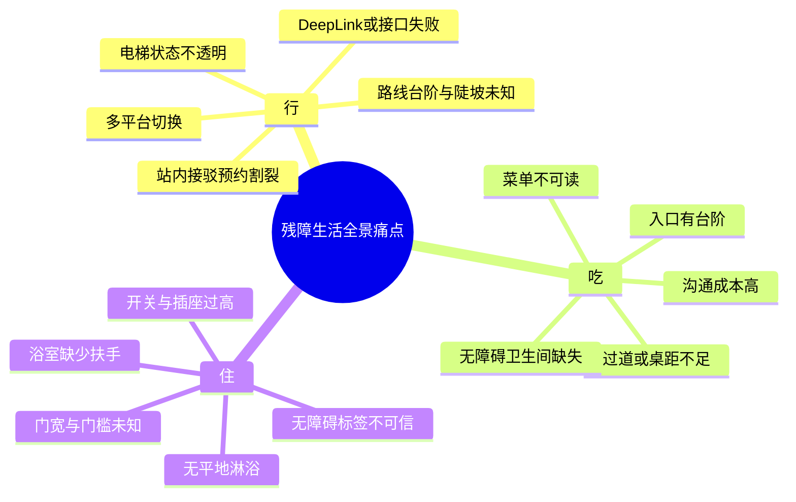
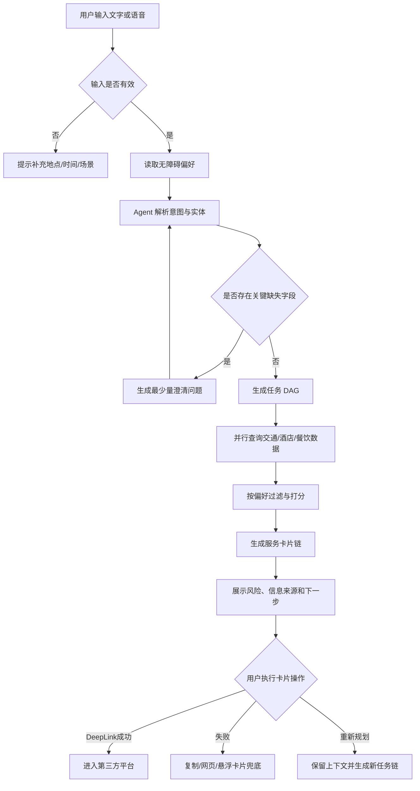
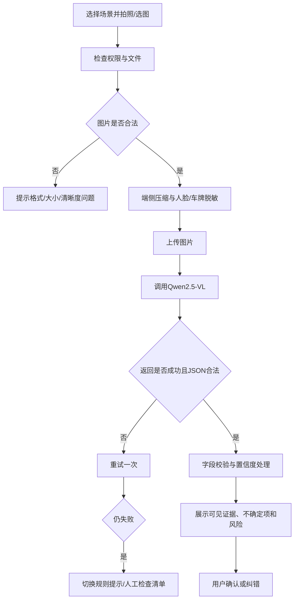
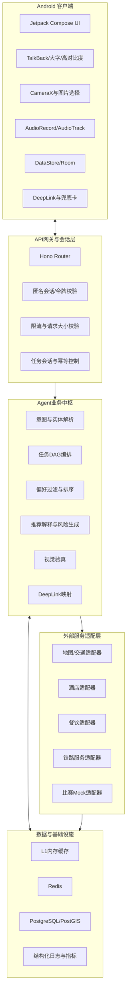
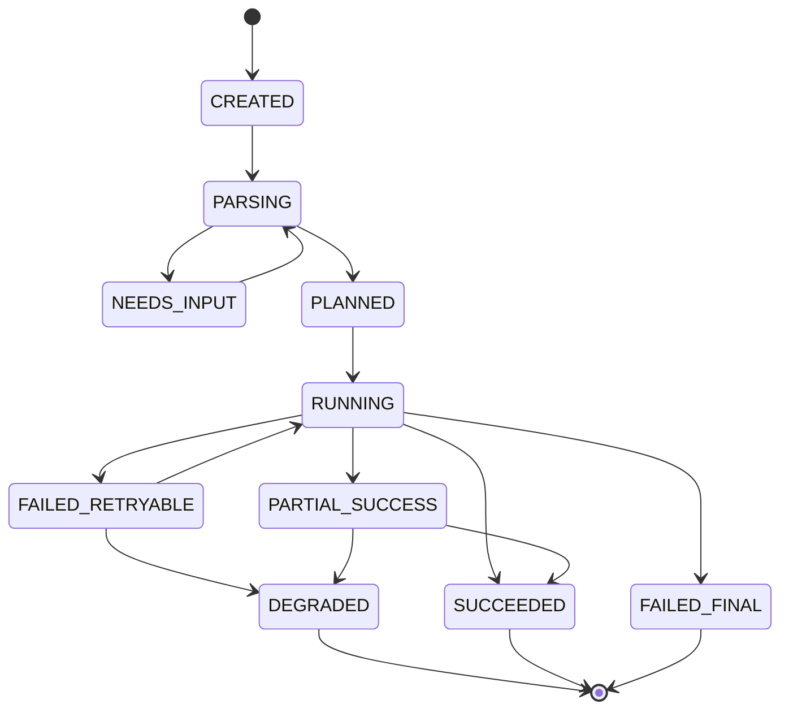
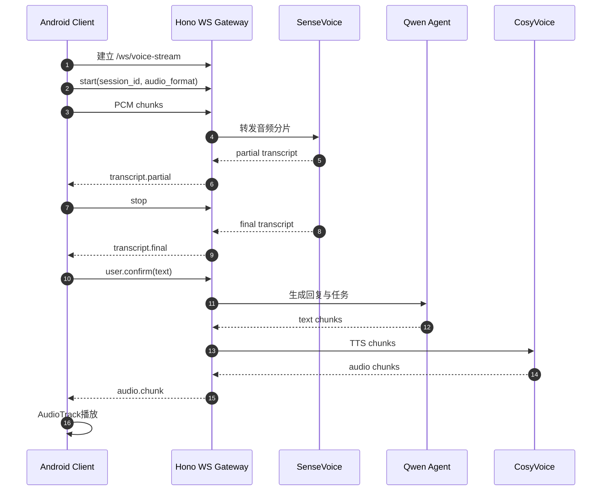
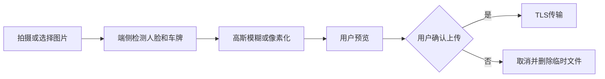

# 跨平台“无障碍生活服务”自动化 Agent 中枢 - 需求规格说明书（PRD）

> **赛题方向**：残健融合：有 AI 无碍  
> **项目定位**：残障人士一站式“吃·住·行”全场景无障碍自动化 Agent 生活中枢  
> **产品载体**：Android 原生 App + Node.js/Hono Agent 服务端  
> **核心能力**：复合需求理解、无障碍偏好匹配、视觉验真、语音交互、跨平台任务编排、失败兜底  
> **文档用途**：指导比赛 Demo 的产品设计、研发实现、联调测试、验收与答辩演示

---

## 0. 文档信息

| 项目 | 内容 |
| :--- | :--- |
| 文档名称 | 跨平台“无障碍生活服务”自动化 Agent 中枢需求规格说明书 |
| 文档版本 | V1.0 |
| 当前阶段 | 比赛 Demo 设计与开发阶段 |
| 目标平台 | Android 10 及以上 |
| 服务端技术 | Node.js 24、Hono、Redis、PostgreSQL/PostGIS（可按 Demo 规模裁剪） |
| AI 能力 | Qwen 系列大模型、Qwen2.5-VL、SenseVoice、CosyVoice |
| 主要用户 | 轮椅用户、视障用户、听障用户、高龄或行动不便用户 |
| 核心场景 | 出行规划、住宿筛选与验真、餐饮筛选与菜单辅助、第三方平台跳转 |
| 验收对象 | 产品负责人、研发团队、测试人员、比赛评委 |

### 0.1 术语说明

| 术语 | 说明 |
| :--- | :--- |
| 无障碍 POI | 带有无障碍设施信息的酒店、餐厅、车站、卫生间等地点 |
| 验真 | 通过现场图片、商家图片或用户上传图片，识别场所是否满足特定无障碍条件 |
| 任务链 | Agent 将一个复合需求拆解为多个可执行子任务后形成的有序任务集合 |
| 服务卡片 | App 中展示某个子任务结果、状态、风险和操作入口的 UI 组件 |
| DeepLink | 用于唤起第三方 App 指定页面的链接或 URL Scheme |
| Mock Adapter | 第三方真实接口不可用时，用于比赛 Demo 的模拟数据适配器 |
| 降级 | 外部服务或 AI 能力失败时，切换到规则、缓存、手动输入或静态数据的处理方式 |
| P0/P1/P2 | P0 为比赛 Demo 必须完成，P1 为时间允许应完成，P2 为生产化扩展 |

---

## 1. 项目背景、目标与成功标准

### 1.1 项目背景

残障人士在“吃、住、行”过程中通常需要在地图、铁路、网约车、酒店、餐饮等多个平台之间反复切换。传统平台主要提供通用信息，缺少对轮椅通行条件、无障碍卫生间、浴室扶手、门槛高度、语音菜单等细粒度信息的统一表达，也缺少跨场景任务衔接和失败后的可恢复机制。

本项目以 Android App 为统一入口，由 Agent 理解用户的自然语言或语音需求，结合用户无障碍偏好，自动生成一组有先后关系的服务卡片，并在第三方平台不可直达时提供复制、悬浮提示、网页打开或人工确认等兜底方式。

### 1.2 核心问题

系统重点解决以下四类问题：

1. **场景割裂**：用户需要跨多个 App 重复填写地点、时间、同行信息和无障碍需求。
2. **信息不可信**：平台中的“无障碍”标签粒度不足，无法说明门宽、门槛、扶手、淋浴条件等关键细节。
3. **交互门槛高**：视障、听障、行动不便用户难以完成复杂表单、扫码菜单、文字阅读或多层页面操作。
4. **链路容易中断**：DeepLink 失败、接口超时、AI 识别失败或网络中断后，用户通常需要从头开始。

### 1.3 产品目标

#### 1.3.1 比赛 Demo 目标

1. 用户可通过文字或语音提交一个包含“吃、住、行”中至少两个场景的复合需求。
2. Agent 能将需求拆解为结构化任务链，并展示任务依赖、推荐理由、风险提示和下一步操作。
3. 用户可上传酒店、餐厅或道路图片，系统输出可解释的无障碍验真结果，并展示置信度与不确定项。
4. 至少完成两个第三方平台的 DeepLink 唤起演示；无法唤起时必须触发可见兜底。
5. App 的关键流程可使用 TalkBack、键盘焦点、大字体和高对比度完成。
6. 任一外部能力失败时，系统不得崩溃、空白或无限加载，必须给出原因、保留已完成结果并提供可操作的替代方案。

#### 1.3.2 生产化远期目标

1. 接入更多真实第三方开放接口，实现实时库存、车次、路线和无障碍服务状态查询。
2. 建立众包验真、商户认证和历史可信度机制。
3. 建立持续监控、风控、审计、数据治理和多区域容灾体系。
4. 在真实用户测试中验证任务完成率、无障碍可用性与信息准确率。

### 1.4 非目标与边界

以下能力不作为比赛 Demo 的强制交付内容：

- 不直接替用户完成支付、购票、酒店下单、网约车下单或身份认证。
- 不承诺第三方平台存在稳定、公开且长期有效的无障碍专用接口。
- 不将 AI 图片判断作为建筑规范鉴定、医疗判断或人身安全保证。
- 不在缺乏真实路况数据时宣称路线绝对无台阶、无陡坡或无施工。
- 不保存用户身份证、银行卡、车票账户密码等高敏感信息。
- 不在后台持续录音、持续拍摄或未经授权上传图像。

### 1.5 成功指标

#### 1.5.1 Demo 验收指标

| 指标 | 目标值 | 测量方式 |
| :--- | :--- | :--- |
| 复合意图拆解成功率 | 预置 20 条测试语句中不低于 90% | 对比预期任务类型、地点、日期和偏好字段 |
| 任务卡片完整率 | 每次任务链必须包含标题、状态、推荐理由、风险、操作入口 | 自动化检查 + 人工验收 |
| VLM 结构化输出成功率 | 预置 15 张图片中不低于 90% 返回合法 JSON | 接口日志与测试报告 |
| 异常可恢复率 | 预置异常用例 100% 有明确提示和替代操作 | 故障注入测试 |
| 核心流程崩溃率 | 0 | 端到端测试 |
| TalkBack 可操作率 | P0 页面关键控件 100% 可聚焦且有语义标签 | 人工无障碍测试 |
| Demo 任务完成时间 | 从提交需求到展示首批任务卡片不超过 8 秒 | 客户端埋点 |

#### 1.5.2 远期生产指标

| 指标 | 目标 |
| :--- | :--- |
| 核心 API P95 | 不高于 1.5 秒（不含第三方慢请求） |
| 任务链生成成功率 | 不低于 99% |
| 缓存命中率 | 不低于 85% |
| 服务可用性 | 不低于 99.9% |
| 验真结果人工复核一致率 | 不低于 90% |

---

## 2. 用户、角色与典型场景

### 2.1 目标用户

#### 2.1.1 轮椅用户

核心关注点包括无台阶入口、坡度、门宽、通道宽度、无障碍卫生间、平地淋浴、扶手、低位设施和上下车接驳。

#### 2.1.2 视障或低视力用户

核心关注点包括语音输入、语音播报、TalkBack 顺序、图片内容描述、菜单朗读、大字模式、高对比度和操作反馈。

#### 2.1.3 听障用户

核心关注点包括实时文字转写、视觉提示、字幕、震动反馈、可展示给服务人员的结构化需求卡。

#### 2.1.4 高龄或临时行动不便用户

核心关注点包括简化操作、较少步骤、清晰提示、大按钮、避免复杂授权和可随时求助。

### 2.2 用户角色

| 角色 | 权限与职责 |
| :--- | :--- |
| 普通用户 | 创建偏好、发起任务、上传图片、查看推荐、跳转第三方平台、反馈结果 |
| 演示管理员 | 切换真实/Mock 数据源、注入异常、查看演示日志、重置 Demo 数据 |
| 运营管理员（P2） | 审核 POI、处理用户反馈、维护 DeepLink 模板、管理黑白名单 |

### 2.3 典型用户故事

1. 作为轮椅用户，我希望一次说出出差需求，系统自动拆分高铁、接驳、酒店和餐厅任务，避免跨平台重复输入。
2. 作为视障用户，我希望通过语音完成查询，并让系统朗读每个推荐的关键无障碍条件和风险。
3. 作为听障用户，我希望语音内容同步显示为文字，并能生成一张需求卡给司机、酒店或餐厅工作人员查看。
4. 作为用户，我希望看到“已验证”“用户反馈”“平台自报”“AI 推测”等信息来源，而不是只看到一个笼统的无障碍标签。
5. 作为用户，我希望第三方 App 跳转失败后仍能保留目的地、车次和要求，并通过复制或网页继续操作。

---

## 3. 场景与痛点拆解



### 3.1 行：无障碍交通

- 传统路线规划通常不包含坡度、台阶、无障碍电梯实时状态等信息。
- 铁路重点旅客服务、网约车、步行导航和酒店入住信息分散。
- 用户到达现场后发现道路不可通行时，缺少快速重新规划和人工求助入口。

### 3.2 吃：无障碍餐饮

- 餐厅入口台阶、桌椅间距和卫生间条件通常没有结构化数据。
- 纸质或扫码菜单可能不适合视障用户。
- 听障用户可能难以口头表达过敏、忌口、座位或通行需求。

### 3.3 住：无障碍住宿

- “无障碍客房”标签可能未覆盖门宽、门槛、淋浴、扶手和洗手台空间等细节。
- 商家图片拍摄角度有限，AI 只能识别可见内容，不能推断未展示设施。
- 真实房型、库存和无障碍设施状态可能随时间变化，需要明确数据更新时间。

---

## 4. Demo 范围与优先级

### 4.1 P0：必须完成

| 编号 | 功能 | 最小交付物 |
| :--- | :--- | :--- |
| P0-01 | 无障碍偏好档案 | 完成首次设置、编辑、保存、用于推荐过滤 |
| P0-02 | 文字复合需求输入 | 能输入一段自然语言并提交 |
| P0-03 | 语音输入与文字回显 | 录音、识别、可编辑识别结果、重新提交 |
| P0-04 | Agent 意图解析与任务拆解 | 输出结构化任务链，支持吃、住、行至少三类任务 |
| P0-05 | 服务卡片链 | 展示状态、推荐、来源、风险、操作和失败信息 |
| P0-06 | 酒店/餐厅/道路图片验真 | 上传图片并得到结构化判断、置信度和不确定项 |
| P0-07 | 第三方 DeepLink | 至少两类平台可演示跳转，并具备失败检测 |
| P0-08 | 复制与网页兜底 | 跳转失败后可复制关键信息或打开备选网页 |
| P0-09 | 无障碍 UI | TalkBack 标签、焦点顺序、大字、高对比度、足够触控区域 |
| P0-10 | 异常处理 | 网络、AI、图片、语音、第三方跳转、权限等异常均有处理 |
| P0-11 | 演示模式 | 可固定数据、切换 Mock、注入异常、重置任务 |
| P0-12 | 日志与关键埋点 | 可查看任务 ID、阶段耗时、错误码和降级路径 |

### 4.2 P1：时间允许应完成

- 菜单图片识别、菜品结构化与语音朗读。
- 用户反馈“实际可通行/不可通行”，形成验真记录。
- 历史任务列表和一键重新执行。
- 卡片排序、收藏和分享。
- 听障沟通卡：将特殊需求以大字卡片展示给服务人员。
- 离线缓存最近一次任务结果。

### 4.3 P2：生产化扩展

- 真实库存与订单接口、商户认证、众包审核、信誉评分。
- 路线实时障碍上报与社区协同。
- 多城市、多语言和多终端适配。
- 运营后台、内容审核、风险控制、审计报表和多活容灾。

### 4.4 Demo 数据接入策略

第三方平台是否提供公开、稳定且可用于比赛环境的接口存在不确定性，因此每个外部服务必须实现统一适配器接口，并支持以下三种模式：

1. **REAL**：使用已获得授权和凭证的真实 API。
2. **MOCK**：使用本地或服务端固定数据，保证比赛现场稳定演示。
3. **DEEPLINK_ONLY**：不查询真实库存，仅生成跳转链接和待填写信息。

禁止在未实际接入的情况下向评委宣称已经完成真实下单、真实购票或实时无障碍车辆调度。

---

## 5. 核心业务流程

### 5.1 复合需求主流程



### 5.2 图片验真流程



### 5.3 语音交互流程

1. 用户点击并明确授权麦克风后开始录音。
2. 客户端显示录音状态、时长、停止按钮和实时音量提示。
3. SenseVoice 返回中间结果时仅用于回显；最终结果返回后进入可编辑文本框。
4. 用户确认后才提交给 Agent，避免误识别直接触发任务。
5. Agent 输出文本后，客户端按句切分并流式播报。
6. 用户可随时暂停、继续或关闭播报。
7. 麦克风权限拒绝、识别超时或环境噪声过大时，自动切换文字输入。

### 5.4 第三方跳转流程

1. 服务端生成经过白名单校验的 DeepLink 和备用 Web URL。
2. Android 使用 `resolveActivity` 检查是否存在可处理目标链接的应用。
3. 可处理时发起跳转，并在返回 App 后提示用户确认是否完成。
4. 不可处理或抛出异常时，复制结构化信息并展示备用操作。
5. 兜底卡必须包含目标平台、目的地/车次、日期、无障碍需求和手动操作步骤。

---

## 6. 系统总体架构

### 6.1 分层架构



### 6.2 核心设计原则

- **适配器隔离**：Agent 不直接依赖第三方响应格式。
- **结构化优先**：LLM 输出必须经过 JSON Schema 校验，不将自由文本直接驱动高风险操作。
- **用户确认**：涉及跳转、上传、定位、复制敏感内容时必须有明确确认。
- **可恢复**：任务、卡片和外部请求均有状态，失败不清空已完成结果。
- **信息来源透明**：推荐结果必须展示数据来源和更新时间。
- **AI 不确定性可见**：低置信度、图片不可见区域和推测内容必须显式提示。

### 6.3 任务状态模型



| 状态 | 含义 | 客户端表现 |
| :--- | :--- | :--- |
| CREATED | 已创建任务 | 显示“正在准备” |
| PARSING | 正在解析需求 | 展示流式进度 |
| NEEDS_INPUT | 缺少必要信息 | 展示一个明确的补充问题 |
| PLANNED | 已生成任务计划 | 展示任务清单骨架 |
| RUNNING | 正在执行子任务 | 每张卡片独立加载 |
| PARTIAL_SUCCESS | 部分子任务成功 | 保留成功卡片并标记失败项 |
| SUCCEEDED | 全部完成 | 允许执行卡片操作 |
| FAILED_RETRYABLE | 可重试失败 | 提供重试按钮并显示次数 |
| DEGRADED | 已使用降级数据 | 显示“演示/缓存/手动模式”标签 |
| FAILED_FINAL | 无法继续 | 给出原因、手动方案和返回入口 |

---

## 7. 功能需求详细说明

## 7.1 用户无障碍偏好档案

### 7.1.1 功能说明

用户首次进入时可选择跳过，也可创建无障碍偏好。偏好只用于筛选与排序，不用于推断用户医疗状况。

### 7.1.2 字段定义

```typescript
export interface UserProfile {
  userId: string;
  profileVersion: number;
  accessibilityMode: Array<
    | 'wheelchair_manual'
    | 'wheelchair_electric'
    | 'visually_impaired'
    | 'low_vision'
    | 'hearing_impaired'
    | 'elderly'
    | 'temporary_mobility_limitation'
  >;
  mobility: {
    requireStepFreeEntrance: boolean;
    maxObstacleHeightCm?: number;
    minAisleWidthCm?: number;
    minDoorWidthCm?: number;
    avoidSteepSlope: boolean;
    requireElevator: boolean;
  };
  dining: {
    requireAccessibleRestroom: boolean;
    needVoiceMenu: boolean;
    needLargeTextMenu: boolean;
    dietaryNotes?: string;
  };
  lodging: {
    requireRollInShower: boolean;
    requireGrabBars: boolean;
    requireBasinLegClearance: boolean;
    requireLowSwitches: boolean;
  };
  interaction: {
    preferVoiceInput: boolean;
    preferVoiceOutput: boolean;
    largeText: boolean;
    highContrast: boolean;
    hapticFeedback: boolean;
  };
  updatedAt: string;
}
```

### 7.1.3 交互要求

- 每项偏好说明其对推荐结果的影响。
- 必选项不超过 3 个，其余均可跳过。
- 数值字段提供合理默认值和范围校验。
- 支持“严格匹配”和“优先满足”两种模式。
- 严格匹配无结果时，不直接展示不满足结果，先询问是否放宽条件。

### 7.1.4 验收标准

- 保存后重新进入页面，字段值保持一致。
- 修改偏好后，新任务使用最新版本，历史任务保留当时的偏好快照。
- TalkBack 能读出字段名称、当前值和控件类型。
- 未创建档案时仍可使用系统，推荐卡片标记“未应用个性化偏好”。

---

## 7.2 文字与语音需求输入

### 7.2.1 功能说明

首页提供文字输入框、语音按钮、常用示例和最近任务入口。用户可输入单一或复合需求。

### 7.2.2 输入校验

- 空输入不可提交。
- 最大长度 1000 个字符。
- 语音单次最长 60 秒，达到上限自动停止并提示。
- 输入包含日期但缺少年份时，按当前时间推断，并在卡片中展示具体日期供用户确认。
- 输入含“帮我订”“直接下单”等表达时，系统只能生成跳转或操作建议，不得宣称已经完成交易。

### 7.2.3 语音实现要求

- 音频格式：16kHz、16bit、mono PCM，或按云服务要求转换。
- 采用 WebSocket 流式上传；网络不稳定时允许切换为录制完成后一次上传。
- 中间识别结果与最终识别结果使用不同样式。
- 最终文本必须可编辑。
- 录音开始、暂停、结束均有视觉和震动反馈。

### 7.2.4 验收标准

- 麦克风权限允许后可正常开始和停止录音。
- 权限拒绝时不循环弹窗，展示“去设置”和“改用文字输入”。
- 识别失败后保留录音失败状态，不提交空任务。
- 用户修改识别文本后，Agent 使用修改后的内容。

---

## 7.3 Agent 意图解析与任务拆解

### 7.3.1 支持意图

| 一级意图 | 二级意图 |
| :--- | :--- |
| 行 | 高铁信息、站内重点旅客服务、网约车、步行/轮椅路线、接驳规划 |
| 住 | 酒店搜索、无障碍条件筛选、客房图片验真、跳转预订 |
| 吃 | 餐厅搜索、无障碍条件筛选、菜单识别、语音菜单、沟通卡 |
| 通用 | 修改条件、重新规划、查看风险、解释推荐、反馈验真结果 |

### 7.3.2 结构化输出

```json
{
  "request_id": "req_xxx",
  "language": "zh-CN",
  "entities": {
    "origin": "南昌",
    "destination": "上海",
    "start_date": "2026-08-14",
    "end_date": "2026-08-16",
    "area": "人民广场",
    "cuisine": "本帮菜"
  },
  "constraints": {
    "step_free": true,
    "accessible_restroom": true,
    "min_door_width_cm": 85
  },
  "missing_required_fields": [],
  "tasks": [
    {"task_id": "t1", "type": "rail", "depends_on": []},
    {"task_id": "t2", "type": "hotel", "depends_on": ["t1"]},
    {"task_id": "t3", "type": "dining", "depends_on": ["t2"]},
    {"task_id": "t4", "type": "ride_hailing", "depends_on": ["t1", "t2"]}
  ]
}
```

### 7.3.3 解析规则

- 所有日期转换为 ISO 8601 绝对日期。
- 地点区分出发地、目的地、住宿区域和餐饮区域。
- 用户明确提出的条件优先级高于偏好档案。
- 条件冲突时不得自行选择，需生成澄清问题。
- 缺少非关键字段时使用默认值，但必须在结果中提示。
- LLM 输出必须通过 JSON Schema 校验；失败后最多修复一次，仍失败则切换规则解析。

### 7.3.4 验收标准

- 预置复合语句能正确生成 2—5 个任务。
- 每个任务具有唯一 ID、类型、依赖关系、执行状态和输入参数。
- 输入修改后可创建新版本，不覆盖原任务日志。
- LLM 返回非法 JSON 时不会导致服务端 500 或客户端崩溃。

---

## 7.4 任务链与服务卡片

### 7.4.1 卡片公共字段

```typescript
export interface ServiceCard {
  cardId: string;
  taskId: string;
  category: 'rail' | 'ride' | 'route' | 'hotel' | 'dining' | 'verification';
  title: string;
  status: 'loading' | 'ready' | 'warning' | 'failed' | 'degraded';
  summary: string;
  matchedAccessibilityFeatures: string[];
  unmetAccessibilityFeatures: string[];
  evidence: EvidenceItem[];
  sourceType: 'official_api' | 'merchant' | 'user_verified' | 'ai_inferred' | 'mock';
  sourceUpdatedAt?: string;
  riskLevel: 'low' | 'medium' | 'high' | 'unknown';
  riskMessage?: string;
  primaryAction?: CardAction;
  secondaryActions: CardAction[];
}
```

### 7.4.2 展示要求

每张卡片至少展示：

- 当前状态。
- 结果名称与简要说明。
- 满足的无障碍条件。
- 未满足或未知的条件。
- 信息来源、更新时间和是否为 Mock。
- 推荐理由。
- 风险等级和风险说明。
- 主操作与至少一个替代操作。

### 7.4.3 排序规则

推荐分数由以下部分组成：

- 无障碍硬条件匹配：50%。
- 距离与时间：20%。
- 信息可信度：20%。
- 用户偏好和历史反馈：10%。

存在任一严格硬条件不满足时，该结果不得进入默认推荐前三名。若全部结果都不满足，展示“暂无完全匹配”，并按缺口最少排序。

### 7.4.4 验收标准

- 一个子任务失败不影响其他卡片展示。
- 卡片加载超过 3 秒时展示进度说明，而不是仅显示转圈。
- Mock 数据必须显示“演示数据”标签。
- 信息来源为 AI 推断时，必须显示“请现场确认”。

---

## 7.5 无障碍 POI 搜索与匹配

### 7.5.1 输入

- 用户当前位置或指定区域。
- POI 类型：酒店、餐厅、车站、卫生间。
- 无障碍偏好与本次任务约束。
- 距离、价格、时间或菜系等普通筛选条件。

### 7.5.2 输出

- POI 基础信息。
- 经纬度与距离。
- 无障碍特征列表。
- 数据来源和更新时间。
- 匹配与未匹配条件。
- 可信度分数。
- 图片验真入口。

### 7.5.3 数据可信度等级

| 等级 | 来源 | 展示文案 |
| :--- | :--- | :--- |
| A | 官方或经审核认证 | 已认证 |
| B | 多名用户近期一致反馈 | 用户近期验证 |
| C | 单次用户反馈或商家自报 | 待进一步确认 |
| D | AI 根据图片推断 | AI 图片判断，请现场确认 |
| E | Mock 数据 | 比赛演示数据 |

### 7.5.4 无结果处理

- 展示未满足的具体条件。
- 提供放宽距离、价格或非关键偏好的选项。
- 严格条件只能由用户主动放宽。
- 仍无结果时提供人工电话确认清单或可复制询问模板。

---

## 7.6 Qwen2.5-VL 图片验真

### 7.6.1 支持场景

| 场景 | 必须识别字段 |
| :--- | :--- |
| 餐厅入口 | 台阶数量、是否有坡道、入口是否可见、是否建议现场确认 |
| 餐厅内部 | 过道是否可能通行、桌椅拥挤程度、可见障碍物 |
| 餐厅卫生间 | 扶手、门槛、可见空间、是否完整展示 |
| 酒店客房 | 房门、通道、低位设施、可见空间 |
| 酒店浴室 | 扶手、平地淋浴、门槛、淋浴凳、洗手台下留空 |
| 道路 | 台阶、施工、路障、积水、陡坡迹象、电梯关闭提示 |
| 菜单 | 菜名、价格、主要成分、过敏风险提示（仅识别，不作医疗保证） |

### 7.6.2 图片预处理

- 支持 JPEG、PNG、WebP。
- 单张原图不超过 10MB。
- 长边压缩到不超过 1920px，JPEG 质量建议 80%—85%。
- 端侧识别人脸和车牌并进行模糊化；用户可预览脱敏结果后再上传。
- 室内验真建议上传整体图和细节图两张。
- 图片过暗、过曝、模糊或遮挡严重时，先提示重拍，不直接输出肯定结论。

### 7.6.3 结构化返回

```json
{
  "scene": "hotel_bathroom",
  "visible": {
    "grab_bars": true,
    "roll_in_shower": false,
    "threshold_present": true,
    "basin_leg_clearance": null
  },
  "confidence": 0.86,
  "evidence": [
    "右侧墙面可见横向扶手",
    "淋浴区入口可见凸起门槛"
  ],
  "unknown_items": [
    "洗手台下方未完整拍摄"
  ],
  "risk_level": "high",
  "recommendation": "不建议仅凭该图片确认可供轮椅独立使用，请联系酒店核实门槛高度和洗手台空间。"
}
```

### 7.6.4 置信度规则

- `confidence >= 0.85`：可展示“较高置信度”，仍需保留 AI 判断提示。
- `0.60 <= confidence < 0.85`：展示“存在不确定性”，建议补拍。
- `confidence < 0.60`：不得输出“可通行/不可通行”的确定结论，只展示可见事实和重拍建议。
- 对图片未覆盖区域必须返回 `unknown`，禁止模型自行补全。

### 7.6.5 调用与重试

- 客户端上传超时：15 秒。
- VLM 请求超时：20 秒。
- 网络或 5xx 最多自动重试 1 次，间隔 1 秒并增加随机抖动。
- 4xx、图片违规、格式错误不自动重试。
- 结构化解析失败时执行一次 JSON 修复；仍失败则返回人工检查清单。

### 7.6.6 验收标准

- 返回内容包含可见事实、未知项、置信度、风险和建议。
- 模型低置信度时不输出确定结论。
- 图片上传过程中退出页面，可取消请求且不继续后台上传。
- 服务失败时保留图片本地状态，并允许重新提交或删除。

---

## 7.7 SenseVoice 与 CosyVoice 流式语音

### 7.7.1 时序



### 7.7.2 WebSocket 消息类型

| 方向 | 类型 | 说明 |
| :--- | :--- | :--- |
| Client → Server | `audio.start` | 会话、采样率、编码格式 |
| Client → Server | `audio.chunk` | 二进制音频分片 |
| Client → Server | `audio.stop` | 停止录音 |
| Client → Server | `user.confirm` | 确认最终识别文本 |
| Server → Client | `transcript.partial` | 中间识别结果 |
| Server → Client | `transcript.final` | 最终识别结果 |
| Server → Client | `agent.progress` | 解析、查询、排序等进度 |
| Server → Client | `tts.chunk` | 音频分片 |
| Server → Client | `error` | 错误码、可重试性和替代方案 |

### 7.7.3 性能目标

比赛 Demo 中采用以下可验收目标：

- 语音中间文字首包不超过 1.5 秒。
- 用户确认文本后，Agent 首个可见进度不超过 1 秒。
- TTS 首包目标不超过 1 秒；350ms 作为优化目标，不作为 Demo 阻断验收项。
- 播报可被用户立即暂停或关闭。

---

## 7.8 跨平台 DeepLink 与兜底

### 7.8.1 适配器定义

```typescript
export interface PlatformLinkAdapter {
  platform: string;
  canBuild(action: string): boolean;
  buildDeepLink(input: Record<string, unknown>): string | null;
  buildWebUrl(input: Record<string, unknown>): string | null;
  buildClipboardText(input: Record<string, unknown>): string;
  validate(input: Record<string, unknown>): ValidationResult;
}
```

### 7.8.2 链接配置

所有 Scheme、App ID、页面路径和参数必须通过服务端配置中心或本地配置文件维护，不得散落硬编码。比赛前逐条在目标设备验证。文档中的链接模板视为候选配置，不视为长期有效承诺。

| 平台类型 | Demo 行为 | 失败兜底 |
| :--- | :--- | :--- |
| 地图导航 | 传入目的地经纬度并唤起地图 | 打开 Web 地图、复制地址 |
| 网约车 | 唤起打车页面或平台首页 | 复制上下车地点与无障碍需求 |
| 铁路服务 | 唤起 12306 或相关服务页面 | 复制车次、日期、联系人和重点旅客需求 |
| 酒店 | 唤起酒店详情页或搜索页 | 打开网页、复制酒店与房型要求 |
| 餐饮 | 唤起门店详情页 | 打开网页、复制店名和无障碍要求 |

### 7.8.3 安全要求

- 仅允许白名单协议和白名单域名。
- 所有参数进行 URL 编码。
- 禁止将模型原始输出直接拼接为 Scheme。
- 禁止在链接中放置身份证、手机号、精确家庭住址等高敏感数据。
- 跳转前展示目标平台和将要传递的主要信息。

### 7.8.4 失败检测与兜底顺序

1. 检查目标 App 是否安装。
2. 尝试 DeepLink。
3. 捕获 `ActivityNotFoundException` 或解析异常。
4. 若存在 Web URL，则提示打开网页。
5. 自动生成剪贴板文本，但仅在用户点击“复制”后写入剪贴板。
6. 可选展示悬浮卡片；首次使用前说明用途并请求悬浮窗权限。
7. 用户拒绝悬浮窗权限时，不影响复制和网页兜底。

### 7.8.5 验收标准

- 目标 App 未安装时不崩溃。
- 链接配置错误时展示错误卡片和备用操作。
- 用户点击复制后显示复制成功反馈，并可在 60 秒后提示清除敏感剪贴板内容。
- 返回本 App 后任务状态和卡片内容仍然保留。

---

## 7.9 结果解释、风险提示与用户确认

### 7.9.1 风险等级

| 等级 | 条件示例 | 展示要求 |
| :--- | :--- | :--- |
| 低 | 多来源一致且近期验证 | 正常展示，仍标注来源 |
| 中 | 单一来源、更新时间较旧、部分条件未知 | 黄色提示并建议电话确认 |
| 高 | 发现台阶、门槛、无扶手或信息冲突 | 红色提示，默认不作为首选 |
| 未知 | 无图片、无结构化信息或模型低置信度 | 不作可通行承诺 |

### 7.9.2 禁止表达

系统不得使用以下无条件承诺式表达：

- “绝对可以通行”。
- “已经成功预订/购票”，除非真实接口明确返回成功凭证。
- “该路线完全安全”。
- “该酒店一定符合所有无障碍标准”。

推荐表达应包含事实依据、未知项和建议确认方式。

---

## 7.10 历史任务与恢复

### 7.10.1 P0 最小实现

- 任务执行期间将 `session_id`、任务状态和已生成卡片保存在本地。
- App 切后台或短时断网后重新进入，可恢复最近一次未结束任务。
- 服务端使用任务 ID 保证重复请求幂等。

### 7.10.2 幂等规则

- 创建任务接口接收 `Idempotency-Key`。
- 相同用户、相同 Key 在 10 分钟内重复提交，返回同一任务。
- 图片验真和外部查询均记录子请求 ID，防止客户端重连后重复计费或重复执行。

---

## 7.11 演示模式

### 7.11.1 功能说明

为了保证现场演示稳定，App 提供仅在 Demo 构建中可见的演示控制面板。

### 7.11.2 控制项

- 数据源：自动、真实、Mock。
- 网络环境：正常、慢速、断网。
- AI 状态：正常、超时、非法 JSON、低置信度。
- DeepLink：成功、目标未安装、链接无效。
- 一键加载上海出差示例。
- 一键重置缓存和任务。

### 7.11.3 安全限制

演示控制面板不得出现在生产构建中；通过 `BuildConfig.DEMO_MODE` 或独立 product flavor 控制。

---

## 8. 页面与交互清单

| 页面 | P级 | 主要内容 | 关键操作 |
| :--- | :--- | :--- | :--- |
| 启动与隐私说明 | P0 | 数据用途、非安全保证、权限说明 | 同意、查看详情、退出 |
| 首页 | P0 | 输入框、语音按钮、示例、最近任务 | 输入、录音、提交 |
| 偏好档案 | P0 | 无障碍需求、交互偏好 | 保存、跳过、恢复默认 |
| 任务进度页 | P0 | Agent 阶段、任务链骨架 | 取消、重试、补充信息 |
| 结果卡片页 | P0 | 吃住行卡片、来源、风险 | 展开、跳转、复制、重新规划 |
| 图片验真页 | P0 | 拍照/选图、脱敏预览、场景选择 | 上传、重拍、删除 |
| 验真结果页 | P0 | 证据、未知项、置信度、建议 | 补拍、纠错、返回卡片 |
| 无障碍设置 | P0 | 大字、高对比度、语音、震动 | 开关与预览 |
| 历史任务 | P1 | 历史任务与状态 | 查看、重新执行、删除 |
| 听障沟通卡 | P1 | 大字需求卡 | 编辑、全屏展示、复制 |
| Demo 控制面板 | P0 | 数据源和故障注入 | 切换、重置、加载脚本 |

### 8.1 无障碍交互规范

- 关键按钮触控区域不小于 48dp × 48dp。
- 文本支持系统字体缩放至 200%，不截断关键内容。
- 不仅依赖颜色表达状态，必须同时使用图标和文字。
- 焦点顺序与视觉顺序一致。
- 卡片标题、状态、风险和按钮均有独立语义。
- 动态更新区域通过可控的无障碍播报提示，避免频繁打断。
- 录音、加载、成功和失败均提供视觉反馈；用户启用时提供震动反馈。
- 动画支持“减少动态效果”设置。

---

## 9. API 设计

### 9.1 通用响应结构

```json
{
  "request_id": "req_xxx",
  "code": "OK",
  "message": "success",
  "data": {},
  "error": null,
  "timestamp": "2026-08-06T12:00:00Z"
}
```

### 9.2 接口清单

| 方法 | 路径 | 功能 | P级 |
| :--- | :--- | :--- | :--- |
| POST | `/api/v1/sessions` | 创建匿名会话 | P0 |
| GET | `/api/v1/profile` | 获取偏好档案 | P0 |
| PUT | `/api/v1/profile` | 保存偏好档案 | P0 |
| POST | `/api/v1/tasks` | 创建 Agent 任务 | P0 |
| GET | `/api/v1/tasks/:taskId` | 获取任务状态与卡片 | P0 |
| POST | `/api/v1/tasks/:taskId/input` | 补充澄清信息 | P0 |
| POST | `/api/v1/tasks/:taskId/retry` | 重试失败子任务 | P0 |
| POST | `/api/v1/tasks/:taskId/cancel` | 取消任务 | P0 |
| GET | `/api/v1/tasks/:taskId/events` | SSE 推送任务进度 | P0 |
| WS | `/ws/voice-stream` | 流式语音识别与播报 | P0 |
| POST | `/api/v1/verifications/images` | 创建图片验真任务 | P0 |
| GET | `/api/v1/verifications/:id` | 获取验真结果 | P0 |
| POST | `/api/v1/links/resolve` | 生成 DeepLink 与兜底信息 | P0 |
| POST | `/api/v1/feedback/poi` | 提交 POI 纠错反馈 | P1 |
| GET | `/api/v1/demo/scenarios` | 获取 Demo 场景 | P0，Demo 构建限定 |

### 9.3 创建任务请求示例

```json
{
  "input_type": "text",
  "content": "我下周五去上海出差两天，住人民广场附近方便轮椅的酒店，晚上找一家无障碍方便的本帮菜，顺便规划高铁和打车。",
  "profile_version": 3,
  "client_timezone": "Asia/Taipei",
  "data_mode": "AUTO"
}
```

### 9.4 错误响应示例

```json
{
  "request_id": "req_xxx",
  "code": "AI_OUTPUT_INVALID",
  "message": "暂时无法解析完整需求，已切换到基础解析模式。",
  "data": {
    "degraded": true,
    "available_actions": ["edit_input", "retry"]
  },
  "error": {
    "retryable": true,
    "retry_after_ms": 1000
  },
  "timestamp": "2026-08-06T12:00:00Z"
}
```

### 9.5 API 通用要求

- 所有请求生成 `request_id` 并贯穿日志。
- 创建类请求支持幂等键。
- 单个请求体默认不超过 1MB；图片走独立上传接口。
- API 返回稳定错误码，不将第三方原始错误直接暴露给客户端。
- 所有时间使用 ISO 8601，服务端存 UTC，客户端按用户时区展示。
- 超时、重试、缓存和降级策略按接口类型配置。

---

## 10. 数据模型与存储

### 10.1 核心实体

- `user_profile`：用户偏好及版本。
- `agent_session`：会话与上下文。
- `agent_task`：主任务。
- `agent_subtask`：吃住行子任务和依赖。
- `service_card`：展示结果快照。
- `accessible_poi`：POI 与无障碍特征。
- `verification_record`：图片验真结构化结果，不保存原图。
- `platform_link_config`：DeepLink 模板和白名单。
- `user_feedback`：纠错和现场反馈。
- `audit_event`：关键操作审计事件。

### 10.2 POI 表结构

```sql
CREATE TABLE accessible_pois (
    id VARCHAR(64) PRIMARY KEY,
    name VARCHAR(128) NOT NULL,
    category VARCHAR(32) NOT NULL,
    location GEOMETRY(Point, 4326) NOT NULL,
    address TEXT,
    door_width_cm INT,
    aisle_width_cm INT,
    entrance_step_count INT,
    has_ramp BOOLEAN,
    has_elevator BOOLEAN,
    has_accessible_restroom BOOLEAN,
    has_grab_bars BOOLEAN,
    has_roll_in_shower BOOLEAN,
    has_basin_leg_clearance BOOLEAN,
    source_type VARCHAR(32) NOT NULL,
    confidence NUMERIC(4,3),
    source_updated_at TIMESTAMPTZ,
    verified_at TIMESTAMPTZ,
    created_at TIMESTAMPTZ DEFAULT CURRENT_TIMESTAMP,
    updated_at TIMESTAMPTZ DEFAULT CURRENT_TIMESTAMP
);

CREATE INDEX idx_accessible_pois_geo
ON accessible_pois USING GIST (location);
```

### 10.3 验真记录

```sql
CREATE TABLE verification_records (
    id VARCHAR(64) PRIMARY KEY,
    poi_id VARCHAR(64),
    scene VARCHAR(32) NOT NULL,
    result_json JSONB NOT NULL,
    confidence NUMERIC(4,3),
    risk_level VARCHAR(16),
    model_name VARCHAR(64),
    prompt_version VARCHAR(32),
    image_hash VARCHAR(128),
    original_media_stored BOOLEAN DEFAULT FALSE,
    created_at TIMESTAMPTZ DEFAULT CURRENT_TIMESTAMP
);
```

### 10.4 缓存设计

| 缓存 | Key 示例 | TTL | 说明 |
| :--- | :--- | :--- | :--- |
| L1 内存 | `poi:geo6:type:filtersHash` | 60 秒 | 热点查询 |
| Redis POI | `poi:{id}` | 30 分钟 | POI 详情 |
| Redis 查询 | `search:{geoHash}:{type}:{filtersHash}` | 5 分钟 | 搜索结果 |
| Agent 会话 | `session:{sessionId}` | 2 小时 | 短期上下文 |
| 任务状态 | `task:{taskId}` | 24 小时 | 任务恢复 |
| DeepLink 配置 | `linkconfig:{platform}` | 10 分钟 | 平台链接模板 |

### 10.5 数据一致性

- 数据库为最终事实来源，缓存仅用于加速。
- POI 更新后删除对应详情缓存，并通过版本号使搜索缓存失效。
- 删除缓存失败时写入短 TTL 和失效版本，避免长期读取旧数据。
- 卡片保存结果快照，保证历史任务可复现当时推荐依据。

---

## 11. 异常处理与降级设计

### 11.1 错误码规范

| 错误码 | 场景 | 是否可重试 | 用户提示 | 系统处理 |
| :--- | :--- | :--- | :--- | :--- |
| `NETWORK_OFFLINE` | 客户端断网 | 是 | 当前网络不可用，可查看已缓存结果 | 读取本地缓存 |
| `REQUEST_TIMEOUT` | 请求超时 | 是 | 请求超时，可重试 | 指数退避，最多 1—2 次 |
| `RATE_LIMITED` | 被限流 | 是 | 请求较多，请稍后重试 | 返回重试时间 |
| `INVALID_INPUT` | 输入为空或非法 | 否 | 请补充有效需求 | 不创建任务 |
| `MISSING_REQUIRED_FIELD` | 缺少地点或日期 | 否 | 需要补充一个关键信息 | 进入 NEEDS_INPUT |
| `AI_UNAVAILABLE` | LLM 服务不可用 | 是 | 智能解析暂不可用，已切换基础模式 | 规则解析/Mock |
| `AI_OUTPUT_INVALID` | JSON 非法 | 是 | 解析结果异常，正在使用基础模式 | 修复一次后降级 |
| `VLM_LOW_CONFIDENCE` | 图片置信度低 | 否 | 图片不足以判断，请补拍 | 返回未知项 |
| `IMAGE_TOO_LARGE` | 图片过大 | 否 | 图片过大，请压缩或重选 | 客户端压缩/拒绝上传 |
| `IMAGE_BLURRY` | 图片模糊 | 否 | 图片不清晰，请重拍 | 不调用或不采纳结论 |
| `MIC_PERMISSION_DENIED` | 麦克风权限拒绝 | 否 | 可改用文字输入 | 不重复强制申请 |
| `CAMERA_PERMISSION_DENIED` | 相机权限拒绝 | 否 | 可从相册选择图片 | 提供替代入口 |
| `DEEPLINK_UNSUPPORTED` | App 未安装或 Scheme 不支持 | 否 | 无法直接打开，已提供备用方式 | Web/复制兜底 |
| `THIRD_PARTY_UNAVAILABLE` | 外部平台不可用 | 是 | 平台暂不可用，展示缓存或演示数据 | 读缓存/Mock |
| `NO_MATCH_FOUND` | 无满足条件结果 | 否 | 暂无完全匹配，可选择放宽条件 | 展示缺口与替代方案 |
| `SESSION_EXPIRED` | 会话过期 | 否 | 会话已过期，可恢复本地结果或新建任务 | 新建会话 |
| `INTERNAL_ERROR` | 未知服务错误 | 视情况 | 服务暂时异常，请重试 | 记录错误并隐藏堆栈 |

### 11.2 异常处理原则

1. **局部失败不影响整体**：交通查询失败时，酒店和餐饮结果仍继续展示。
2. **已完成结果不丢失**：重试仅针对失败子任务。
3. **提示必须可行动**：每个错误至少提供“重试、修改、手动继续、返回”中的一个。
4. **不无限重试**：自动重试次数有上限，防止重复计费和长时间等待。
5. **不暴露技术细节**：客户端不展示堆栈、API Key 或第三方原始错误。
6. **降级可见**：使用缓存、规则或 Mock 时必须显示标签。
7. **取消有效**：用户取消后终止可终止的下游请求并停止语音播放。

### 11.3 典型异常流程

#### 11.3.1 Agent 超时

- 8 秒内未返回完整任务计划时，先展示已解析出的任务骨架。
- 后续结果按卡片增量更新。
- 达到服务端总超时后，切换规则模板生成基础任务链。
- 提示“智能解析较慢，已先生成基础计划”。

#### 11.3.2 VLM 失败

- 网络/5xx 自动重试一次。
- 仍失败则展示人工检查清单：入口台阶、坡道、门宽、扶手、门槛、通道、卫生间。
- 保留用户图片本地引用，允许稍后重新分析。

#### 11.3.3 第三方平台失败

- 保留卡片和关键信息。
- 提供 Web、复制和手动步骤。
- 若是演示环境，允许切换 Mock 结果，但必须明确标记。

#### 11.3.4 App 被系统回收

- 本地保存最近任务 ID、卡片快照和未完成状态。
- 重启后提示“发现未完成任务”，由用户选择恢复或放弃。
- 不自动重新发起录音、上传或第三方跳转。

---

## 12. 性能、稳定性与可观测性

### 12.1 Demo 性能指标

| 指标 | Demo 验收目标 | 说明 |
| :--- | :--- | :--- |
| App 冷启动 | 不超过 3 秒 | 中档 Android 设备 |
| 创建任务接口 | P95 不超过 2 秒 | 返回任务 ID 与初始状态 |
| 首个进度事件 | 不超过 1 秒 | 可先显示“正在解析” |
| 首批卡片可见 | 不超过 8 秒 | 可增量展示 |
| VLM 单次结果 | P95 不超过 12 秒 | 受云服务和网络影响 |
| DeepLink 响应 | 点击后 1 秒内有跳转或兜底反馈 | 不允许无反馈 |
| 崩溃 | 核心验收流程 0 次 | 20 次连续运行 |

### 12.2 生产化参考指标

| 性能维度 | 目标 |
| :--- | :--- |
| 核心 API P90 | 不高于 1.0 秒 |
| 核心 API P95 | 不高于 1.5 秒 |
| 核心 API P99 | 不高于 2.5 秒 |
| 缓存命中率 | 不低于 85% |
| 服务可用性 | 不低于 99.9% |
| 并发能力 | 通过压测确定，不在 Demo 阶段直接承诺 1200 QPS |

### 12.3 超时与熔断

| 服务 | 连接超时 | 总超时 | 自动重试 | 熔断 |
| :--- | :--- | :--- | :--- | :--- |
| LLM | 3 秒 | 15 秒 | 1 次 | 连续失败阈值 5 次 |
| VLM | 3 秒 | 20 秒 | 1 次 | 连续失败阈值 3 次 |
| ASR | 3 秒 | 会话级 70 秒 | 断线重连 1 次 | 按会话隔离 |
| TTS | 3 秒 | 15 秒 | 1 次 | 连续失败阈值 5 次 |
| 第三方 POI | 2 秒 | 8 秒 | 1 次 | 平台级熔断 |
| Redis | 200ms | 500ms | 0 | 失败直读数据库 |

### 12.4 日志字段

- `request_id`
- `session_id`
- `task_id`
- `subtask_id`
- `user_id_hash`
- `service_name`
- `data_mode`
- `stage`
- `latency_ms`
- `status`
- `error_code`
- `retry_count`
- `degraded`
- `model_name`
- `prompt_version`

日志禁止记录原始语音、完整图片 Base64、API Key、身份证、手机号和精确家庭地址。

### 12.5 关键埋点

- 首页展示、开始录音、录音成功/失败。
- 任务提交、任务生成、澄清、取消、重试。
- 卡片展示、展开、跳转、复制、网页兜底。
- 图片选择、脱敏完成、上传、验真成功/低置信度/失败。
- TalkBack 模式、字体缩放和高对比度模式使用情况（仅匿名统计）。

---

## 13. 隐私、安全与合规

### 13.1 数据分类

| 数据 | 分类 | 默认处理 |
| :--- | :--- | :--- |
| 无障碍偏好 | 敏感个人偏好 | 最小化保存、加密存储、可删除 |
| 精确位置 | 高敏感 | 仅任务期间使用，默认不记录历史轨迹 |
| 原始图片 | 高敏感 | 端侧脱敏，服务端不落盘 |
| 原始语音 | 高敏感 | 仅流式处理，服务端不落盘 |
| 识别文本 | 敏感 | 仅任务需要时短期保存 |
| POI 公开信息 | 一般数据 | 可缓存并记录来源 |
| 日志 | 运营数据 | 脱敏后保存 |

### 13.2 权限原则

- 相机、麦克风、定位和悬浮窗分别申请，不捆绑授权。
- 在用户触发对应功能时再申请权限。
- 权限拒绝后提供不依赖该权限的替代方案。
- 不在后台持续获取定位、录音或拍照。

### 13.3 端侧脱敏



### 13.4 传输与存储

- HTTPS 和 WSS 强制使用 TLS 1.2 以上，优先 TLS 1.3。
- 服务端密钥只通过环境变量或密钥管理服务注入。
- 敏感字段采用 AES-256-GCM 等认证加密方式。
- 数据库账号按最小权限分配。
- 上传接口校验 MIME、魔数、大小和扩展名。
- DeepLink 只允许白名单协议和域名，防止任意跳转。

### 13.5 数据生命周期

- 原始音视频：服务端零落盘，内存处理完成立即释放。
- 临时上传文件：异常中断后最迟 10 分钟清理。
- 任务上下文：默认 24 小时后删除或匿名化。
- 用户偏好：持续保存，用户可随时清空。
- 日志：Demo 阶段建议保存 7 天，且不得含原始敏感内容。

### 13.6 AI 安全边界

- 图片识别结果只描述可见证据，不替代人工或专业验收。
- Agent 不执行未经用户确认的外部跳转和数据提交。
- 第三方网页、商家文本和用户评论均视为不可信输入，不允许覆盖系统规则。
- 工具调用参数使用结构化白名单，防止提示注入驱动任意工具调用。

---

## 14. 研发任务拆解与完成方式

### 14.1 Android 客户端任务

| 编号 | 具体任务 | 完成方式 | 输出物 | 验收 |
| :--- | :--- | :--- | :--- | :--- |
| A-01 | 建立 Compose 工程和导航 | 建立 Demo/Release flavor，配置页面路由 | 可运行 APK | 所有 P0 页面可进入 |
| A-02 | 首页文字输入 | TextField、示例填充、输入校验 | 首页模块 | 空输入不可提交 |
| A-03 | 语音采集 | AudioRecord、权限处理、WS 分片 | 语音组件 | 可录音、停止、回显 |
| A-04 | 任务进度流 | SSE/WS 客户端、状态映射 | 进度页面 | 可增量展示状态 |
| A-05 | 服务卡片 | 统一卡片组件、状态和操作区域 | 卡片组件库 | 成功/失败/降级均可展示 |
| A-06 | 图片采集 | CameraX/Photo Picker、压缩、预览 | 图片验真页面 | 支持重拍和取消 |
| A-07 | 端侧脱敏 | MediaPipe/OpenCV 人脸车牌检测 | 脱敏模块 | 上传前可见预览 |
| A-08 | DeepLink | resolveActivity、Intent、异常捕获 | 跳转模块 | 未安装时触发兜底 |
| A-09 | 兜底操作 | Web URL、复制、悬浮卡片可选 | 兜底卡 | 每次失败有替代操作 |
| A-10 | 本地恢复 | DataStore/Room 保存任务快照 | 恢复模块 | 重启后可恢复最近任务 |
| A-11 | 无障碍适配 | semantics、焦点、字体、高对比度 | 无障碍验收记录 | P0 控件可由 TalkBack 操作 |
| A-12 | Demo 控制 | 隐藏入口和故障注入配置 | Demo 面板 | 可切换 Mock 与异常 |

### 14.2 服务端任务

| 编号 | 具体任务 | 完成方式 | 输出物 | 验收 |
| :--- | :--- | :--- | :--- | :--- |
| B-01 | Hono API 骨架 | 路由、中间件、统一响应、错误处理 | API 服务 | 健康检查可用 |
| B-02 | 会话和任务模型 | session/task/subtask 状态机 | 任务服务 | 状态流转符合定义 |
| B-03 | Agent 解析 | Prompt、JSON Schema、修复与规则降级 | 解析服务 | 非法 JSON 可降级 |
| B-04 | Task Planner | 生成 DAG、并行执行、依赖控制 | 编排器 | 子任务可独立成功失败 |
| B-05 | 推荐匹配 | 硬条件过滤、评分、解释 | Matcher | 显示满足/不满足条件 |
| B-06 | 外部适配器 | REAL/MOCK/DEEPLINK_ONLY 统一接口 | Adapter 层 | 可配置切换数据源 |
| B-07 | VLM 服务 | 上传校验、Prompt、结构化解析 | 验真 API | 返回证据、未知项、风险 |
| B-08 | Voice Gateway | WS 会话、ASR/TTS 转发 | 语音网关 | 断线可恢复一次 |
| B-09 | DeepLink Mapper | 模板配置、白名单、URL 编码 | 链接服务 | 不接受任意 Scheme |
| B-10 | 缓存与幂等 | Redis、缓存键、Idempotency-Key | 基础设施模块 | 重复提交不重复执行 |
| B-11 | 监控与日志 | 结构化日志、耗时、错误码 | 可观测性 | 可按 request_id 定位链路 |
| B-12 | Demo 场景 | 固定数据、异常注入 | Demo 数据包 | 无公网时可演示主流程 |

### 14.3 AI Prompt 与评测任务

| 编号 | 具体任务 | 完成方式 | 输出物 | 验收 |
| :--- | :--- | :--- | :--- | :--- |
| AI-01 | 意图解析 Prompt | 明确字段、禁止补全、日期规则 | Prompt V1 | 20 条测试集通过率 ≥90% |
| AI-02 | VLM 场景 Prompt | 按场景拆分字段和未知项 | Prompt V1 | 15 张图合法 JSON ≥90% |
| AI-03 | 输出 Schema | 使用 JSON Schema 校验 | Schema 文件 | 错误字段可识别 |
| AI-04 | 解释生成 | 只引用结构化证据 | Explain Prompt | 不出现无依据承诺 |
| AI-05 | 测试集 | 正常、模糊、冲突、缺失、注入样本 | 评测数据集 | 可重复执行 |
| AI-06 | 回归脚本 | 批量调用并统计准确率、合法率和耗时 | 测试报告 | 每次改 Prompt 可对比 |

### 14.4 测试与演示任务

| 编号 | 具体任务 | 输出物 |
| :--- | :--- | :--- |
| T-01 | 编写 P0 功能测试用例 | 测试用例表 |
| T-02 | 准备 20 条复合需求语句 | Agent 测试集 |
| T-03 | 准备 15—20 张验真图片 | VLM 测试集 |
| T-04 | 执行权限、断网、超时、低置信度和 DeepLink 失败测试 | 异常测试报告 |
| T-05 | TalkBack 与 200% 字体测试 | 无障碍测试报告 |
| T-06 | 20 次完整演示回归 | 稳定性记录 |
| T-07 | 准备录屏和离线备用视频 | 答辩备份素材 |

---

## 15. 验收标准

### 15.1 总体验收门槛

以下条件全部满足，才视为比赛 Demo 可交付：

1. P0 功能完成率 100%。
2. 核心主流程可在目标 Android 设备连续运行 20 次，无崩溃和卡死。
3. 所有预置异常均有用户可理解的提示和替代操作。
4. 至少一个完整“吃住行”复合场景可从输入走到卡片和第三方跳转/兜底。
5. 至少一个图片验真场景能展示证据、未知项、置信度和风险。
6. TalkBack 可完成首页输入、任务提交、结果浏览和主要按钮操作。
7. Demo 中真实能力与 Mock 能力有清晰标识。
8. 不出现“已下单”“已购票”等与实际能力不符的表述。

### 15.2 Given-When-Then 验收用例

#### AC-01 复合需求生成任务链

- **Given** 用户已设置轮椅偏好。
- **When** 用户输入“下周五去上海两天，找人民广场附近无障碍酒店和本帮菜，并规划高铁和打车”。
- **Then** 系统生成高铁、酒店、餐饮和接驳任务；日期转换为具体日期；卡片展示偏好匹配和来源。

#### AC-02 缺少关键信息

- **Given** 用户输入“帮我找一家方便轮椅的酒店”。
- **When** 系统无法确定城市或区域。
- **Then** 仅询问地点，不一次提出多个无关问题；用户补充后继续原任务。

#### AC-03 部分子任务失败

- **Given** 酒店接口正常、餐饮接口超时。
- **When** Agent 执行任务链。
- **Then** 酒店卡正常展示；餐饮卡显示超时、重试和手动搜索选项；整个页面不失败。

#### AC-04 图片高置信度验真

- **Given** 上传清晰的酒店浴室图片，可见扶手和门槛。
- **When** VLM 返回置信度 0.85 以上。
- **Then** 页面展示可见证据、门槛风险、未知项和“AI 判断，请现场确认”。

#### AC-05 图片低置信度

- **Given** 上传模糊或遮挡严重的图片。
- **When** 置信度低于 0.60。
- **Then** 系统不输出确定可通行结论，提示补拍角度和所需细节。

#### AC-06 DeepLink 成功

- **Given** 目标 App 已安装且链接配置有效。
- **When** 用户点击“打开地图”。
- **Then** 系统跳转目标页面；返回后原任务状态保留。

#### AC-07 DeepLink 失败

- **Given** 目标 App 未安装。
- **When** 用户点击主操作。
- **Then** App 不崩溃，展示网页打开和复制地址选项。

#### AC-08 网络断开

- **Given** 用户已获得部分任务结果。
- **When** 网络断开。
- **Then** 已有卡片继续可读；未完成卡片显示离线状态；恢复网络后可单独重试。

#### AC-09 麦克风权限拒绝

- **Given** 用户拒绝麦克风权限。
- **When** 再次点击语音按钮。
- **Then** 系统解释原因并提供“去设置”和“文字输入”，不反复强制弹窗。

#### AC-10 会话恢复

- **Given** 任务执行中 App 被关闭。
- **When** 用户重新打开 App。
- **Then** 系统提示恢复最近任务，并恢复已生成卡片和失败状态。

#### AC-11 TalkBack

- **Given** Android 已开启 TalkBack。
- **When** 用户从首页进入结果页。
- **Then** 焦点顺序正确，所有关键按钮、状态和风险均可被读出。

#### AC-12 Mock 标识

- **Given** Demo 使用 Mock 酒店数据。
- **When** 卡片展示结果。
- **Then** 卡片明确显示“比赛演示数据”，答辩文案不宣称实时库存。

---

## 16. 测试计划

### 16.1 功能测试

- 偏好保存、修改、删除和版本快照。
- 文字输入边界、日期解析、地点歧义和条件冲突。
- 任务状态流转和多子任务并发。
- 卡片成功、失败、警告和降级状态。
- 图片选择、拍摄、压缩、脱敏、上传、取消和重试。
- DeepLink、网页、复制和悬浮卡片。
- 本地恢复和幂等提交。

### 16.2 异常测试

- 无网络、弱网、请求超时、DNS 失败。
- LLM 超时、限流、非法 JSON、空响应。
- VLM 低置信度、违规图片、格式不支持。
- Redis 不可用、数据库慢查询。
- 第三方接口 4xx、5xx、字段缺失和返回格式变化。
- 目标 App 未安装、Scheme 失效、系统禁止跳转。
- 麦克风、相机、定位和悬浮窗权限拒绝。
- App 切后台、进程被回收、屏幕旋转和系统字体变化。

### 16.3 无障碍测试

- TalkBack 全流程。
- 字体 100%、150%、200%。
- 高对比度和深色模式。
- 仅键盘/外接开关控制。
- 色盲场景下状态辨识。
- 语音播报可暂停和关闭。
- 动态内容不会频繁抢占焦点。

### 16.4 AI 评测集

#### 意图解析测试维度

- 单一意图与复合意图。
- 相对日期与绝对日期。
- 地点缺失、地点歧义。
- 明确硬条件与偏好条件冲突。
- 用户修改前一轮条件。
- 口语、省略、ASR 错别字。
- 提示注入和无关指令。

#### VLM 测试维度

- 清晰整体图、清晰细节图。
- 模糊、过暗、遮挡和角度不足。
- 有扶手/无扶手、有门槛/无门槛。
- 图片内容与用户描述冲突。
- 不包含目标设施的无关图片。

---

## 17. 项目里程碑与交付计划

> 具体日期由团队根据比赛截止时间填写。以下按 4 个迭代组织，每个迭代均应产出可运行版本。

### 17.1 迭代一：骨架与主流程

- 完成 Android 工程、首页、偏好页和任务进度页。
- 完成 Hono API 骨架、会话、任务状态和 Mock 数据。
- 打通文字输入 → 任务链 → 卡片展示。
- 交付物：可运行的纯文字 Mock 主流程。

### 17.2 迭代二：AI 与视觉验真

- 完成 LLM 结构化意图解析和 Schema 校验。
- 完成 VLM 图片上传、验真和结果页。
- 建立 Agent 与 VLM 基础评测集。
- 交付物：复合任务与图片验真可演示。

### 17.3 迭代三：语音、DeepLink 与异常处理

- 接入语音识别和流式播报。
- 完成至少两类 DeepLink 和完整兜底。
- 完成错误码、超时、重试、熔断和恢复。
- 交付物：端到端闭环和故障注入演示。

### 17.4 迭代四：无障碍、稳定性与答辩

- 完成 TalkBack、大字、高对比度和焦点修复。
- 完成 20 次回归、异常测试和性能记录。
- 固化 Demo 数据、准备备用录屏和答辩脚本。
- 交付物：比赛 APK、后端部署包、测试报告、演示视频和答辩材料。

---

## 18. 风险与依赖

| 风险 | 影响 | 概率 | 应对措施 |
| :--- | :--- | :--- | :--- |
| 第三方 API 无权限或不稳定 | 无法查询真实数据 | 高 | 统一适配器、Mock、DeepLink-only |
| DeepLink 参数变更 | 跳转失败 | 高 | 配置化、赛前真机验证、Web/复制兜底 |
| VLM 判断不准确 | 错误推荐 | 中高 | 证据与未知项、置信度阈值、禁止绝对承诺 |
| 语音网络延迟 | 现场卡顿 | 中 | 可编辑文字回显、一次上传降级、预置文本入口 |
| TalkBack 适配不足 | 无障碍价值受质疑 | 中 | 将无障碍验收列为 P0 阻断项 |
| Demo 依赖公网 | 现场失败 | 高 | 本地 Mock、离线卡片、备用录屏 |
| 团队范围过大 | P0 无法完成 | 高 | 严格冻结 P0，真实下单和复杂后台移至 P2 |
| 隐私说明不足 | 合规风险 | 中 | 上传前预览、按需授权、原始媒体零落盘 |
| 性能目标过度承诺 | 答辩被质疑 | 中 | 区分 Demo 实测与生产远期目标 |

### 18.1 外部依赖清单

- 阿里云百炼模型账号、配额和 API Key。
- Android 测试设备至少 2 台，其中 1 台安装目标第三方 App。
- 可部署 Hono 服务的云主机或容器环境。
- Redis 与 PostgreSQL；Demo 时间紧时 PostgreSQL 可先使用 SQLite/JSON Mock 替代，但接口保持一致。
- 经许可使用的酒店、餐饮、地图或铁路数据源。
- 用于验真的自有或已获授权图片素材。

---

## 19. 答辩演示方案

### 19.1 主演示剧本

1. 打开 App，展示大字、高对比度和 TalkBack 标签。
2. 使用语音输入：“我下周五去上海出差两天，住人民广场附近方便轮椅的酒店，晚上找一家无障碍方便的本帮菜，顺便规划高铁和打车。”
3. 展示语音实时转写，并由用户确认文字。
4. 展示 Agent 将需求拆分为高铁、酒店、餐厅和接驳四个任务。
5. 展示服务卡片的匹配条件、信息来源、风险和操作入口。
6. 打开一张酒店浴室图片，展示端侧人脸/车牌脱敏预览。
7. 展示 VLM 识别到扶手、门槛和未知项，并给出风险而非绝对结论。
8. 点击地图或酒店 DeepLink，演示成功跳转。
9. 注入“目标 App 未安装”，演示网页和复制兜底。
10. 返回 App，证明任务状态和结果仍然保留。

### 19.2 异常演示剧本

- 将餐饮适配器切换为超时。
- 展示酒店和交通卡片继续成功，餐饮卡片单独失败。
- 点击重试仍失败后，系统切换 Mock 或手动搜索方案。
- 说明该设计避免整条出行链因一个平台故障而中断。

### 19.3 答辩时必须说明

- 哪些数据来自真实 API，哪些来自 Mock。
- 系统不代替用户完成付款或身份认证。
- 图片验真是风险辅助，不是建筑规范鉴定。
- DeepLink 受第三方平台限制，因此设计了配置化和多级兜底。
- 价值重点不是简单聚合信息，而是将无障碍偏好贯穿任务拆解、匹配、解释、执行和失败恢复全过程。

### 19.4 现场备用方案

- 预置一套本地 Mock 数据。
- 预置语音识别后的标准文本，可一键填充。
- 预置 VLM 结果缓存，但必须标注缓存或演示数据。
- 准备 2—3 分钟完整流程录屏。
- 准备二维码或本地文件分发 APK。

---

## 20. 最终交付物清单

### 20.1 产品与设计

- 本需求规格说明书。
- 页面原型或高保真设计稿。
- 用户流程图与异常流程图。
- 无障碍设计检查表。

### 20.2 研发

- Android APK 和源代码。
- Hono 服务端源代码和部署说明。
- 数据库初始化脚本。
- DeepLink 配置文件。
- Mock 数据和 Demo 场景配置。
- 环境变量模板，不包含真实密钥。

### 20.3 测试

- 功能测试用例。
- 异常测试报告。
- AI 意图解析评测报告。
- VLM 验真评测报告。
- TalkBack 与字体缩放测试记录。
- 20 次完整演示回归记录。

### 20.4 答辩

- 演示 APK。
- 主演示脚本和异常演示脚本。
- 演示录屏。
- 架构图、任务链图、异常降级图。
- 真实能力与 Mock 能力说明表。

---

## 附录 A：上海出差示例任务链

### A.1 用户输入

“我下周五去上海出差两天，住人民广场附近方便轮椅的酒店，晚上找一家无障碍方便的本帮菜，顺便帮我规划高德打车和高铁。”

### A.2 预期解析

- 目的地：上海。
- 日期：将“下周五”转换为具体日期，并展示给用户确认。
- 时长：两天。
- 住宿区域：人民广场附近。
- 餐饮：本帮菜。
- 核心无障碍条件：轮椅通行。
- 子任务：高铁、站内服务、酒店、餐饮、网约车/接驳。

### A.3 预期卡片

1. **高铁与重点旅客服务卡**：展示候选车次或 Demo 车次、站内服务入口、信息来源和手动确认事项。
2. **无障碍酒店卡**：展示门宽、浴室扶手、平地淋浴、信息来源、图片验真状态和跳转入口。
3. **无障碍餐厅卡**：展示入口、过道、卫生间、菜单辅助和电话确认清单。
4. **接驳卡**：展示车站到酒店、酒店到餐厅的上下车地点、地图跳转和复制兜底。

### A.4 预期异常

- 酒店真实接口不可用时，展示演示数据并明确标识。
- 餐厅无完全匹配时，展示缺少无障碍卫生间等具体原因。
- 地图 App 未安装时，打开 Web 地图或复制地址。
- VLM 不能看到洗手台下方时，返回未知而不是默认满足。

---

## 附录 B：人工无障碍检查清单

### B.1 餐厅

- 入口是否有台阶，台阶数量和高度。
- 是否有稳定坡道，坡道是否过陡。
- 门宽和门槛。
- 主要过道和桌间距。
- 是否有可供轮椅靠近的桌位。
- 是否有无障碍卫生间、扶手和转身空间。
- 是否可提供大字、文字或语音菜单。

### B.2 酒店

- 房门净宽和门槛。
- 床边轮椅转移空间。
- 浴室门宽和门槛。
- 坐便器与淋浴区扶手。
- 是否为平地淋浴。
- 是否有淋浴凳。
- 洗手台下方是否留空。
- 开关、插座、门锁和空调控制高度。
- 从大堂到客房是否全程有电梯和无台阶通道。

### B.3 道路与交通

- 是否有台阶、陡坡或施工围挡。
- 无障碍电梯是否开放。
- 人行道是否被车辆或杂物占用。
- 路面是否破损、积水或过窄。
- 上下车点是否有安全停靠空间。
- 是否需要提前预约站内协助。

---

## 附录 C：发布前检查表

### C.1 功能

- [ ] 文字主流程可完整运行。
- [ ] 语音输入可回显和编辑。
- [ ] 四类任务卡可展示。
- [ ] 图片验真可返回结构化结果。
- [ ] 至少两个 DeepLink 已真机验证。
- [ ] Web 与复制兜底可用。
- [ ] 任务可恢复。

### C.2 异常

- [ ] 无网时有提示和缓存。
- [ ] LLM 超时可降级。
- [ ] VLM 失败可重试或展示人工清单。
- [ ] App 未安装不崩溃。
- [ ] 权限拒绝有替代方案。
- [ ] 子任务部分失败不影响其他结果。

### C.3 无障碍

- [ ] TalkBack 焦点顺序正确。
- [ ] 所有图标按钮有语义标签。
- [ ] 200% 字体无关键内容截断。
- [ ] 状态不只依赖颜色。
- [ ] 触控区域不小于 48dp。
- [ ] 语音播放可暂停和关闭。

### C.4 安全与演示真实性

- [ ] APK 和仓库中无明文 API Key。
- [ ] 原始图片和语音不落盘。
- [ ] DeepLink 使用白名单。
- [ ] Mock 数据有明显标识。
- [ ] 答辩不宣称已完成真实下单或支付。
- [ ] 已准备离线 Mock 和备用录屏。
